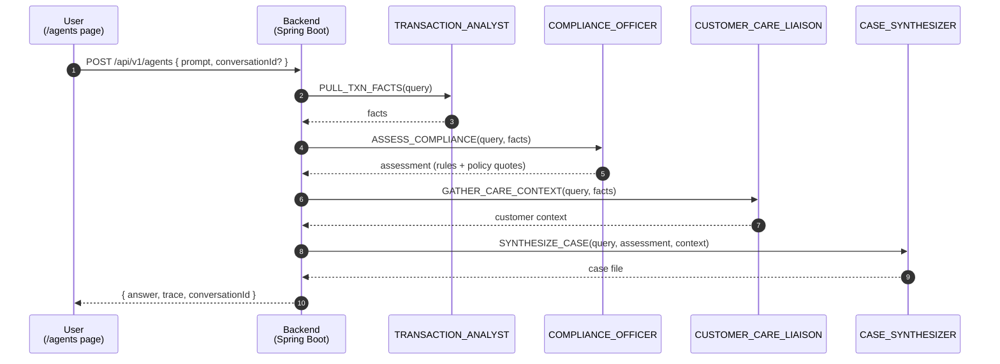

# Demo

The narrative and the six screens, in presentation order. Each section has a
**headline** (what it says at a glance), the **talking points**, and where
relevant a **show** line naming the live screen to flip to.

The deck is built directly from this file — when the content here changes, the
slides change.

---

## Part 1 — The argument

### The problem

**Headline:** AI-powered attacks are landing on AI-less defences.

- Synthetic identities at onboarding, deepfake voice on phone banking,
  automated credential stuffing, real-time transaction-pattern attacks tuned by
  adversaries with LLMs.
- Defences need the same generation of tooling — hybrid vector search, NL2SQL,
  agentic investigations.
- Most enterprise data still sits on Oracle 19c or older. A multi-year platform
  migration is the wrong gate for shipping AI features now.

### The shift

**Headline:** Bring AI to the data, not the data to the AI.

- The instinct is to copy data into a separate AI stack (warehouse + vector DB +
  agent framework + glue). That's a new pipeline, new copies, new governance
  surface, new attack surface.
- Flip it: leave the data where it is, run AI next to it.
- The database becomes the AI runtime — SQL, vectors, RAG, and agents over the
  same governed data.

### The pattern

**Headline:** Attach an AI Data Gateway alongside production.

- An Autonomous AI Database 26ai instance is bolted on alongside the existing
  production databases.
- It reaches into the existing data through `DB_LINK` views (Oracle and
  PostgreSQL today; MongoDB is deferred).
- The application is unchanged. AI features call the gateway; everything else
  keeps using the production stores.
- Oracle's name for this in the docs is **AI Proxy Database** / **Select AI
  Sidecar**. This repo calls it the **AI Data Gateway** because that is what the
  audience hears.

**Show:** the README "What stays. What's added." diagram.

### What stays, what's added

**Headline:** The box on top doesn't change to get the box at the bottom.

- Stays: the application, its connections, the production databases, their
  lifecycle.
- Added: one Autonomous AI Database 26ai instance, attached through `DB_LINK`.
- This is a stepping stone, not an end state. The gateway buys time: ship AI
  features now while the rest of the migration runs on its own clock.
- When 26ai lands on the production side, the same architecture flips cleanly —
  the gateway either folds into the production database or stays as a dedicated
  AI tier. No rewrite either way.

### Deployability

**Headline:** Autonomous is the easy on-ramp. On-prem ships the same pieces.

- Autonomous AI Database 26ai is the fastest path — managed credentials, zero
  install, ready in minutes.
- Oracle AI Database 26ai went GA on-prem (Linux x86-64) in January 2026. Select
  AI, AI Proxy, the agent framework, and hybrid vector indexes all ship in that
  release.
- A few conveniences are cloud-only (managed credentials, Cloud Links, Table
  Hyperlinks) — on-prem uses the classic Database Gateway and Database Links to
  do the same job.
- Pick the deployment that matches your operating model. The architecture
  doesn't change.

---

## Part 2 — The six screens

One banking dataset: customers, accounts, branches, transactions (Oracle),
policies and rules (PostgreSQL), support tickets (MongoDB). Six routes over it.

### `/risk` — Risk Dashboard

**Headline:** What a compliance officer sees today — no AI in the loop.

A compliance and risk overview built from the production databases only. KPI
strip across the top (KYC attention, frozen accounts, high-risk customers,
sub-CTR activity, decline velocity, open HIGH-priority tickets) followed by five
chart cards: sub-CTR structuring watchlist, KYC pipeline, risk × account-status
mix, ticket priority over time, and an active-rule-violations table.

Every chart card has a banking-language footer citing the rule codes
(`R-AML-005`, `R-FRAUD-007`, `R-OFAC-001`, …) and policy codes (`P-CTR-01`,
`P-OFAC-01`, `P-KYC-01`, …) so a compliance officer can read it without a
translator.

This dashboard is the human counterpart to `/agents`: the same patterns computed
visually here are what the agent team narrates in plain English over there.

**Show:** `/risk` live.

### `/fraud` — Fraud Dashboard

**Headline:** Pattern-level fraud via SQL Property Graph.

A `banking_graph` on the gateway models accounts as vertices and a
`transaction_edges` table as edges. The backend runs three
`GRAPH_TABLE (banking_graph MATCH ...)` queries, one per pattern.

Four cards:

1. **Round-trip cycles** — `MATCH (a)-[t1]->(b)-[t2]->(c)-[t3]->(a)` detects
   A→B→C→A loops with similar amounts and tight timestamps, a classic layering
   pattern. Canonicalised so each underlying triangle emits once, and rendered
   as an inline SVG triangle alongside the customer names.
2. **Fan-out** — a single source pushing funds to ≥5 distinct destinations in a
   short window. Often correlates with account takeover or money-mule activity.
3. **Structuring** — ≥3 transfers in the $8,000–$9,999 band summing to ≥$25,000.
   The graph-level counterpart to the per-customer sub-CTR signal on `/risk`.
4. **Cross-border wire flows** — outbound `WIRE` transactions grouped by
   destination country, with OFAC-sanctioned jurisdictions flagged for
   `R-OFAC-001` under policy `P-OFAC-01`.

Each match comes with a deterministic risk score.

**Why the graph lives on the gateway.** Production `transactions` is a
blockchain table, which seals it against the `ALTER TABLE ADD COLUMN` and
`UPDATE` operations that adding `src_account_id` / `dst_account_id` would
require. The graph instead sits on the gateway next to the agent and Select AI
surfaces, with `local_accounts` mirrored from `V_BNK_ACCOUNTS` at deploy time.

**Tech callout:** Oracle SQL Property Graph — graph patterns in SQL, no separate
graph database.

**Show:** `/fraud` live.

### `/app` — Current System

**Headline:** What the application sees today.

The backend opens direct JDBC/Mongo connections to each production database.
Five cards, one per table (accounts, transactions, policies, rules,
support_tickets), each with a wall-clock latency badge measured at the backend
boundary. One click fans out into five parallel requests; each card fills in
independently as its response returns.

This is the baseline the AI Data Gateway path is compared against.

**Show:** `/app` live, click once and let the cards fill in.

### `/ai-data-gateway` — federated via the gateway

**Headline:** Same data, same cards — now routed through the gateway.

Same five cards, same dataset, but every query is routed through the gateway and
its `V_BNK_*` `DB_LINK` views. The latency badges show what the federated hop
costs; compare with `/app` side by side.

The `support_tickets` card is statically marked "not available" — MongoDB stays
connected directly by the app and is deferred gateway coverage. See
[`docs/known-limitation-mongodb-federation.md`](docs/known-limitation-mongodb-federation.md).

**Tech callout:** `DBMS_CLOUD_ADMIN.CREATE_DATABASE_LINK` to a heterogeneous
gateway, then plain SQL views over the result.

**Show:** `/ai-data-gateway` live, compare badges to `/app`.

### `/agents` — Select AI Agent framework

**Headline:** Four agents collaborating inside the database.

The backend issues one `DBMS_CLOUD_AI_AGENT.RUN_TEAM` call; the gateway plans
the work, calls OCI Generative AI for each agent, runs the SQL/RAG tools against
`V_BNK_*` views, and returns both the final synthesised answer and a structured
execution trace.

**The team — `BANKING_INVESTIGATION_TEAM`, sequential process:**

| #   | Agent                   | Profile                     | Tools                                        | Reads from                                                                                         |
| --- | ----------------------- | --------------------------- | -------------------------------------------- | -------------------------------------------------------------------------------------------------- |
| 1   | `TRANSACTION_ANALYST`   | `BANKING_NL2SQL_TXN`        | `TXN_SQL_TOOL`                               | `V_BNK_CUSTOMERS`, `V_BNK_ACCOUNTS`, `V_BNK_TRANSACTIONS`, `V_BNK_BRANCHES`                        |
| 2   | `COMPLIANCE_OFFICER`    | `BANKING_NL2SQL_COMPLIANCE` | `COMPLIANCE_SQL_TOOL`, `COMPLIANCE_RAG_TOOL` | `V_BNK_POLICIES`, `V_BNK_RULES`, `BANKING_POLICY_INDEX` (5 markdown policy docs in Object Storage) |
| 3   | `CUSTOMER_CARE_LIAISON` | `BANKING_NL2SQL_CARE`       | `CARE_SQL_TOOL`                              | `V_BNK_CUSTOMERS` today; `V_BNK_SUPPORT_TICKETS` once the Mongo gateway is fixed                   |
| 4   | `CASE_SYNTHESIZER`      | `BANKING_CHAT`              | (none — pure LLM reasoning)                  | The other agents' outputs                                                                          |

**Five demo questions** (clickable chips on the page; each reaches a different
combination of agents and tools):

1. _Are there any suspicious patterns on Carol Diaz's accounts this month?_
2. _Bob Chen disputed a $230 charge — what should we do?_
3. _Summarise Alice Morgan's risk profile._
4. _Why is Jamal Reed's checking account frozen?_
5. _What policies apply to international wires above $10K?_

**Tech callout:** Select AI Agent framework + Hybrid Vector Index for the policy
RAG tool.

**Show:** `/agents` live, run one of the five questions, expand the trace.

### `/measurements` — direct vs federated

**Headline:** How much does the federated path cost? Here's the data.

**What is timed.** Exactly one JDBC/Mongo call per measurement, at the backend
boundary (`System.nanoTime()` immediately before the call, again immediately
after). HTTP handling, JSON serialization, and the measurement-row INSERT are
all outside the timed region — the INSERT is fired asynchronously on a dedicated
executor so it can't pollute the number.

**Where it lives.** Rows are persisted to `QUERY_MEASUREMENTS` on the gateway.
Each row carries `query_id`, `route` (`direct` | `federated`), `elapsed_ms`,
`rows_returned`, `success`, `run_id`, and `measured_at`.

**How to read it.** The summary table shows `n`, mean, and p95 for both routes
side by side per query. The rightmost `Δ mean (ms)` column is
`federated_mean − direct_mean` in absolute ms. Below the table, the distribution
chart shows the runtime spread per query for both routes. "Trim outliers (IQR)"
is on by default and strips points outside `[Q1 − 1.5·IQR, Q3 + 1.5·IQR]` —
without it, rare warm-up runs in the 5000–7000 ms range dominate the Y axis and
the boxes collapse to flat lines.

**Show:** `/measurements` live.

---

## Part 3 — Closing

### Technology callouts

- **Autonomous AI Database 26ai** — the AI Data Gateway itself. Visible on every
  screen that hits the gateway (`/fraud`, `/ai-data-gateway`, `/agents`,
  `/measurements`).
- **Select AI / NL2SQL** — `V_BNK_*` views as the NL2SQL surface. Drives every
  agent tool on `/agents`.
- **Select AI Agent framework** — `DBMS_CLOUD_AI_AGENT.RUN_TEAM` orchestrates
  the four agents. `/agents`.
- **AI Data Gateway** (AI Proxy Database / Select AI Sidecar) — `DB_LINK` views
  into Oracle and PostgreSQL. `/ai-data-gateway`.
- **Oracle SQL Property Graph** — `GRAPH_TABLE MATCH` on `banking_graph` for
  cycle / fan-out / structuring detection. `/fraud`.
- **Blockchain Tables** — production `transactions` is a `BLOCKCHAIN TABLE` with
  SHA2_512 hash chaining; tamper detection via
  `DBMS_BLOCKCHAIN_TABLE.VERIFY_ROWS`. Invisible to the app — the chain columns
  are hidden and reads are unchanged.
- **Hybrid Vector Index** — policy-doc RAG used by the Compliance Officer agent.
  `/agents`.

### Domain framing

**Headline:** Banking is the demo. The pattern travels.

The shape — production stores stay, gateway federates, AI features layer on top
— is industry-agnostic. What changes per industry and what doesn't:

- **Data model** changes (banking → claims, EHRs, telco CDRs, retail orders,
  manufacturing telemetry).
- **Policies and rules** change (AML/OFAC → HIPAA, GDPR, PCI-DSS, supplier
  compliance).
- **Agent roles** change (Transaction Analyst → Claims Examiner / Clinician /
  Network Ops / Buyer).
- **The pattern stays the same**: production stores unchanged, gateway
  federates, vector + agents on top.

[`REFERENCE.md`](REFERENCE.md) is the porting guide — the real DDL for each
capability and what to swap.

### Migration runway

**Headline:** Ship AI now. Migrate on your own clock.

- No big-bang re-platform. No parallel rewrite. No application freeze.
- The current architecture stays the current architecture — the gateway is
  additive.
- When the production side moves to 26ai, the gateway either folds into the
  production database or stays as a dedicated AI tier. The application doesn't
  care either way.
- Closes the "attackers have AI, defenders don't" window today, on data you
  already have.
