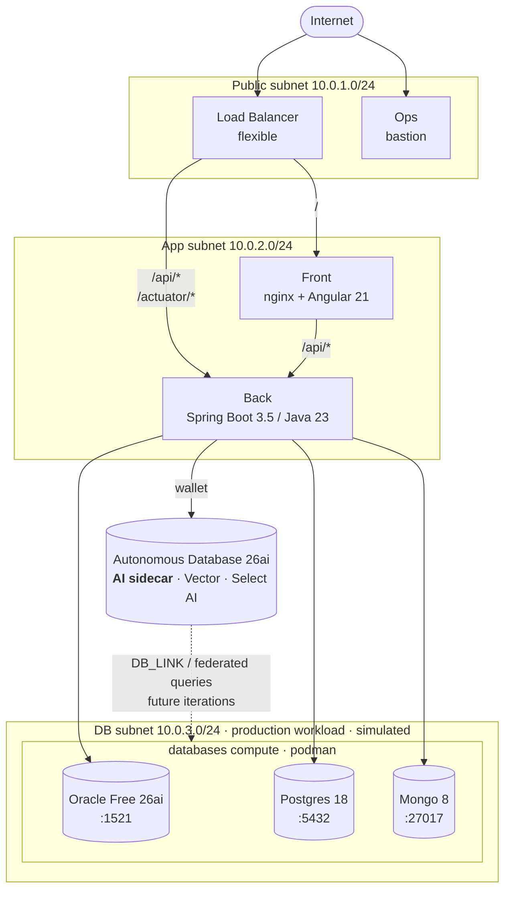

# Oracle ADB 26ai Sidecar Architecture

A **stepping-stone pattern** for bringing Autonomous Database 26ai capabilities — Vector Search, Hybrid Vector Index, Select AI, and the rest of the 26ai feature set — to workloads that still live in older Oracle, PostgreSQL, and MongoDB deployments.

In this architecture **ADB 26ai is the sidecar**. It does _not_ host the production data. The three Podman containers on the `databases` compute (Oracle Database Free 26ai, PostgreSQL 18, MongoDB 8) stand in for the existing production databases that a typical enterprise already runs. ADB 26ai is attached alongside them and reaches into each one via DB_LINK and federated queries, layering 26ai's modern AI/analytics capabilities on top — so teams can adopt Vector Search, Select AI, etc. without rehosting or rewriting the production systems first.

This unlocks an incremental modernization path: keep the existing production databases running unchanged, use the ADB 26ai sidecar to power new AI features against the same data, and migrate workloads into ADB 26ai on your own schedule.

The first iteration ships one user-facing feature: **a button that fetches the version of every database**, proving every connection works end-to-end. Subsequent iterations wire the ADB sidecar into each production DB via DB_LINK / DBMS_CLOUD_LINK so 26ai features can operate over the production data.

## Architecture

| Tier                            | Component                                 | Subnet                   | Notes                                                                                |
| ------------------------------- | ----------------------------------------- | ------------------------ | ------------------------------------------------------------------------------------ |
| Frontend                        | Angular 21 served by nginx                | private (app)            | Reverse-proxies `/api/*` to back                                                     |
| Backend                         | Spring Boot 3.5 / Java 23                 | private (app)            | Holds 4 datasource beans (3 JDBC + Mongo)                                            |
| Production workload (simulated) | Podman containers on one compute (4 OCPU) | private (db)             | Oracle Free 26ai, Postgres 18, Mongo 8 — stand-ins for existing production databases |
| AI sidecar                      | Autonomous Database 26ai (OLTP, ECPU)     | OCI-managed, mTLS wallet | Vector Search, Hybrid Vector Index, Select AI — layered over prod via DB_LINK        |
| Ops                             | Bastion compute (1 OCPU)                  | public                   | OCI Bastion service enabled                                                          |
| Edge                            | Flexible Load Balancer                    | public                   | `/api*` → back, default → front                                                      |



## Layout

```
.
├── manage.py                       # Click CLI: setup → build → tf → info → clean
├── requirements.txt
├── deploy/
│   ├── tf/
│   │   ├── app/                   # main.tf, network.tf, lb.tf, storage.tf, artifacts.tf, ...
│   │   └── modules/
│   │       ├── adbs/              # Autonomous Database 26ai + wallet
│   │       ├── ops/               # bastion compute + OCI Bastion service
│   │       ├── front/             # nginx + Angular dist
│   │       ├── back/              # Spring Boot jar via systemd
│   │       └── databases/         # podman host with 3 systemd container units
│   └── ansible/
│       ├── ops/                   # roles/base — install jump-host tools
│       ├── front/                 # roles/app  — nginx + reverse proxy
│       ├── back/                  # roles/java — JDK 23 + jar + systemd
│       └── databases/             # roles/podman — 3 container services
├── src/
│   ├── backend/                   # Java 23 / Gradle / Spring Boot 3.5
│   └── frontend/                  # Angular 21
└── database/
    ├── liquibase/{adb,oracle,postgres}/   # YAML changelogs + .properties.j2
    └── mongo/init.js                       # mongosh schema seed
```

## Provisioning flow

1. `python manage.py setup` — interactive OCI config (profile, region, compartment, SSH key). Generates an Oracle-compliant DB password. Writes `.env`.
2. `python manage.py build` — builds the Spring Boot jar (`./gradlew build -x test`) and the Angular dist (`npm install && npm run build`).
3. `python manage.py tf` — renders `deploy/tf/app/terraform.tfvars` from `.env`.
4. `cd deploy/tf/app && terraform init && terraform plan -out=tfplan && terraform apply tfplan` — provisions VCN, ADB 26ai, 4 computes, LB, Object Storage bucket, and 7-day pre-authenticated requests (PARs) for every artifact.
5. Cloud-init on each instance pulls its artifact via PAR and runs Ansible **locally** (no SSH between instances).
6. `python manage.py info` — prints the LB public IP, ops SSH command, and the versions endpoint URL.

## Prerequisites

- OCI account with API key in `~/.oci/config`
- Python 3.9+ (`pip install -r requirements.txt`)
- Terraform 1.x
- Java 23 (Temurin or Oracle JDK)
- Node 22+, npm 10+
- Gradle (one-time, to bootstrap the wrapper: `cd src/backend && gradle wrapper --gradle-version 8.13`)
- An RSA SSH keypair (e.g. `~/.ssh/id_rsa` + `id_rsa.pub`)

## Verifying iteration 1

```bash
# After terraform apply
python manage.py info

# Open the load balancer IP in a browser, or:
curl http://<lb_public_ip>/api/v1/health
curl http://<lb_public_ip>/api/v1/versions
```

The versions endpoint returns:

```json
{
  "adb": "Oracle Database 26ai Enterprise Edition Release 26.x.x.x.x ...",
  "oracle": "Oracle Database 26ai Free Release 26.x.x.x.x ...",
  "postgres": "PostgreSQL 18.x on x86_64-pc-linux-musl, ...",
  "mongo": "MongoDB 8.0.x"
}
```

Each value is the result of:

- ADB / Oracle: `SELECT BANNER_FULL FROM V$VERSION`
- Postgres: `SELECT version()`
- Mongo: `db.runCommand({buildInfo: 1}).version`

## Cleanup

```bash
cd deploy/tf/app && terraform destroy
cd ../../..
python manage.py clean   # refuses if Terraform state still has resources
```

## Reference architectures

The project's structure was derived from three sibling repos in the workspace:

- `oracle-database-select-ai` — manage.py + Terraform + Ansible + Spring Boot + Angular layout
- `oracle-database-mcp-intro` — Liquibase invocation patterns + dual local/cloud lifecycle
- `oracle-database-java-agent-memory` — cloud-init + PAR-based artifact delivery

See [NOTES.md](NOTES.md) for what's intentionally deferred and the iteration roadmap.
