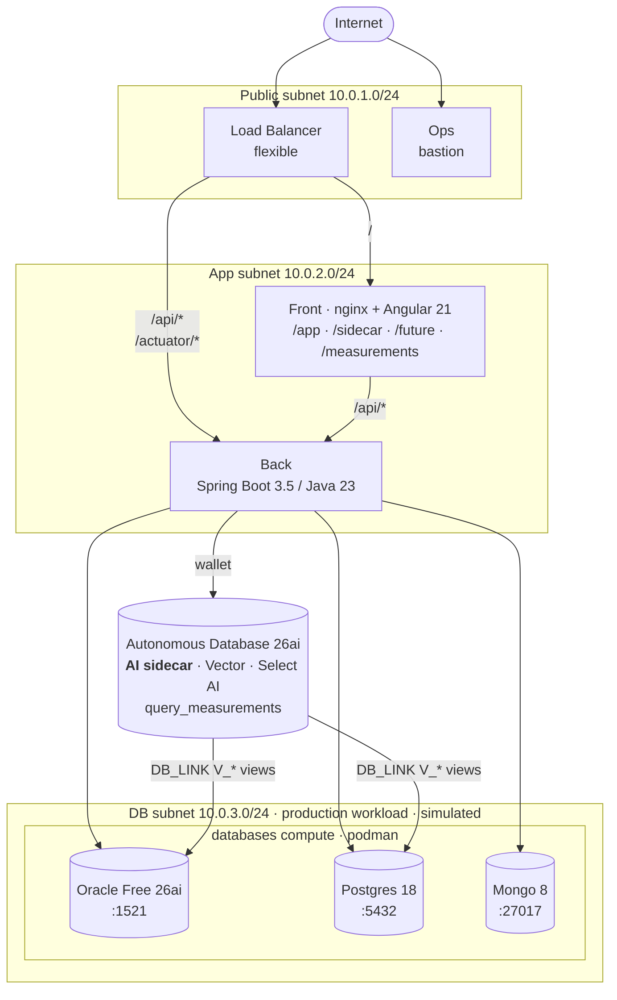

# Oracle ADB 26ai Sidecar Architecture

**Keep your current app. Keep your current databases and their lifecycle. Attach Autonomous Database 26ai as a sidecar, layer AI features on top, and consolidate datasources on your own schedule.**

This repo is a working implementation of the stepping-stone pattern. Three Podman containers on the `databases` compute (Oracle Database Free 26ai, PostgreSQL 18, MongoDB 8) stand in for the kind of production databases an enterprise already runs. ADB 26ai is attached alongside them as the _sidecar_ — not the production store. It reaches into each engine via DB_LINK views, letting teams adopt Vector Search, Hybrid Vector Index, Select AI Agents, and the rest of 26ai's feature set over the same data without rehosting or rewriting.

The frontend ships four routes against a small banking demo dataset seeded on first deploy: **accounts + transactions** in Oracle Free, **policies + rules** in PostgreSQL, **support_tickets** in MongoDB.

- `/app` — **current app path.** The backend opens direct JDBC/Mongo connections to each production database. Proves every datasource is reachable; this is what your app already does today.
- `/sidecar` — **sidecar path.** The backend queries ADB; ADB resolves `V_ACCOUNTS`, `V_TRANSACTIONS`, `V_POLICIES`, `V_RULES` over DB_LINK. Proves the federated path end-to-end. (Mongo via sidecar is deliberately disabled; see [docs/ISSUE_ADB_HETEROGENEOUS_MONGODB_OBJECT_NOT_FOUND.md](docs/ISSUE_ADB_HETEROGENEOUS_MONGODB_OBJECT_NOT_FOUND.md).)
- `/future` — **AI features.** Placeholder for Select AI Agents and other 26ai capabilities that land next.
- `/measurements` — **direct vs federated dashboard.** Wall-clock timing for every query, persisted asynchronously to ADB, with summary stats and box plots so the "federated is slower — by how much?" question has a data answer.

## Architecture

| Tier                            | Component                                 | Subnet                   | Notes                                                                                |
| ------------------------------- | ----------------------------------------- | ------------------------ | ------------------------------------------------------------------------------------ |
| Frontend                        | Angular 21 served by nginx                | private (app)            | Reverse-proxies `/api/*` to back                                                     |
| Backend                         | Spring Boot 3.5 / Java 23                 | private (app)            | Holds 4 datasource beans (3 JDBC + Mongo)                                            |
| Production workload (simulated) | Podman containers on one compute (4 OCPU) | private (db)             | Oracle Free 26ai, Postgres 18, Mongo 8 — stand-ins for existing production databases |
| AI sidecar                      | Autonomous Database 26ai (OLTP, ECPU)     | OCI-managed, mTLS wallet | Vector Search, Hybrid Vector Index, Select AI — layered over prod via DB_LINK        |
| Ops                             | Bastion compute (1 OCPU)                  | public                   | OCI Bastion service enabled                                                          |
| Edge                            | Flexible Load Balancer                    | public                   | `/api*` → back, default → front                                                      |



## Layout

```
.
├── manage.py                       # Click CLI: setup → build → tf → info → clean
├── requirements.txt
├── deploy/
│   ├── tf/
│   │   ├── app/                   # main.tf, network.tf, lb.tf, storage.tf, artifacts.tf, ...
│   │   └── modules/
│   │       ├── adbs/              # Autonomous Database 26ai + wallet
│   │       ├── ops/               # bastion compute + OCI Bastion service
│   │       ├── front/             # nginx + Angular dist
│   │       ├── back/              # Spring Boot jar via systemd
│   │       └── databases/         # podman host with 3 systemd container units
│   └── ansible/
│       ├── ops/                   # roles/base — install jump-host tools
│       ├── front/                 # roles/app  — nginx + reverse proxy
│       ├── back/                  # roles/java — JDK 23 + jar + systemd
│       └── databases/             # roles/podman — 3 container services
├── src/
│   ├── backend/                   # Java 23 / Gradle / Spring Boot 3.5
│   └── frontend/                  # Angular 21
└── database/
    ├── liquibase/{adb,oracle,postgres}/   # YAML changelogs + .properties.j2
    └── mongo/init.js                       # mongosh schema seed
```

## Provisioning flow

> **First time only:** create the virtualenv and install Python dependencies.

```bash
python -m venv venv
```

```bash
pip install -r requirements.txt
```

Activate the virtualenv (every new shell):

```bash
source venv/bin/activate
```

Interactive OCI config (profile, region, compartment, SSH key). Generates an Oracle-compliant DB password. Writes `.env`.

```bash
python manage.py setup
```

Builds the Spring Boot jar (`./gradlew build -x test`) and the Angular dist (`npm install && npm run build`).

```bash
python manage.py build
```

Renders `deploy/tf/app/terraform.tfvars` from `.env`.

```bash
python manage.py tf
```

Provisions VCN, ADB 26ai, 4 computes, LB, Object Storage bucket, and 7-day pre-authenticated requests (PARs) for every artifact.

```bash
cd deploy/tf/app
terraform init
terraform plan -out=tfplan
```

```bash
terraform apply tfplan
```

Cloud-init on each instance pulls its artifact via PAR and runs Ansible **locally** (no SSH between instances).

Prints the LB public IP, ops SSH command, and the demo endpoint URL.

```bash
cd ../../..
```

```bash
python manage.py info
```

## Prerequisites

- OCI account with API key in `~/.oci/config`
- Python 3.9+ (`pip install -r requirements.txt`)
- Terraform 1.x
- Java 23 (Temurin or Oracle JDK)
- Node 22+, npm 10+
- Gradle (one-time, to bootstrap the wrapper: `cd src/backend && gradle wrapper --gradle-version 8.13`)
- An RSA SSH keypair (e.g. `~/.ssh/id_rsa` + `id_rsa.pub`)

## Verifying

After `terraform apply`, print the endpoints and SSH command:

```bash
python manage.py info
```

Open the load balancer IP in a browser, or hit the endpoints directly. Health check:

```bash
curl http://<lb_public_ip>/api/v1/health
```

Direct path — backend queries each production engine directly:

```bash
RUN=$(uuidgen)
for t in accounts transactions policies rules support_tickets; do
  curl -s "http://<lb_public_ip>/api/v1/query?table=$t&route=direct&runId=$RUN"
done
```

Federated path — backend queries ADB, which resolves DB_LINK views to the engines:

```bash
RUN=$(uuidgen)
for t in accounts transactions policies rules; do
  curl -s "http://<lb_public_ip>/api/v1/query?table=$t&route=federated&runId=$RUN"
done
```

Aggregated measurements:

```bash
curl -s "http://<lb_public_ip>/api/v1/measurements"
curl -s "http://<lb_public_ip>/api/v1/measurements?trim=iqr"
```

Each response is `{ rows: [...], rowsReturned: N, elapsedMs: <number> }`. The UI splits these across per-table cards at `/app` and `/sidecar`, each with a ms badge next to the table header.

## Measuring the federated tax

Customers asked first about the ADB sidecar architecture typically ask: _how much does the federated path cost in latency?_ The `/measurements` route answers that directly.

**What is timed.** Exactly one JDBC/Mongo call per measurement, at the backend boundary (`System.nanoTime()` immediately before the call, again immediately after). HTTP handling, JSON serialization, and the measurement-row INSERT are all outside the timed region — the INSERT is fired asynchronously on a dedicated executor so it can't pollute the number.

**Where it lives.** Rows are persisted to `QUERY_MEASUREMENTS` in ADB. Each row carries `query_id`, `route` (`direct` | `federated`), `elapsed_ms`, `rows_returned`, `success`, `run_id`, and `measured_at`.

**How to read the dashboard.** The summary table shows count, mean, and p95 for both routes side by side per query, sorted by the federated-vs-direct delta. The box plots show the distribution shape; the time-series scatter colors points by `run_id` so warm-up runs stand out. Toggle "Trim outliers (IQR)" to strip points outside `[Q1 − 1.5·IQR, Q3 + 1.5·IQR]` before computing the summary.

## Cleanup

```bash
cd deploy/tf/app && terraform destroy
```

`manage.py clean` refuses if Terraform state still has resources:

```bash
cd ../../..
python manage.py clean
```

## Reference architectures

The project's structure was derived from three sibling repos in the workspace:

- `oracle-database-select-ai` — manage.py + Terraform + Ansible + Spring Boot + Angular layout
- `oracle-database-mcp-intro` — Liquibase invocation patterns + dual local/cloud lifecycle
- `oracle-database-java-agent-memory` — cloud-init + PAR-based artifact delivery

See [NOTES.md](NOTES.md) for what's intentionally deferred and the iteration roadmap.
