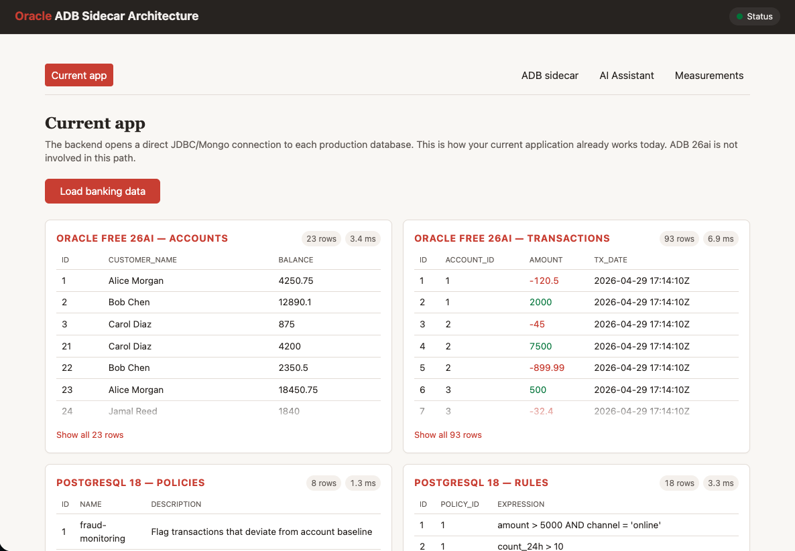
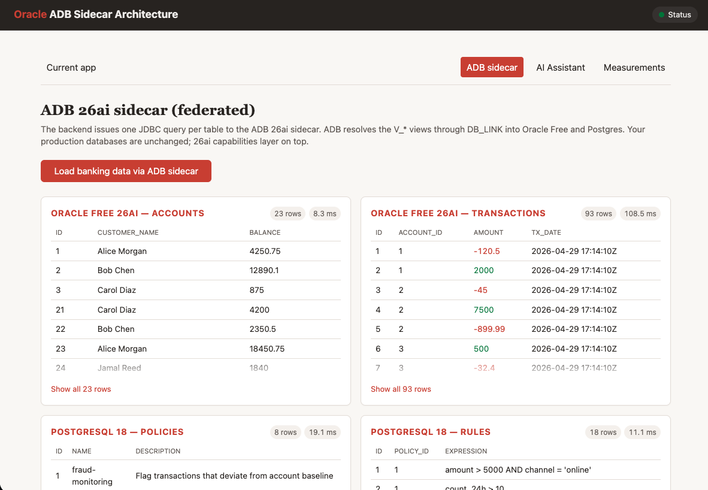
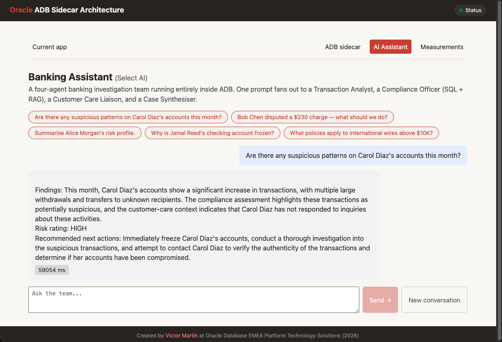
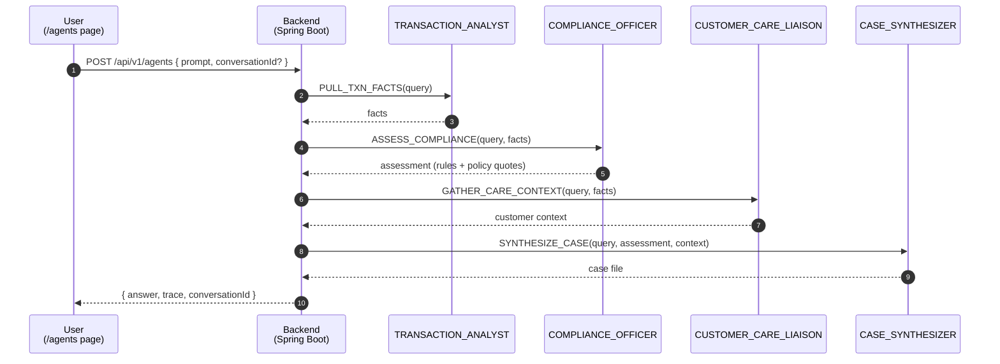
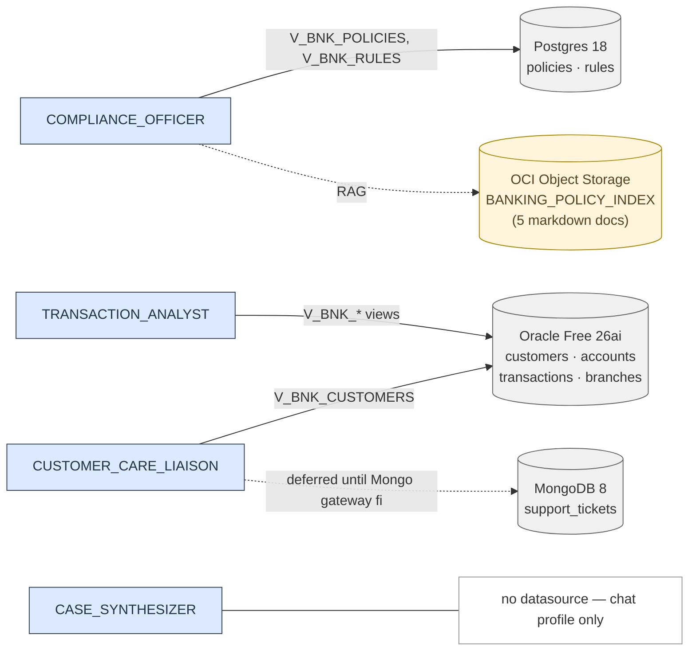
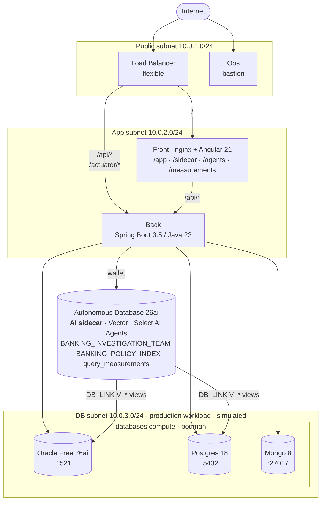
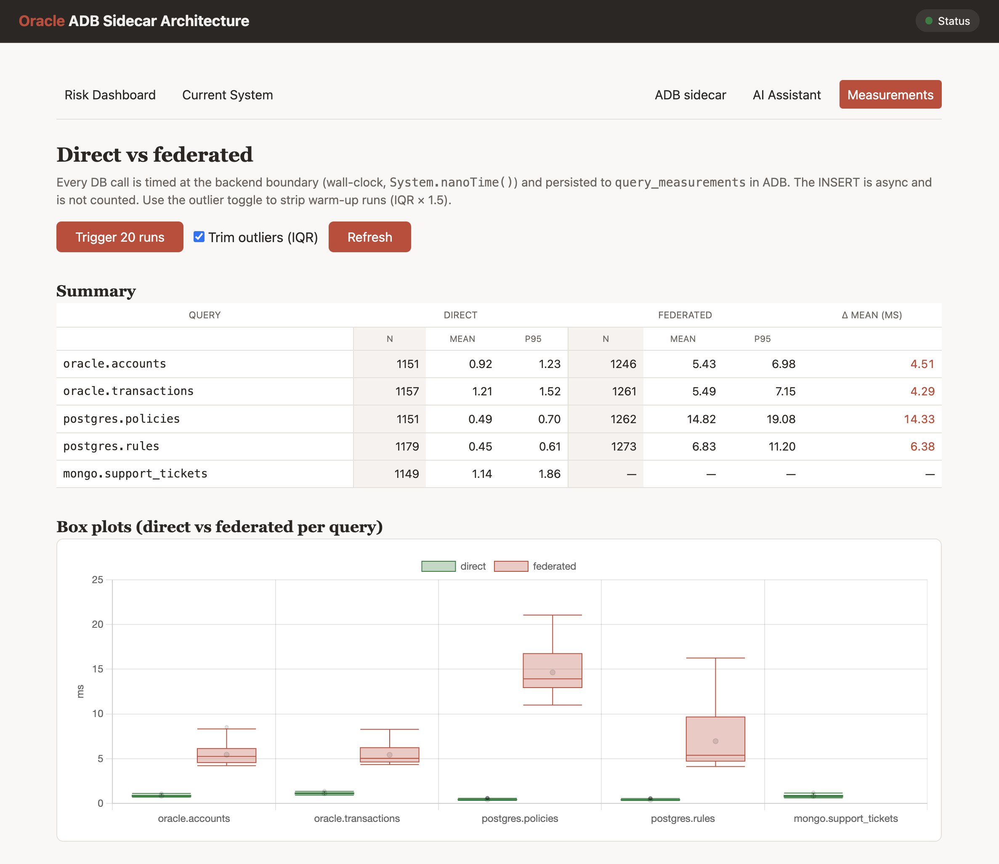

# Oracle ADB 26ai Sidecar Architecture

**Keep your current app. Keep your current databases and their lifecycle. Attach Autonomous Database 26ai as a sidecar, layer AI features on top, and consolidate datasources on your own schedule.**

This repository is a working live demo of the **Oracle Select AI "AI Proxy Database" pattern** (also called _Select AI sidecar_), as described in the Oracle Database 26ai Select AI User's Guide ([Use Autonomous AI Database as an AI Proxy for Select AI](https://docs.oracle.com/en/database/oracle/oracle-database/26/selai/select-ai-sidecar-databases.html)). An ADB 26ai instance acts as the AI Proxy: production data stays in Oracle Free 26ai and PostgreSQL 18 containers, ADB reaches them via `DBMS_CLOUD_ADMIN.CREATE_DATABASE_LINK` and exposes `V_BNK_*` views, and Select AI runs NL2SQL on top. The demo extends the documented NL2SQL pattern with a vector-RAG index and a 4-agent `DBMS_CLOUD_AI_AGENT.RUN_TEAM` investigation team — Select AI capabilities that compose with the AI Proxy pattern but are not covered on that specific docs page.

This repo is a working implementation of the stepping-stone pattern. Three Podman containers on the `databases` compute (Oracle Database Free 26ai, PostgreSQL 18, MongoDB 8) stand in for the kind of production databases an enterprise already runs. ADB 26ai is attached alongside them as the _sidecar_ — not the production store. It reaches into each engine via DB_LINK views, letting teams adopt Vector Search, Hybrid Vector Index, Select AI Agents, and the rest of 26ai's feature set over the same data without rehosting or rewriting.

The frontend ships four routes against a small banking demo dataset seeded on first deploy: **accounts + transactions** in Oracle Free, **policies + rules** in PostgreSQL, **support_tickets** in MongoDB.

- `/app` — **current app path.** The backend opens direct JDBC/Mongo connections to each production database. Proves every datasource is reachable; this is what your app already does today.
- `/sidecar` — **sidecar path.** The backend queries ADB; ADB resolves `V_ACCOUNTS`, `V_TRANSACTIONS`, `V_POLICIES`, `V_RULES` over DB_LINK. Proves the federated path end-to-end. (Mongo via sidecar is deliberately disabled; see [docs/ISSUE_ADB_HETEROGENEOUS_MONGODB_OBJECT_NOT_FOUND.md](docs/ISSUE_ADB_HETEROGENEOUS_MONGODB_OBJECT_NOT_FOUND.md).)
- `/agents` — **Select AI Agents.** A four-agent banking investigation team running entirely inside the ADB sidecar (`DBMS_CLOUD_AI_AGENT.RUN_TEAM`). One prompt fans out to a Transaction Analyst, a Compliance Officer (SQL + RAG over a policy-doc vector index), a Customer Care Liaison, and a Case Synthesiser; the page renders the final answer plus a per-task execution trace. See the new "Select AI Agents" section below.
- `/measurements` — **direct vs federated dashboard.** Wall-clock timing for every query, persisted asynchronously to ADB, with summary stats and box plots so the "federated is slower — by how much?" question has a data answer.

### `/app` — direct



Five cards, one per table (accounts, transactions, policies, rules, support_tickets), each with a wall-clock badge measured at the backend boundary. One click fans out into five parallel HTTP requests and each card fills in independently as its response returns.

### `/sidecar` — federated via ADB



Same five cards, same dataset, but every query is now routed through the ADB sidecar and its DB_LINK views. The numbers next to each card show the extra latency the federated hop costs (compare with `/app` side by side). The `support_tickets` card is statically marked "not available" — the ADB heterogeneous MongoDB gateway is broken.

### `/agents` — Select AI Agents

 <!-- captured after first deploy; see §13.2 -->

The same banking dataset, but every question is now answered by a team of four
agents collaborating inside ADB. The backend issues one
`DBMS_CLOUD_AI_AGENT.RUN_TEAM` call; ADB plans the work, calls OCI Generative
AI for each agent, runs the SQL/RAG tools against `V_BNK_*` views, and returns
both the final synthesised answer and a structured execution trace.

**The team — `BANKING_INVESTIGATION_TEAM`, sequential process:**

| #   | Agent                   | Profile                     | Tools                                        | Reads from                                                                                             |
| --- | ----------------------- | --------------------------- | -------------------------------------------- | ------------------------------------------------------------------------------------------------------ |
| 1   | `TRANSACTION_ANALYST`   | `BANKING_NL2SQL_TXN`        | `TXN_SQL_TOOL`                               | `V_BNK_CUSTOMERS`, `V_BNK_ACCOUNTS`, `V_BNK_TRANSACTIONS`, `V_BNK_BRANCHES`                            |
| 2   | `COMPLIANCE_OFFICER`    | `BANKING_NL2SQL_COMPLIANCE` | `COMPLIANCE_SQL_TOOL`, `COMPLIANCE_RAG_TOOL` | `V_BNK_POLICIES`, `V_BNK_RULES`, `BANKING_POLICY_INDEX` (5 markdown policy docs in OCI Object Storage) |
| 3   | `CUSTOMER_CARE_LIAISON` | `BANKING_NL2SQL_CARE`       | `CARE_SQL_TOOL`                              | `V_BNK_CUSTOMERS` today; `V_BNK_SUPPORT_TICKETS` once the Mongo gateway is fixed                       |
| 4   | `CASE_SYNTHESIZER`      | `BANKING_CHAT`              | (none — pure LLM reasoning)                  | The other agents' outputs                                                                              |





**Five demo questions** (clickable chips on the page; each reaches a different combination of agents and tools):

1. _Are there any suspicious patterns on Carol Diaz's accounts this month?_
2. _Bob Chen disputed a $230 charge — what should we do?_
3. _Summarise Alice Morgan's risk profile._
4. _Why is Jamal Reed's checking account frozen?_
5. _What policies apply to international wires above $10K?_

**Mongo support tickets are wired but deferred.** `V_BNK_SUPPORT_TICKETS` is shipped as a commented-out Liquibase changeset; the seed in `database/mongo/init.js` is extended from 4 to ~25 documents so the data is in place. When the ADB heterogeneous-gateway issue (`docs/ISSUE_ADB_HETEROGENEOUS_MONGODB_OBJECT_NOT_FOUND.md`) is resolved, three small Liquibase edits flip the CARE agent online — see §14, "Mongo flip-the-switch".

## Architecture

| Tier                            | Component                                 | Subnet                   | Notes                                                                                |
| ------------------------------- | ----------------------------------------- | ------------------------ | ------------------------------------------------------------------------------------ |
| Frontend                        | Angular 21 served by nginx                | private (app)            | Reverse-proxies `/api/*` to back                                                     |
| Backend                         | Spring Boot 3.5 / Java 23                 | private (app)            | Holds 4 datasource beans (3 JDBC + Mongo)                                            |
| Production workload (simulated) | Podman containers on one compute (4 OCPU) | private (db)             | Oracle Free 26ai, Postgres 18, Mongo 8 — stand-ins for existing production databases |
| AI sidecar                      | Autonomous Database 26ai (OLTP, ECPU)     | OCI-managed, mTLS wallet | Vector Search, Hybrid Vector Index, Select AI — layered over prod via DB_LINK        |
| Ops                             | Bastion compute (1 OCPU)                  | public                   | OCI Bastion service enabled                                                          |
| Edge                            | Flexible Load Balancer                    | public                   | `/api*` → back, default → front                                                      |



## Layout

```
.
├── manage.py                       # Click CLI: setup → build → tf → info → clean
├── requirements.txt
├── deploy/
│   ├── tf/
│   │   ├── app/                   # main.tf, network.tf, lb.tf, storage.tf, artifacts.tf, ...
│   │   └── modules/
│   │       ├── adbs/              # Autonomous Database 26ai + wallet
│   │       ├── ops/               # bastion compute + OCI Bastion service
│   │       ├── front/             # nginx + Angular dist
│   │       ├── back/              # Spring Boot jar via systemd
│   │       └── databases/         # podman host with 3 systemd container units
│   └── ansible/
│       ├── ops/                   # roles/base — install jump-host tools
│       ├── front/                 # roles/app  — nginx + reverse proxy
│       ├── back/                  # roles/java — JDK 23 + jar + systemd
│       └── databases/             # roles/podman — 3 container services
├── src/
│   ├── backend/                   # Java 23 / Gradle / Spring Boot 3.5
│   └── frontend/                  # Angular 21
└── database/
    ├── liquibase/{adb,oracle,postgres}/   # YAML changelogs + .properties.j2
    └── mongo/init.js                       # mongosh schema seed
```

## Provisioning flow

> **First time only:** create the virtualenv and install Python dependencies.

```bash
python -m venv venv
```

Activate the virtualenv (every new shell):

```bash
source venv/bin/activate
```

```bash
pip install -r requirements.txt
```

Interactive OCI config (profile, region, compartment, SSH key). Generates an Oracle-compliant DB password. Writes `.env`.

```bash
python manage.py setup
```

Builds the Spring Boot jar (`./gradlew build -x test`) and the Angular dist (`npm install && npm run build`).

```bash
python manage.py build
```

Renders `deploy/tf/app/terraform.tfvars` from `.env`.

```bash
python manage.py tf
```

Provisions VCN, ADB 26ai, 4 computes, LB, Object Storage bucket, and 7-day pre-authenticated requests (PARs) for every artifact.

```bash
cd deploy/tf/app
terraform init
terraform plan -out=tfplan
```

```bash
terraform apply tfplan
```

Cloud-init on each instance pulls its artifact via PAR and runs Ansible **locally** (no SSH between instances).

Prints the LB public IP, ops SSH command, and the demo endpoint URL.

```bash
cd ../../..
python manage.py info
```

## Prerequisites

- OCI account with API key in `~/.oci/config`
- Python 3.9+ (`pip install -r requirements.txt`)
- Terraform 1.x
- Java 23 (Temurin or Oracle JDK)
- Node 22+, npm 10+
- Gradle (one-time, to bootstrap the wrapper: `cd src/backend && gradle wrapper --gradle-version 8.13`)
- An RSA SSH keypair (e.g. `~/.ssh/id_rsa` + `id_rsa.pub`)

## Verifying

After `terraform apply`, print the endpoints and SSH command:

```bash
python manage.py info
```

Open the load balancer IP in a browser and click through `/app`, `/sidecar`, `/agents`, and `/measurements`. The backend health check, for quick sanity:

```bash
curl http://<lb_public_ip>/api/v1/health
```

## Measuring the federated tax

Customers asked first about the ADB sidecar architecture typically ask: _how much does the federated path cost in latency?_ The `/measurements` route answers that directly.

**What is timed.** Exactly one JDBC/Mongo call per measurement, at the backend boundary (`System.nanoTime()` immediately before the call, again immediately after). HTTP handling, JSON serialization, and the measurement-row INSERT are all outside the timed region — the INSERT is fired asynchronously on a dedicated executor so it can't pollute the number.

**Where it lives.** Rows are persisted to `QUERY_MEASUREMENTS` in ADB. Each row carries `query_id`, `route` (`direct` | `federated`), `elapsed_ms`, `rows_returned`, `success`, `run_id`, and `measured_at`.

**How to read the dashboard.** The summary table shows `n`, mean, and p95 for both routes side by side per query, with a shaded `N` column marking the start of each section. The rightmost `Δ mean (ms)` column is `federated_mean − direct_mean` in absolute ms. Below the table, box plots show the distribution shape for each query. "Trim outliers (IQR)" is on by default and strips points outside `[Q1 − 1.5·IQR, Q3 + 1.5·IQR]` — without it, rare warm-up runs in the 5000-7000 ms range dominate the Y axis and the boxes collapse to flat lines. Toggle it off if you want to see those outliers.



## Cleanup

```bash
cd deploy/tf/app && terraform destroy
```

`manage.py clean` refuses if Terraform state still has resources:

```bash
cd ../../..
python manage.py clean
```

## More info

- [docs/FEDERATED_QUERIES.md](docs/FEDERATED_QUERIES.md) — the deep dive on how ADB reaches Oracle Free / Postgres / Mongo through `DBMS_CLOUD_ADMIN.CREATE_DATABASE_LINK`, with the two hard requirements (DNS-resolvable hostname, Mongo data outside `admin`) and the `ORA-17008` mid-run recovery path.
- [docs/AGENTS_DEMO.md](docs/AGENTS_DEMO.md) — manual runbook for the five Select AI Agents demo prompts, with the expected agent fan-out and what to point at on screen for each one.
- [docs/TROUBLESHOOTING.md](docs/TROUBLESHOOTING.md) — day-two playbook for each tier (ops, databases, back, front) plus how to poke at each database from the ops bastion.
- [NOTES.md](NOTES.md) — what's intentionally deferred and the iteration roadmap.

### Official Oracle references

- [Use Autonomous AI Database as an AI Proxy for Select AI](https://docs.oracle.com/en/database/oracle/oracle-database/26/selai/select-ai-sidecar-databases.html) — the Oracle Database 26ai Select AI User's Guide page that defines the AI Proxy Database / sidecar pattern this repo demonstrates.
- [Use an AI Proxy Database for Select AI NL2SQL](https://docs.oracle.com/en-us/iaas/autonomous-database-serverless/doc/select-ai-dblinks.html) — the same pattern in the ADB Serverless docs, with the explicit list of supported heterogeneous engines.
- [Select AI Proxy Integration release note (January 2026)](https://docs.oracle.com/en-us/iaas/releasenotes/autonomous-database-serverless/2026-01-selectai-proxy-int.htm) — when the AI Proxy / sidecar terminology landed in ADB Serverless.
- [Unlocking Data for All with Sidecar — Oracle Autonomous AI Database blog](https://blogs.oracle.com/autonomous-ai-database/unlocking-data-for-all-with-sidecar-empowering-business-users-with-aidriven-insights) — narrative framing of the pattern for a less technical audience.
