# Live AI Hub using the AI Data Gateway

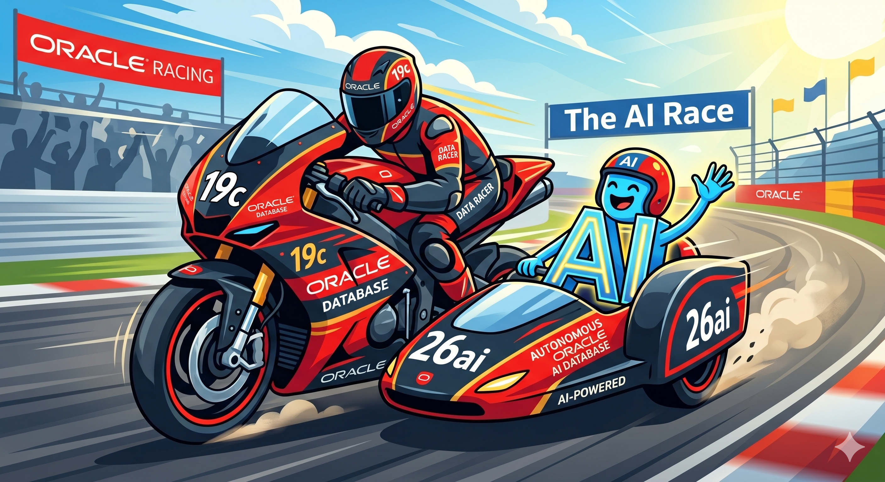

**Keep your current app. Keep your current databases and their lifecycle. Attach Autonomous AI Database 26ai as the AI Data Gateway, layer AI features on top, and consolidate datasources on your own schedule.**

This repository is a working live demo of the **Live AI Hub using the AI Data Gateway** pattern (referred to as the AI Proxy Database pattern in the Oracle Database 26ai Select AI User's Guide — [Use Autonomous AI Database as an AI Proxy for Select AI](https://docs.oracle.com/en/database/oracle/oracle-database/26/selai/select-ai-sidecar-databases.html)). An Autonomous AI Database 26ai instance acts as the AI Data Gateway: production data stays in two containers — an Oracle Database Free 26ai container, used as a stand-in for an existing Oracle 19c production database, and a PostgreSQL 18 container — Autonomous AI Database 26ai reaches them via `DBMS_CLOUD_ADMIN.CREATE_DATABASE_LINK` and exposes `V_BNK_*` views, and Select AI runs NL2SQL on top. The demo extends the documented NL2SQL pattern with a vector-RAG index and an agent team built using the Oracle Select AI Agent framework (`DBMS_CLOUD_AI_AGENT.RUN_TEAM`) — Select AI capabilities that compose with this pattern but are not covered on that specific docs page.

The pattern itself works against any Oracle AI Database, including 19c, minus the vector and RAG functionality; only the demo requires 26ai for the vector and agent surfaces.

This repo is a working implementation of the stepping-stone pattern. Three Podman containers on the `databases` compute (Oracle Database Free 26ai standing in for an existing Oracle 19c production database, PostgreSQL 18, MongoDB 8) stand in for the kind of production databases an enterprise already runs. Autonomous AI Database 26ai is attached alongside them as the _AI Data Gateway_ — not the production store. ADB federates Oracle and PostgreSQL today through DB_LINK views; MongoDB remains connected directly by the app and is included as deferred AI Data Gateway coverage. Teams adopt Vector Search, Hybrid Vector Index, the Oracle Select AI Agent framework, and the rest of 26ai's feature set over the same data without rehosting or rewriting.

## What stays. What's added.

The whole point of the AI Data Gateway pattern is that the box on top does not change to get the box at the bottom. The application keeps its existing connections to the production databases; the AI Data Gateway is bolted on alongside and reaches into the same data through DB_LINK views.

This is a stepping-stone, not an end state. The AI Data Gateway buys you time: you can ship AI-powered features against your live data — fraud screening, natural-language analytics, agent-driven investigations — while the current system follows its own migration runway to 26ai on whatever timeline the rest of the business can absorb. No big-bang re-platform, no parallel rewrite, no application freeze. The architecture you already operate stays the architecture you operate.

That timing matters. Fraud and intrusion attempts have gone AI-powered — synthetic identities at onboarding, deepfake voice on phone-banking lines, automated credential stuffing, and real-time transaction-pattern attacks tuned by adversaries who themselves have access to large language models. Defences have to be on the same generation of tooling. Waiting for a multi-year platform migration before you can layer on hybrid vector search, NL2SQL, or agent-driven investigations leaves a window in which the attackers have AI and the defenders don't. The AI Data Gateway closes that window now, on the data you already have, while the rest of the migration takes the time it needs to take.

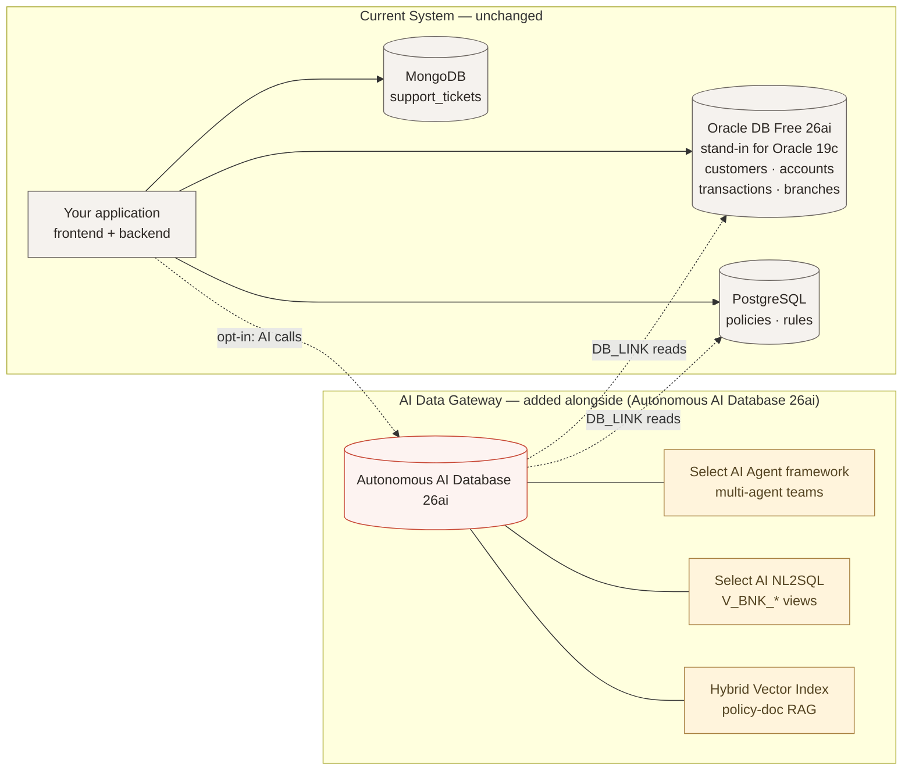
```mermaid
flowchart LR
    classDef existing fill:#F5F2EE,stroke:#6B6560,color:#2C2723
    classDef gateway  fill:#FDF3F1,stroke:#C74634,color:#2C2723
    classDef ai       fill:#FFF4DC,stroke:#A88040,color:#542

    subgraph current ["Current System — unchanged"]
        direction TB
        app[Your application<br/>frontend + backend]:::existing
        oracle[(Oracle DB Free 26ai<br/>stand-in for Oracle 19c<br/>customers · accounts<br/>transactions · branches)]:::existing
        postgres[(PostgreSQL<br/>policies · rules)]:::existing
        mongo[(MongoDB<br/>support_tickets)]:::existing
        app --> oracle
        app --> postgres
        app --> mongo
    end

    subgraph gatewaybox ["AI Data Gateway — added alongside (Autonomous AI Database 26ai)"]
        direction TB
        adb[(Autonomous AI Database 26ai)]:::gateway
        agents[Select AI Agent framework<br/>multi-agent teams]:::ai
        nl2sql[Select AI NL2SQL<br/>V_BNK_* views]:::ai
        rag[Hybrid Vector Index<br/>policy-doc RAG]:::ai
        adb --- agents
        adb --- nl2sql
        adb --- rag
    end

    app -. opt-in: AI calls .-> adb
    adb -. DB_LINK reads .-> oracle
    adb -. DB_LINK reads .-> postgres
```

The frontend ships six routes against a small banking demo dataset seeded on first deploy: **customers + branches + accounts + transactions** in the Oracle Database Free 26ai container (stand-in for Oracle 19c), **policies + rules** in PostgreSQL 18, **support_tickets** in MongoDB 8.

- `/risk` — **Risk Dashboard** (default landing). Reads only from the existing production databases; no AI Data Gateway involvement. Six KPI cards plus five charts (sub-CTR structuring watchlist, KYC pipeline, risk × account-status mix, ticket priority over time, and an active-rule-violations table). Each chart cites the policy and rule codes that drive it.
- `/fraud` — **Fraud Dashboard.** Pattern-level fraud signals from a SQL Property Graph (`banking_graph`) on Autonomous AI Database 26ai plus the cross-border wire flows view. Four cards: round-trip cycles (A→B→C→A detected via `GRAPH_TABLE MATCH`), fan-out (single source → many destinations), structuring (sub-$10K transfers summing well over the CTR threshold), and the OFAC-flagged international wires that used to live on `/risk`. Each match comes with a deterministic risk score.
- `/app` — **Current System.** The backend opens direct JDBC/Mongo connections to each production database. Proves every datasource is reachable; this is what your app already does today.
- `/ai-data-gateway` — **AI Data Gateway path.** The backend queries Autonomous AI Database 26ai; ADB resolves `V_ACCOUNTS`, `V_TRANSACTIONS`, `V_POLICIES`, `V_RULES` over DB_LINK. Proves the federated path end-to-end. (MongoDB via the AI Data Gateway is deliberately disabled; see [docs/ISSUE_ADB_HETEROGENEOUS_MONGODB_OBJECT_NOT_FOUND.md](docs/ISSUE_ADB_HETEROGENEOUS_MONGODB_OBJECT_NOT_FOUND.md).)
- `/agents` — **Select AI Agent framework.** A four-agent banking investigation team running entirely inside Autonomous AI Database 26ai (`DBMS_CLOUD_AI_AGENT.RUN_TEAM`). One prompt fans out to a Transaction Analyst, a Compliance Officer (SQL + RAG over a policy-doc vector index), a Customer Care Liaison, and a Case Synthesiser; the page renders the final answer plus a per-task execution trace. See the "Select AI Agent framework" section below.
- `/measurements` — **direct vs federated dashboard.** Wall-clock timing for every query, persisted asynchronously to Autonomous AI Database 26ai, with summary stats and a distribution chart so the "federated is slower — by how much?" question has a data answer.

### `/risk` — Risk Dashboard

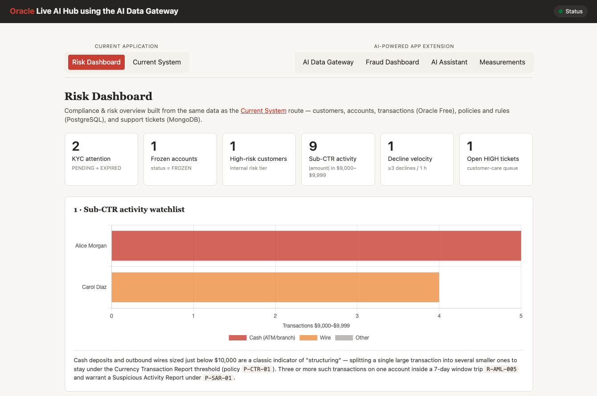

A compliance & risk overview built from the same production data as `/app`. KPI strip across the top (KYC attention, frozen accounts, high-risk customers, sub-CTR activity, decline velocity, open HIGH-priority tickets) followed by five chart cards. Every chart card has a banking-language footer that cites the relevant rule codes (`R-AML-005`, `R-FRAUD-007`, `R-OFAC-001`, …) and policy codes (`P-CTR-01`, `P-OFAC-01`, `P-KYC-01`, …) so a compliance officer can read it without a translator.

The dashboard is intentionally the human counterpart to `/agents`: the same patterns that get computed visually here are what the Select AI Agent framework investigation team narrates in plain English over there. Fraud-shaped signals (cross-border wires, graph-pattern matches) live on `/fraud`; this dashboard is for prudential and compliance views (KYC, account status mix, ticket priority, rule-violation counts).

### `/fraud` — Fraud Dashboard

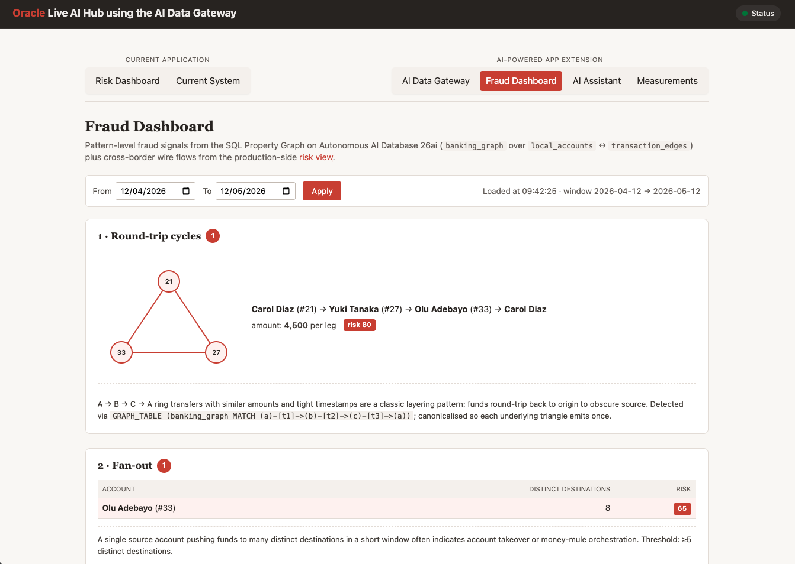

Pattern-level fraud detection driven by Oracle's SQL Property Graph feature. A `banking_graph` on Autonomous AI Database 26ai models accounts as vertices and a `transaction_edges` table as edges; the backend runs three `GRAPH_TABLE (banking_graph MATCH ...)` queries — one per pattern — and the dashboard renders the matches.

**Four cards:**

1. **Round-trip cycles** — `MATCH (a)-[t1]->(b)-[t2]->(c)-[t3]->(a)` detects A→B→C→A loops with similar amounts and tight timestamps (a classic layering pattern). Canonicalised so each underlying triangle emits once. Each match is rendered as an inline SVG triangle alongside the customer names.
2. **Fan-out** — a single source pushing funds to ≥5 distinct destinations in a short window. Often correlates with account takeover or money-mule activity.
3. **Structuring** — ≥3 transfers in the $8,000–$9,999 band summing to ≥$25,000. The graph-level counterpart to the per-customer sub-CTR signal on `/risk`; both surface activity sized just under the $10,000 CTR threshold.
4. **Cross-border wire flows** — moved over from `/risk`. Outbound `WIRE` transactions grouped by destination country, with OFAC-sanctioned jurisdictions flagged for `R-OFAC-001` violation under policy `P-OFAC-01`.

**Why Autonomous AI Database 26ai and not the production-side database.** Production `transactions` is a blockchain table (see [Architecture](#architecture)) which seals it against the `ALTER TABLE ADD COLUMN` and `UPDATE` operations that adding `src_account_id`/`dst_account_id` would require. The graph instead lives on Autonomous AI Database 26ai next to the agents/Select-AI surfaces, with `local_accounts` mirrored from `V_BNK_ACCOUNTS` at deploy time and `transaction_edges` seeded with synthetic but account-ID-faithful fraud patterns.

### `/app` — Current System

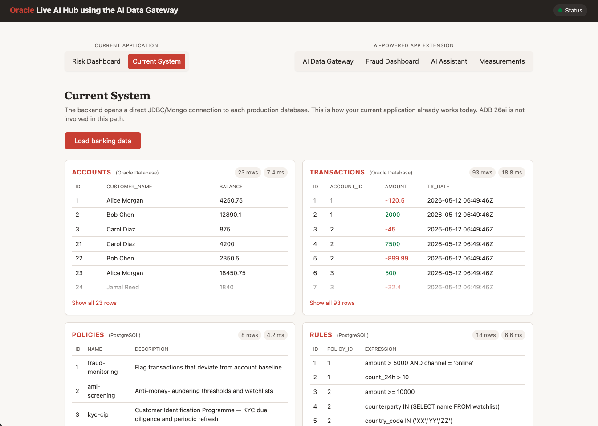

Five cards, one per table (accounts, transactions, policies, rules, support_tickets), each with a wall-clock badge measured at the backend boundary. One click fans out into five parallel HTTP requests and each card fills in independently as its response returns.

### `/ai-data-gateway` — federated via the AI Data Gateway

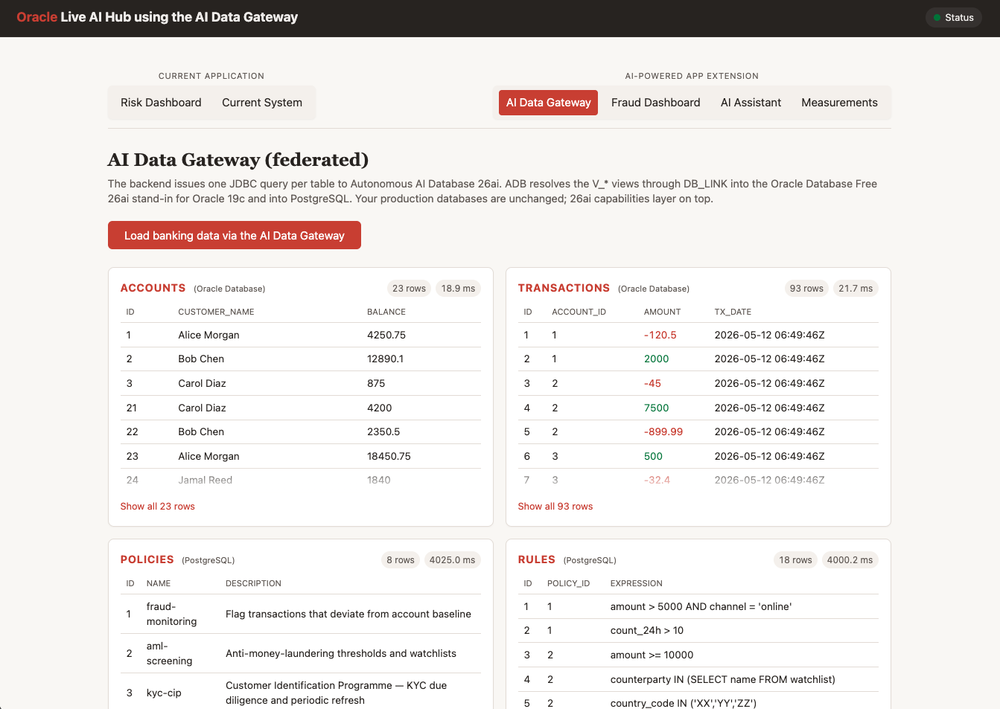

Same five cards, same dataset, but every query is now routed through the AI Data Gateway and its DB_LINK views. The numbers next to each card show the extra latency the federated hop costs (compare with `/app` side by side). The `support_tickets` card is statically marked "not available" — the heterogeneous MongoDB gateway in Autonomous AI Database 26ai is broken; MongoDB stays connected directly by the app and is deferred AI Data Gateway coverage.

### `/agents` — Select AI Agent framework

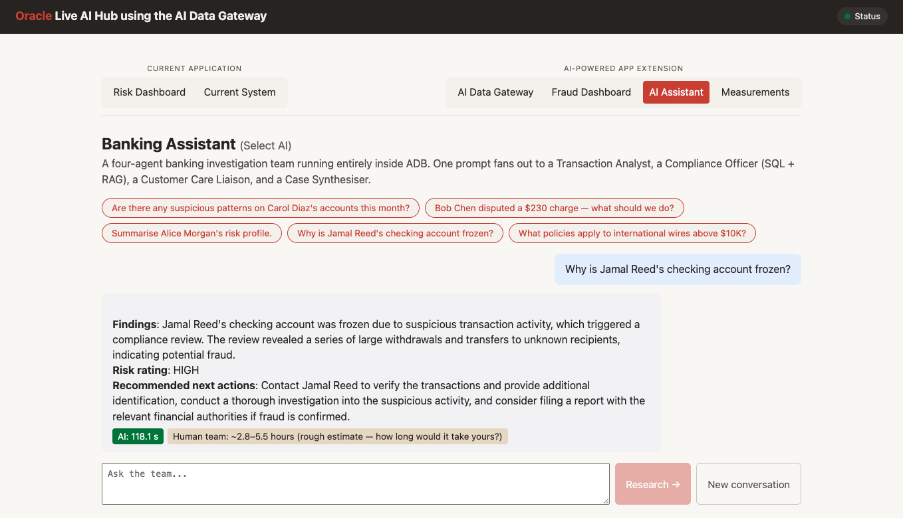

The same banking dataset, but every question is now answered by an agent team
built using the Oracle Select AI Agent framework, collaborating inside
Autonomous AI Database 26ai. The backend issues one
`DBMS_CLOUD_AI_AGENT.RUN_TEAM` call; ADB plans the work, calls OCI Generative
AI for each agent, runs the SQL/RAG tools against `V_BNK_*` views, and returns
both the final synthesised answer and a structured execution trace.

**The team — `BANKING_INVESTIGATION_TEAM`, sequential process:**

| #   | Agent                   | Profile                     | Tools                                        | Reads from                                                                                             |
| --- | ----------------------- | --------------------------- | -------------------------------------------- | ------------------------------------------------------------------------------------------------------ |
| 1   | `TRANSACTION_ANALYST`   | `BANKING_NL2SQL_TXN`        | `TXN_SQL_TOOL`                               | `V_BNK_CUSTOMERS`, `V_BNK_ACCOUNTS`, `V_BNK_TRANSACTIONS`, `V_BNK_BRANCHES`                            |
| 2   | `COMPLIANCE_OFFICER`    | `BANKING_NL2SQL_COMPLIANCE` | `COMPLIANCE_SQL_TOOL`, `COMPLIANCE_RAG_TOOL` | `V_BNK_POLICIES`, `V_BNK_RULES`, `BANKING_POLICY_INDEX` (5 markdown policy docs in OCI Object Storage) |
| 3   | `CUSTOMER_CARE_LIAISON` | `BANKING_NL2SQL_CARE`       | `CARE_SQL_TOOL`                              | `V_BNK_CUSTOMERS` today; `V_BNK_SUPPORT_TICKETS` once the Mongo gateway is fixed                       |
| 4   | `CASE_SYNTHESIZER`      | `BANKING_CHAT`              | (none — pure LLM reasoning)                  | The other agents' outputs                                                                              |

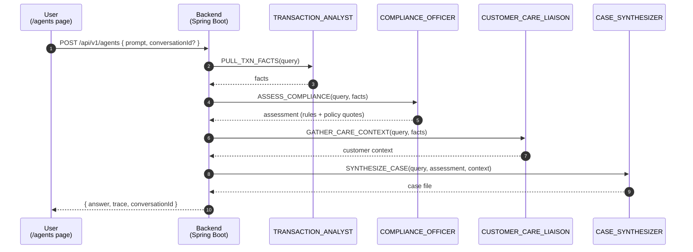
```mermaid
sequenceDiagram
    autonumber
    participant U as User<br/>(/agents page)
    participant B as Backend<br/>(Spring Boot)
    participant T as TRANSACTION_ANALYST
    participant C as COMPLIANCE_OFFICER
    participant L as CUSTOMER_CARE_LIAISON
    participant S as CASE_SYNTHESIZER

    U->>B: POST /api/v1/agents { prompt, conversationId? }
    B->>T: PULL_TXN_FACTS(query)
    T-->>B: facts
    B->>C: ASSESS_COMPLIANCE(query, facts)
    C-->>B: assessment (rules + policy quotes)
    B->>L: GATHER_CARE_CONTEXT(query, facts)
    L-->>B: customer context
    B->>S: SYNTHESIZE_CASE(query, assessment, context)
    S-->>B: case file
    B-->>U: { answer, trace, conversationId }
```

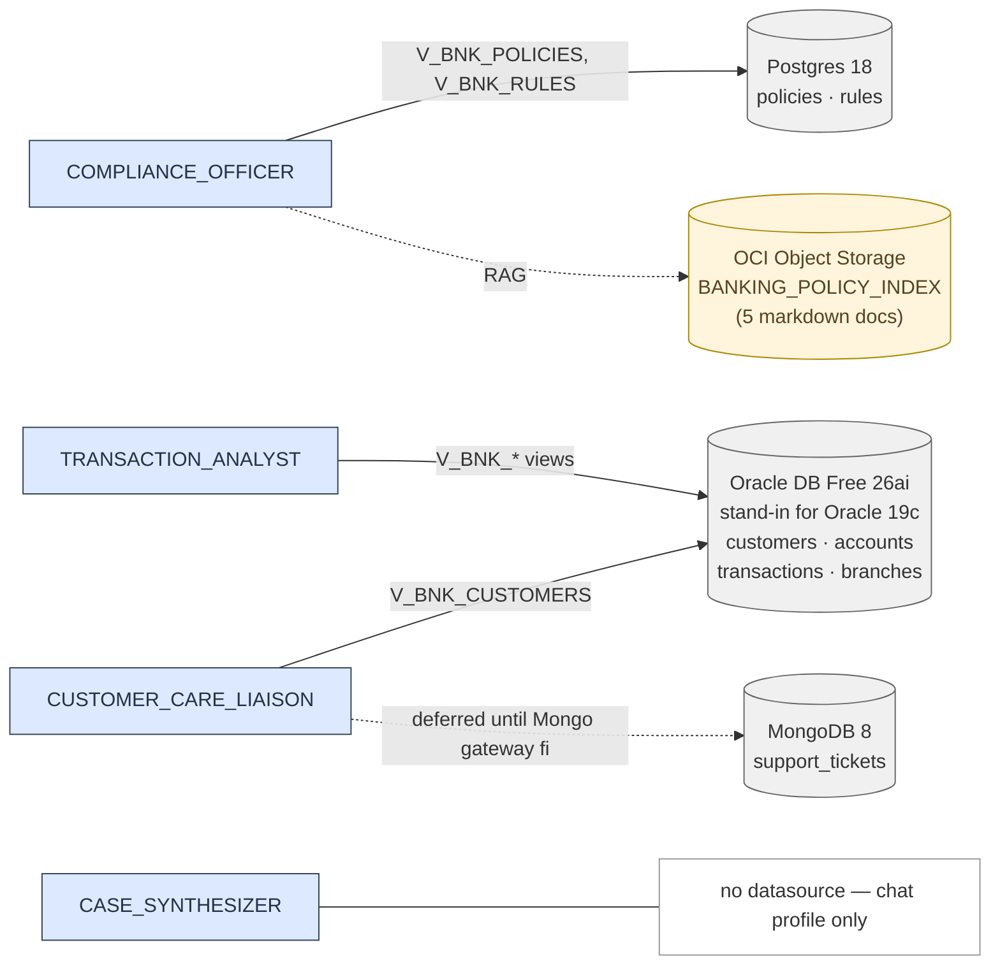
```mermaid
flowchart LR
    classDef def fill:#fff,stroke:#999,color:#333
    classDef agent fill:#dde9ff,stroke:#345,color:#234
    classDef store fill:#f0f0f0,stroke:#666,color:#333
    classDef rag   fill:#fff4dc,stroke:#a80,color:#542

    T[TRANSACTION_ANALYST]:::agent
    C[COMPLIANCE_OFFICER]:::agent
    L[CUSTOMER_CARE_LIAISON]:::agent
    S[CASE_SYNTHESIZER]:::agent

    O[("Oracle DB Free 26ai<br/>stand-in for Oracle 19c<br/>customers · accounts<br/>transactions · branches")]:::store
    P[("Postgres 18<br/>policies · rules")]:::store
    M[("MongoDB 8<br/>support_tickets")]:::store
    R[("OCI Object Storage<br/>BANKING_POLICY_INDEX<br/>(5 markdown docs)")]:::rag

    T -->|V_BNK_* views| O
    C -->|V_BNK_POLICIES, V_BNK_RULES| P
    C -.RAG.-> R
    L -->|V_BNK_CUSTOMERS| O
    L -.deferred until Mongo gateway fix.-> M
    S --- nope[no datasource — chat profile only]:::def
```

**Five demo questions** (clickable chips on the page; each reaches a different combination of agents and tools):

1. _Are there any suspicious patterns on Carol Diaz's accounts this month?_
2. _Bob Chen disputed a $230 charge — what should we do?_
3. _Summarise Alice Morgan's risk profile._
4. _Why is Jamal Reed's checking account frozen?_
5. _What policies apply to international wires above $10K?_

**Mongo support tickets are wired but deferred.** `V_BNK_SUPPORT_TICKETS` is shipped as a commented-out Liquibase changeset; the seed in `database/mongo/init.js` is extended from 4 to ~25 documents so the data is in place. When the heterogeneous-gateway issue (`docs/ISSUE_ADB_HETEROGENEOUS_MONGODB_OBJECT_NOT_FOUND.md`) is resolved, three small Liquibase edits flip the CARE agent online.

### `/measurements` — direct vs federated

Customers asked first about the AI Data Gateway architecture typically ask: _how much does the federated path cost in latency?_ The `/measurements` route answers that directly.

**What is timed.** Exactly one JDBC/Mongo call per measurement, at the backend boundary (`System.nanoTime()` immediately before the call, again immediately after). HTTP handling, JSON serialization, and the measurement-row INSERT are all outside the timed region — the INSERT is fired asynchronously on a dedicated executor so it can't pollute the number.

**Where it lives.** Rows are persisted to `QUERY_MEASUREMENTS` in Autonomous AI Database 26ai. Each row carries `query_id`, `route` (`direct` | `federated`), `elapsed_ms`, `rows_returned`, `success`, `run_id`, and `measured_at`.

**How to read the dashboard.** The summary table shows `n`, mean, and p95 for both routes side by side per query, with a shaded `N` column marking the start of each section. The rightmost `Δ mean (ms)` column is `federated_mean − direct_mean` in absolute ms. Below the table, the distribution chart shows the runtime spread per query for both routes. "Trim outliers (IQR)" is on by default and strips points outside `[Q1 − 1.5·IQR, Q3 + 1.5·IQR]` — without it, rare warm-up runs in the 5000-7000 ms range dominate the Y axis and the boxes collapse to flat lines. Toggle it off if you want to see those outliers.

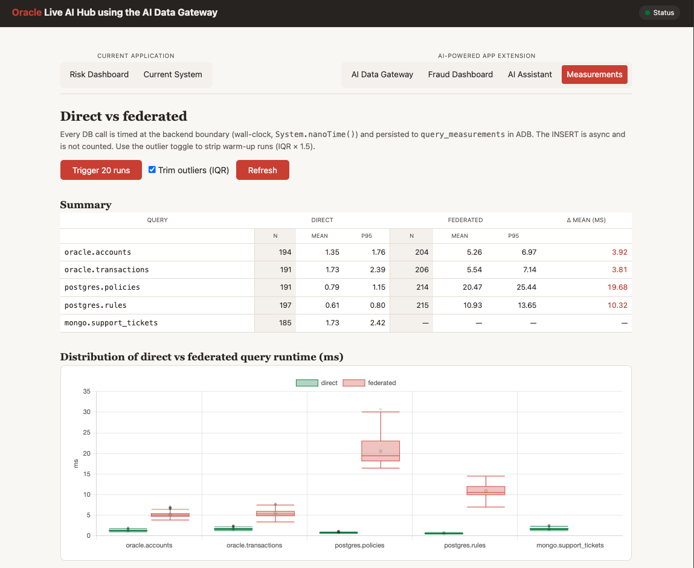

## Architecture

| Tier                            | Component                                 | Subnet                   | Notes                                                                                                                   |
| ------------------------------- | ----------------------------------------- | ------------------------ | ----------------------------------------------------------------------------------------------------------------------- |
| Frontend                        | Angular 21 served by nginx                | private (app)            | Reverse-proxies `/api/*` to back                                                                                        |
| Backend                         | Spring Boot 3.5 / Java 23                 | private (app)            | Holds 4 datasource beans (3 JDBC + Mongo)                                                                               |
| Production workload (simulated) | Podman containers on one compute (4 OCPU) | private (db)             | Oracle Database Free 26ai (stand-in for Oracle 19c), Postgres 18, Mongo 8 — stand-ins for existing production databases |
| AI Data Gateway                 | Autonomous AI Database 26ai (OLTP, ECPU)  | OCI-managed, mTLS wallet | Vector Search, Hybrid Vector Index, Select AI Agent framework — layered over prod via DB_LINK                           |
| Ops                             | Bastion compute (1 OCPU)                  | public                   | OCI Bastion service enabled                                                                                             |
| Edge                            | Flexible Load Balancer                    | public                   | `/api*` → back, default → front                                                                                         |

> _Oracle Database Free 26ai container, used as a stand-in for an existing Oracle 19c production database — Oracle does not ship a free-tier 19c binary; the federated path and demo features are version-agnostic and the same pattern works against any Oracle AI Database (including 19c) minus the vector / RAG functionality._

**`transactions` is a blockchain table.** On the production-side Oracle, the `transactions` table is created as `BLOCKCHAIN TABLE ... HASHING USING SHA2_512`, with `NO DROP UNTIL 0 DAYS IDLE NO DELETE UNTIL 16 DAYS AFTER INSERT`. Every row is hash-chained to the previous row by Oracle, and `DBMS_BLOCKCHAIN_TABLE.VERIFY_ROWS` lets you cryptographically prove the ledger hasn't been tampered with — even by a privileged user with file-system access. The application reads this table the same way as any other (the chain columns are hidden), so the demo's "current app stays" promise holds end-to-end. Caveats inherited from the feature: only single-row INSERT works (no MERGE, no `INSERT /*+ APPEND */`, no distributed-transaction inserts), no UPDATE / DELETE / `ALTER TABLE` shape changes, and chain verification has to run on the production Oracle directly (not via DB_LINK from Autonomous AI Database 26ai).

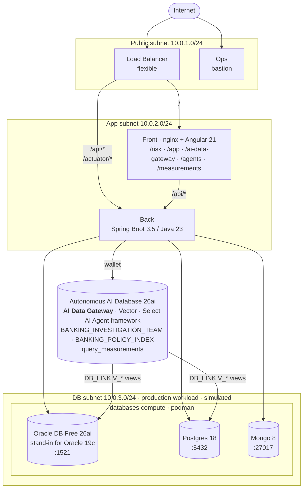
```mermaid
flowchart TB
    internet([Internet])

    subgraph public [Public subnet 10.0.1.0/24]
        lb[Load Balancer<br/>flexible]
        ops[Ops<br/>bastion]
    end

    subgraph appnet [App subnet 10.0.2.0/24]
        front["Front · nginx + Angular 21<br/>/risk · /app · /ai-data-gateway · /agents · /measurements"]
        back[Back<br/>Spring Boot 3.5 / Java 23]
    end

    subgraph dbnet [DB subnet 10.0.3.0/24 · production workload · simulated]
        subgraph databases [databases compute · podman]
            oracle[(Oracle DB Free 26ai<br/>stand-in for Oracle 19c<br/>:1521)]
            postgres[(Postgres 18<br/>:5432)]
            mongo[(Mongo 8<br/>:27017)]
        end
    end

    adb[(Autonomous AI Database 26ai<br/><b>AI Data Gateway</b> · Vector · Select AI Agent framework<br/>BANKING_INVESTIGATION_TEAM · BANKING_POLICY_INDEX<br/>query_measurements)]

    internet --> lb
    internet --> ops
    lb -->|/| front
    lb -->|/api/*<br/>/actuator/*| back
    front -->|/api/*| back
    back -->|wallet| adb
    back --> oracle
    back --> postgres
    back --> mongo
    adb -->|DB_LINK V_* views| oracle
    adb -->|DB_LINK V_* views| postgres
```

## Layout

```
.
├── manage.py                       # Click CLI: setup → build → tf → info → clean
├── requirements.txt
├── deploy/
│   ├── tf/
│   │   ├── app/                   # main.tf, network.tf, lb.tf, storage.tf, artifacts.tf, ...
│   │   └── modules/
│   │       ├── adbs/              # Autonomous AI Database 26ai + wallet
│   │       ├── ops/               # bastion compute + OCI Bastion service
│   │       ├── front/             # nginx + Angular dist
│   │       ├── back/              # Spring Boot jar via systemd
│   │       └── databases/         # podman host with 3 systemd container units
│   └── ansible/
│       ├── ops/                   # roles/base — install jump-host tools
│       ├── front/                 # roles/app  — nginx + reverse proxy
│       ├── back/                  # roles/java — JDK 23 + jar + systemd
│       └── databases/             # roles/podman — 3 container services
├── src/
│   ├── backend/                   # Java 23 / Gradle / Spring Boot 3.5
│   └── frontend/                  # Angular 21
└── database/
    ├── liquibase/{adb,oracle,postgres}/   # YAML changelogs + .properties.j2
    └── mongo/init.js                       # mongosh schema seed
```

## Deploying

End-to-end provisioning, prerequisites, and cleanup live in **[DEPLOY.md](DEPLOY.md)** — virtualenv setup, the `manage.py setup → build → tf → info` flow, the `terraform apply` step, and how to tear everything down.

## More info

- [DEPLOY.md](DEPLOY.md) — provisioning prerequisites, the `manage.py` flow, and cleanup.
- [docs/FEDERATED_QUERIES.md](docs/FEDERATED_QUERIES.md) — the deep dive on how Autonomous AI Database 26ai reaches the Oracle Database Free 26ai stand-in / Postgres / Mongo through `DBMS_CLOUD_ADMIN.CREATE_DATABASE_LINK`, with the two hard requirements (DNS-resolvable hostname, Mongo data outside `admin`) and the `ORA-17008` mid-run recovery path.
- [docs/TROUBLESHOOTING.md](docs/TROUBLESHOOTING.md) — day-two playbook for each tier (ops, databases, back, front) plus how to poke at each database from the ops bastion.
- [docs/ISSUE_AI_AGENT_RUN_TEAM_PG_LINK_WEDGE.md](docs/ISSUE_AI_AGENT_RUN_TEAM_PG_LINK_WEDGE.md) — the two `PG_LINK` heterogeneous-gateway failure modes (5-minute idle drop and the durable AI-agent enumeration wedge), and why `PG_LINK` is not deployed in this repo.
- [docs/ISSUE_ADB_HETEROGENEOUS_MONGODB_OBJECT_NOT_FOUND.md](docs/ISSUE_ADB_HETEROGENEOUS_MONGODB_OBJECT_NOT_FOUND.md) — known issue: the third heterogeneous engine (Mongo via `MONGO_LINK`) is unusable due to a DataDirect ODBC bug.
- [NOTES.md](NOTES.md) — what's intentionally deferred and the iteration roadmap.

### Official Oracle references

- [Use Autonomous AI Database as an AI Proxy for Select AI](https://docs.oracle.com/en/database/oracle/oracle-database/26/selai/select-ai-sidecar-databases.html) — the Oracle Database 26ai Select AI User's Guide page that defines the AI Proxy Database pattern this repo demonstrates as a Live AI Hub using the AI Data Gateway.
- [Use an AI Proxy Database for Select AI NL2SQL](https://docs.oracle.com/en-us/iaas/autonomous-database-serverless/doc/select-ai-dblinks.html) — the same pattern in the ADB Serverless docs, with the explicit list of supported heterogeneous engines.
- [Select AI Proxy Integration release note (January 2026)](https://docs.oracle.com/en-us/iaas/releasenotes/autonomous-database-serverless/2026-01-selectai-proxy-int.htm) — when the AI Proxy terminology landed in ADB Serverless.
- [Unlocking Data for All with Sidecar — Oracle Autonomous AI Database blog](https://blogs.oracle.com/autonomous-ai-database/unlocking-data-for-all-with-sidecar-empowering-business-users-with-aidriven-insights) — narrative framing of the pattern for a less technical audience.
