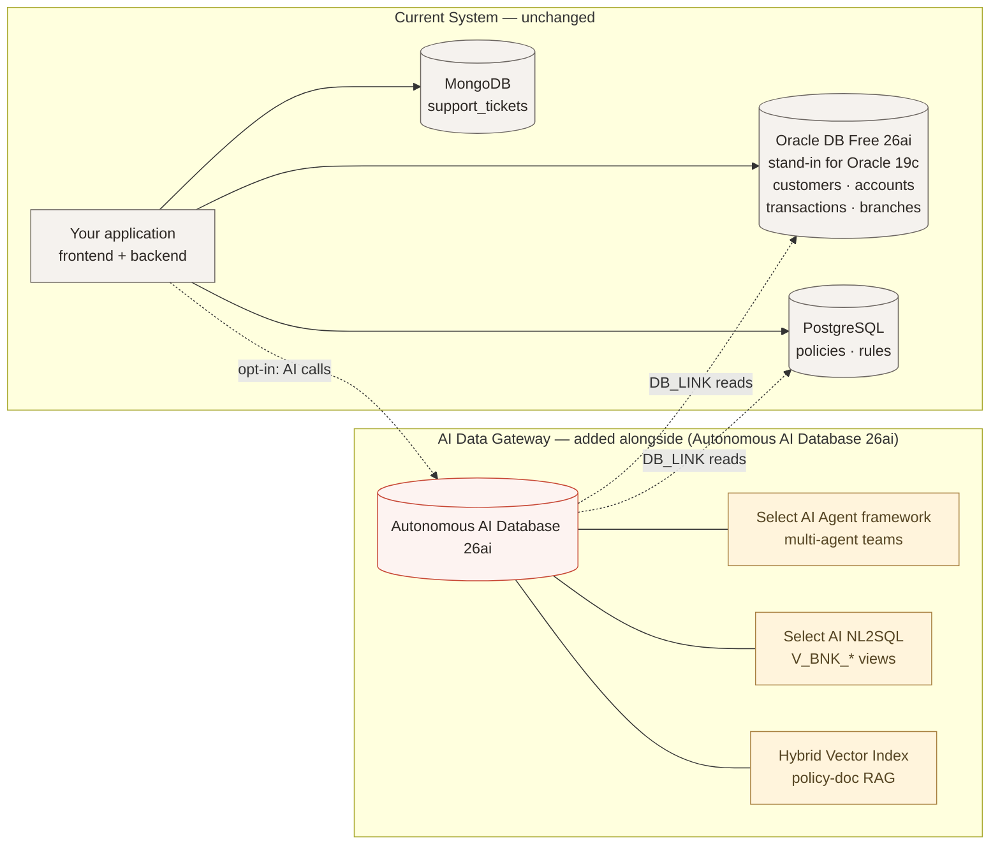

# Live AI Hub using the AI Data Gateway


**Keep your current app. Keep your current databases and their lifecycle. Attach
Autonomous AI Database 26ai as the AI Data Gateway, layer AI features on top, and
consolidate datasources on your own schedule.**

A working deployment of the **AI Data Gateway** pattern — the AI Proxy Database
pattern in the Oracle Database 26ai Select AI User's Guide. An Autonomous AI
Database 26ai instance is attached alongside the production databases and reaches
into them through `DBMS_CLOUD_ADMIN.CREATE_DATABASE_LINK`, exposing `V_BNK_*`
views that Select AI runs NL2SQL over. On top of the documented NL2SQL pattern
the demo adds a vector-RAG index and an agent team built with the Select AI Agent
framework (`DBMS_CLOUD_AI_AGENT.RUN_TEAM`).

The pattern works against any Oracle AI Database, including 19c, minus the vector
and RAG functionality; only the demo requires 26ai for the vector and agent
surfaces.

## What stays. What's added.

The whole point is that the box on top does not change to get the box at the
bottom. The application keeps its existing connections to the production
databases; the gateway is bolted on alongside and reaches the same data through
`DB_LINK` views.

This is a stepping stone, not an end state. It buys time: ship AI-powered
features against live data — fraud screening, natural-language analytics,
agent-driven investigations — while the current system follows its own migration
runway on whatever timeline the business can absorb. No big-bang re-platform, no
parallel rewrite, no application freeze.


```mermaid
flowchart LR
    classDef existing fill:#F5F2EE,stroke:#6B6560,color:#2C2723
    classDef gateway  fill:#FDF3F1,stroke:#C74634,color:#2C2723
    classDef ai       fill:#FFF4DC,stroke:#A88040,color:#542

    subgraph current ["Current System — unchanged"]
        direction TB
        app[Your application<br/>frontend + backend]:::existing
        oracle[(Oracle DB Free 26ai<br/>stand-in for Oracle 19c<br/>customers · accounts<br/>transactions · branches)]:::existing
        postgres[(PostgreSQL<br/>policies · rules)]:::existing
        mongo[(MongoDB<br/>support_tickets)]:::existing
        app --> oracle
        app --> postgres
        app --> mongo
    end

    subgraph gatewaybox ["AI Data Gateway — added alongside (Autonomous AI Database 26ai)"]
        direction TB
        adb[(Autonomous AI Database 26ai)]:::gateway
        agents[Select AI Agent framework<br/>multi-agent teams]:::ai
        nl2sql[Select AI NL2SQL<br/>V_BNK_* views]:::ai
        rag[Hybrid Vector Index<br/>policy-doc RAG]:::ai
        adb --- agents
        adb --- nl2sql
        adb --- rag
    end

    app -. opt-in: AI calls .-> adb
    adb -. DB_LINK reads .-> oracle
    adb -. DB_LINK reads .-> postgres
```

## The six screens

One banking dataset, six routes over it. [`DEMO.md`](DEMO.md) walks all six with
screenshots.

| Route              | What it shows                                                                       |
| ------------------ | ----------------------------------------------------------------------------------- |
| `/risk`            | Compliance dashboard off the production databases only — no gateway in the loop     |
| `/fraud`           | Cycle, fan-out, and structuring detection via SQL Property Graph on the gateway     |
| `/app`             | The backend's direct JDBC/Mongo connections — today's baseline, with latency badges |
| `/ai-data-gateway` | The same five cards routed through the gateway's `DB_LINK` views                    |
| `/agents`          | A four-agent investigation team running inside the database via `RUN_TEAM`          |
| `/measurements`    | Direct versus federated wall-clock latency, with distribution and p95               |

## Architecture


```mermaid
flowchart TB
    internet([Internet])

    subgraph public [Public subnet 10.0.1.0/24]
        lb[Load Balancer<br/>flexible]
        ops[Ops<br/>bastion]
    end

    subgraph appnet [App subnet 10.0.2.0/24]
        frontend["Frontend · nginx + Angular 21<br/>/risk · /fraud · /app · /ai-data-gateway · /agents · /measurements"]
        backend[Backend<br/>Spring Boot 3.5 / Java 23]
    end

    subgraph dbnet [DB subnet 10.0.3.0/24 · production workload · simulated]
        subgraph databases [databases compute · podman]
            oracle[(Oracle DB Free 26ai<br/>stand-in for Oracle 19c<br/>:1521)]
            postgres[(Postgres 18<br/>:5432)]
            mongo[(Mongo 8<br/>:27017)]
        end
    end

    adb[(Autonomous AI Database 26ai<br/><b>AI Data Gateway</b> · Vector · Select AI Agent framework<br/>BANKING_INVESTIGATION_TEAM · BANKING_POLICY_INDEX<br/>query_measurements)]

    internet --> lb
    internet --> ops
    lb -->|/| frontend
    lb -->|/api/*<br/>/actuator/*| backend
    frontend -->|/api/*| backend
    backend -->|wallet| adb
    backend --> oracle
    backend --> postgres
    backend --> mongo
    adb -->|DB_LINK V_BNK_* views| oracle
    adb -->|DB_LINK V_BNK_* views| postgres
```

Tier-by-tier detail and the reasoning behind each choice are in
[`DESIGN.md`](DESIGN.md).

## Layout

```
manage.py                 CLI: setup, build, provision, status, reset, clean
deploy/
  terraform/              OCI stack — VCN, ADB 26ai, 4 computes, LB, Object Storage
    modules/adbs/         Autonomous AI Database 26ai + wallet
    modules/ops/          Bastion compute + OCI Bastion service
    modules/frontend/     nginx + Angular dist
    modules/backend/      Spring Boot jar via systemd
    modules/databases/    Podman host with 3 systemd container units
  ansible/                One playbook per tier, run locally by cloud-init
    ops/opstools/         Jump-host tools, SQLcl, Liquibase for all four engines
    frontend/webstack/    nginx + SPA
    backend/appstack/     JDK 23 + jar + systemd
    databases/dbstack/    Oracle Free 26ai, PostgreSQL 18, MongoDB 8 containers
src/
  backend/                Java 23 / Gradle / Spring Boot 3.5
  frontend/               Angular 21
database/
  liquibase/{adb,oracle,postgres}/   YAML changelogs + liquibase.properties.j2
  mongo/init.js                       mongosh schema seed
  banking-policy-docs/                Markdown policy docs behind the RAG index
```

## Getting started

Follow [`DEPLOY.md`](DEPLOY.md): prerequisites (including the tenancy IAM
rights Terraform needs to create the gateway's resource-principal grants), then
the `manage.py` verbs in order — `setup` → `build` → `provision` → `status` — with `reset` to
re-run database provisioning and `clean` to tear everything down.

## Documentation map

- [DEPLOY.md](DEPLOY.md) — the runbook: prerequisites and what each `manage.py`
  command does.
- [DEMO.md](DEMO.md) — the demo narrative and all six screens, in presentation
  order.
- [REFERENCE.md](REFERENCE.md) — portable field guide to each Oracle building
  block: the real DDL and how to port it to another domain.
- [DESIGN.md](DESIGN.md) — tiers, decisions, and the constraints behind them.
- [BACKLOG.md](BACKLOG.md) — unbuilt slices, each a self-contained addition.
- [docs/](docs/README.md) — deep dives: federated queries, troubleshooting,
  known gateway limitations.

## Official Oracle references

- [Use Autonomous AI Database as an AI Proxy for Select AI](https://docs.oracle.com/en/database/oracle/oracle-database/26/selai/select-ai-sidecar-databases.html)
  — the Select AI User's Guide page that defines the pattern this repo
  demonstrates.
- [Use an AI Proxy Database for Select AI NL2SQL](https://docs.oracle.com/en-us/iaas/autonomous-database-serverless/doc/select-ai-dblinks.html)
  — the same pattern in the ADB Serverless docs, with the supported
  heterogeneous engines.
- [Select AI Proxy Integration release note (January 2026)](https://docs.oracle.com/en-us/iaas/releasenotes/autonomous-database-serverless/2026-01-selectai-proxy-int.htm)
- [Unlocking Data for All with Sidecar](https://blogs.oracle.com/autonomous-ai-database/unlocking-data-for-all-with-sidecar-empowering-business-users-with-aidriven-insights)
  — narrative framing of the pattern for a less technical audience.
