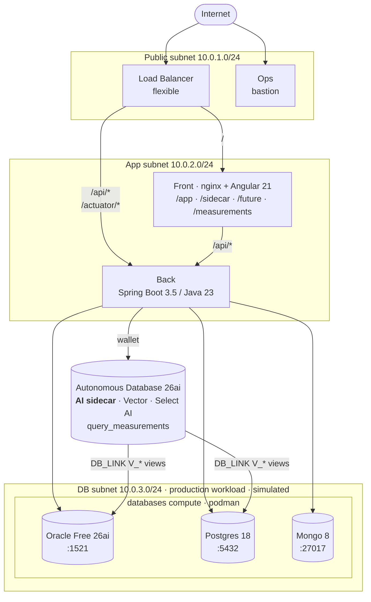

# Three-route UI + direct-vs-federated measurements — Implementation Plan

> **For agentic workers:** REQUIRED SUB-SKILL: Use superpowers:subagent-driven-development (recommended) or superpowers:executing-plans to implement this plan task-by-task. Steps use checkbox (`- [ ]`) syntax for tracking.

**Goal:** Reframe the UI around 4 routes (`/app`, `/sidecar`, `/future`, `/measurements`), time every DB call at the backend boundary, and persist measurements to ADB for a performance dashboard that answers the "federated is slower — by how much?" question.

**Architecture:** Spring Boot backend gets a parameterized `GET /api/v1/query?table=&route=&runId=` that times exactly one JDBC/Mongo call with `System.nanoTime()` and asynchronously inserts a row into `QUERY_MEASUREMENTS` on ADB. Angular 21 frontend splits the current single page into 4 routes, fans each click into parallel per-table HTTP requests, and renders a performance-engineer dashboard (summary + box plots + time-series scatter) via ng2-charts.

**Tech Stack:** Spring Boot 3.5 / Java 23, Angular 21 (standalone, signals), Liquibase, ng2-charts + chart.js + @sgratzl/chartjs-chart-boxplot, Oracle ADB 26ai, PostgreSQL 18, MongoDB 8.

**Project ethos (from `~/.claude/CLAUDE.md`):** POC. Simple, direct, no premature abstraction. No formal unit tests — verification is curl + browser + SQL, matching the existing project style.

**Source spec:** [`docs/superpowers/specs/2026-04-20-three-route-ui-measurements-design.md`](../specs/2026-04-20-three-route-ui-measurements-design.md)

---

## File layout

### Backend — new

- `src/backend/src/main/java/dev/victormartin/adbsidecar/back/config/AsyncConfig.java` — `@EnableAsync` + dedicated `measurementExecutor` bean.
- `src/backend/src/main/java/dev/victormartin/adbsidecar/back/measurement/QueryMeasurement.java` — immutable record carrying one measurement row.
- `src/backend/src/main/java/dev/victormartin/adbsidecar/back/measurement/MeasurementRecorder.java` — `@Async` INSERT-only component.
- `src/backend/src/main/java/dev/victormartin/adbsidecar/back/query/QueryResult.java` — immutable record for rows + timing + error.
- `src/backend/src/main/java/dev/victormartin/adbsidecar/back/query/QueryExecutor.java` — maps `(table, route)` → timed call, returns `QueryResult`.
- `src/backend/src/main/java/dev/victormartin/adbsidecar/back/controller/QueryController.java` — `GET /api/v1/query`.
- `src/backend/src/main/java/dev/victormartin/adbsidecar/back/controller/MeasurementsController.java` — `GET /api/v1/measurements`, `/api/v1/measurements/series`.

### Backend — delete

- `src/backend/src/main/java/dev/victormartin/adbsidecar/back/controller/VersionsController.java`

### Database — new / modified

- `database/liquibase/adb/003-measurements.yaml` — new changelog with `QUERY_MEASUREMENTS` table and index.
- `database/liquibase/adb/db.changelog-master.yaml` — append include for `003-measurements.yaml`.

### Frontend — new

- `src/frontend/src/app/nav/nav.component.ts` — top nav bar, 4 links.
- `src/frontend/src/app/query.service.ts` — `run(table, route, runId)` + `triggerRuns(n)` helpers.
- `src/frontend/src/app/measurements.service.ts` — aggregate + series fetchers.
- `src/frontend/src/app/card/card.component.ts` — loading-state entity card with ms badge.
- `src/frontend/src/app/pages/app-page.component.ts` — `/app`.
- `src/frontend/src/app/pages/sidecar-page.component.ts` — `/sidecar`.
- `src/frontend/src/app/pages/future-page.component.ts` — `/future`.
- `src/frontend/src/app/pages/measurements-page.component.ts` — `/measurements`.

### Frontend — delete

- `src/frontend/src/app/versions/versions.component.ts`
- `src/frontend/src/app/versions.service.ts`

### Frontend — modified

- `src/frontend/src/app/app.routes.ts` — new route set.
- `src/frontend/src/app/app.ts` — mount nav + `<router-outlet>`.
- `src/frontend/src/app/app.config.ts` — register Chart.js + boxplot plugin.
- `src/frontend/package.json` — add chart libs.

### Root — modified

- `README.md` — new framing, new diagram, new sections, updated endpoints.

---

## Task 1: Create `QUERY_MEASUREMENTS` table via Liquibase

**Files:**

- Create: `database/liquibase/adb/003-measurements.yaml`
- Modify: `database/liquibase/adb/db.changelog-master.yaml`

- [ ] **Step 1: Create the changelog**

Create `database/liquibase/adb/003-measurements.yaml`:

```yaml
databaseChangeLog:
  - changeSet:
      id: adb-003-table-measurements
      author: adbsidecar
      changes:
        - sql:
            endDelimiter: "/"
            splitStatements: false
            sql: |
              CREATE TABLE query_measurements (
                id              NUMBER GENERATED ALWAYS AS IDENTITY PRIMARY KEY,
                query_id        VARCHAR2(64)  NOT NULL,
                route           VARCHAR2(16)  NOT NULL,
                elapsed_ms      NUMBER(10,3)  NOT NULL,
                rows_returned   NUMBER        NOT NULL,
                success         NUMBER(1)     NOT NULL,
                error_class     VARCHAR2(128),
                measured_at     TIMESTAMP WITH TIME ZONE DEFAULT SYSTIMESTAMP NOT NULL,
                run_id          VARCHAR2(36)  NOT NULL,
                CONSTRAINT qm_route_ck   CHECK (route IN ('direct','federated')),
                CONSTRAINT qm_success_ck CHECK (success IN (0,1))
              )
              /
      rollback:
        - sql:
            sql: DROP TABLE query_measurements

  - changeSet:
      id: adb-003-index-measurements
      author: adbsidecar
      changes:
        - sql:
            sql: CREATE INDEX qm_lookup_ix ON query_measurements (query_id, route, measured_at DESC)
      rollback:
        - sql:
            sql: DROP INDEX qm_lookup_ix
```

- [ ] **Step 2: Register in master changelog**

Edit `database/liquibase/adb/db.changelog-master.yaml`. Current contents:

```yaml
databaseChangeLog:
  - include:
      file: 001-init.yaml
      relativeToChangelogFile: true
  - include:
      file: 002-db-links.yaml
      relativeToChangelogFile: true
```

Append:

```yaml
- include:
    file: 003-measurements.yaml
    relativeToChangelogFile: true
```

- [ ] **Step 3: Commit**

```bash
git add database/liquibase/adb/003-measurements.yaml database/liquibase/adb/db.changelog-master.yaml
git commit -m "feat(adb): add query_measurements table"
```

---

## Task 2: Add async executor configuration

**Files:**

- Create: `src/backend/src/main/java/dev/victormartin/adbsidecar/back/config/AsyncConfig.java`

- [ ] **Step 1: Write the bean**

Create `src/backend/src/main/java/dev/victormartin/adbsidecar/back/config/AsyncConfig.java`:

```java
package dev.victormartin.adbsidecar.back.config;

import org.springframework.context.annotation.Bean;
import org.springframework.context.annotation.Configuration;
import org.springframework.scheduling.annotation.EnableAsync;
import org.springframework.scheduling.concurrent.ThreadPoolTaskExecutor;

@Configuration
@EnableAsync
public class AsyncConfig {

    @Bean(name = "measurementExecutor")
    public ThreadPoolTaskExecutor measurementExecutor() {
        ThreadPoolTaskExecutor ex = new ThreadPoolTaskExecutor();
        ex.setCorePoolSize(2);
        ex.setMaxPoolSize(2);
        ex.setQueueCapacity(200);
        ex.setThreadNamePrefix("measure-");
        ex.initialize();
        return ex;
    }
}
```

- [ ] **Step 2: Build to verify it compiles**

```bash
cd src/backend && ./gradlew build -x test
```

Expected: `BUILD SUCCESSFUL`.

- [ ] **Step 3: Commit**

```bash
git add src/backend/src/main/java/dev/victormartin/adbsidecar/back/config/AsyncConfig.java
git commit -m "feat(back): add async executor for measurement inserts"
```

---

## Task 3: Measurement recorder (async INSERT)

**Files:**

- Create: `src/backend/src/main/java/dev/victormartin/adbsidecar/back/measurement/QueryMeasurement.java`
- Create: `src/backend/src/main/java/dev/victormartin/adbsidecar/back/measurement/MeasurementRecorder.java`

- [ ] **Step 1: Create the record**

Create `src/backend/src/main/java/dev/victormartin/adbsidecar/back/measurement/QueryMeasurement.java`:

```java
package dev.victormartin.adbsidecar.back.measurement;

public record QueryMeasurement(
        String queryId,
        String route,
        double elapsedMs,
        int rowsReturned,
        boolean success,
        String errorClass,
        String runId) {
}
```

- [ ] **Step 2: Create the recorder**

Create `src/backend/src/main/java/dev/victormartin/adbsidecar/back/measurement/MeasurementRecorder.java`:

```java
package dev.victormartin.adbsidecar.back.measurement;

import org.slf4j.Logger;
import org.slf4j.LoggerFactory;
import org.springframework.beans.factory.annotation.Qualifier;
import org.springframework.jdbc.core.JdbcTemplate;
import org.springframework.scheduling.annotation.Async;
import org.springframework.stereotype.Component;

@Component
public class MeasurementRecorder {

    private static final Logger log = LoggerFactory.getLogger(MeasurementRecorder.class);

    private static final String INSERT_SQL = """
            INSERT INTO query_measurements
              (query_id, route, elapsed_ms, rows_returned, success, error_class, run_id)
            VALUES (?, ?, ?, ?, ?, ?, ?)
            """;

    private final JdbcTemplate adbJdbc;

    public MeasurementRecorder(@Qualifier("adbJdbc") JdbcTemplate adbJdbc) {
        this.adbJdbc = adbJdbc;
    }

    @Async("measurementExecutor")
    public void record(QueryMeasurement m) {
        try {
            adbJdbc.update(INSERT_SQL,
                    m.queryId(),
                    m.route(),
                    m.elapsedMs(),
                    m.rowsReturned(),
                    m.success() ? 1 : 0,
                    m.errorClass(),
                    m.runId());
        } catch (Exception e) {
            log.warn("measurement insert failed: {}", e.getMessage());
        }
    }
}
```

- [ ] **Step 3: Build**

```bash
cd src/backend && ./gradlew build -x test
```

Expected: `BUILD SUCCESSFUL`.

- [ ] **Step 4: Commit**

```bash
git add src/backend/src/main/java/dev/victormartin/adbsidecar/back/measurement
git commit -m "feat(back): add async measurement recorder"
```

---

## Task 4: Query executor (timed JDBC / Mongo calls)

**Files:**

- Create: `src/backend/src/main/java/dev/victormartin/adbsidecar/back/query/QueryResult.java`
- Create: `src/backend/src/main/java/dev/victormartin/adbsidecar/back/query/QueryExecutor.java`

- [ ] **Step 1: Create `QueryResult`**

Create `src/backend/src/main/java/dev/victormartin/adbsidecar/back/query/QueryResult.java`:

```java
package dev.victormartin.adbsidecar.back.query;

import java.util.List;
import java.util.Map;

public record QueryResult(
        List<Map<String, Object>> rows,
        int rowsReturned,
        double elapsedMs,
        boolean success,
        String errorClass,
        String errorMessage) {

    public static QueryResult success(List<Map<String, Object>> rows, double elapsedMs) {
        return new QueryResult(rows, rows.size(), elapsedMs, true, null, null);
    }

    public static QueryResult failure(Exception e, double elapsedMs) {
        return new QueryResult(List.of(), 0, elapsedMs, false,
                e.getClass().getSimpleName(), e.getMessage());
    }
}
```

- [ ] **Step 2: Create `QueryExecutor`**

Create `src/backend/src/main/java/dev/victormartin/adbsidecar/back/query/QueryExecutor.java`:

```java
package dev.victormartin.adbsidecar.back.query;

import java.util.ArrayList;
import java.util.List;
import java.util.Map;

import org.bson.Document;
import org.springframework.beans.factory.annotation.Qualifier;
import org.springframework.data.mongodb.core.MongoTemplate;
import org.springframework.jdbc.core.JdbcTemplate;
import org.springframework.stereotype.Service;

@Service
public class QueryExecutor {

    private final JdbcTemplate adbJdbc;
    private final JdbcTemplate oracleJdbc;
    private final JdbcTemplate postgresJdbc;
    private final MongoTemplate mongo;

    public QueryExecutor(
            @Qualifier("adbJdbc") JdbcTemplate adbJdbc,
            @Qualifier("oracleJdbc") JdbcTemplate oracleJdbc,
            @Qualifier("postgresJdbc") JdbcTemplate postgresJdbc,
            MongoTemplate mongo) {
        this.adbJdbc = adbJdbc;
        this.oracleJdbc = oracleJdbc;
        this.postgresJdbc = postgresJdbc;
        this.mongo = mongo;
    }

    public static String queryIdFor(String table) {
        return switch (table) {
            case "accounts", "transactions" -> "oracle." + table;
            case "policies", "rules"        -> "postgres." + table;
            case "support_tickets"          -> "mongo.support_tickets";
            default -> throw new IllegalArgumentException("unknown table: " + table);
        };
    }

    public QueryResult run(String table, String route) {
        long t0 = System.nanoTime();
        try {
            List<Map<String, Object>> rows = call(table, route);
            double elapsed = (System.nanoTime() - t0) / 1_000_000.0;
            return QueryResult.success(rows, elapsed);
        } catch (Exception e) {
            double elapsed = (System.nanoTime() - t0) / 1_000_000.0;
            return QueryResult.failure(e, elapsed);
        }
    }

    private List<Map<String, Object>> call(String table, String route) {
        boolean federated = "federated".equals(route);
        return switch (table) {
            case "accounts" -> federated
                    ? adbJdbc.queryForList(
                            "SELECT id, customer_name, balance FROM V_ACCOUNTS ORDER BY id")
                    : oracleJdbc.queryForList(
                            "SELECT id, customer_name, balance FROM accounts ORDER BY id");
            case "transactions" -> federated
                    ? adbJdbc.queryForList(
                            "SELECT id, account_id, amount, tx_date FROM V_TRANSACTIONS ORDER BY id")
                    : oracleJdbc.queryForList(
                            "SELECT id, account_id, amount, tx_date FROM transactions ORDER BY id");
            case "policies" -> federated
                    ? adbJdbc.queryForList(
                            "SELECT id, name, description FROM V_POLICIES ORDER BY id")
                    : postgresJdbc.queryForList(
                            "SELECT id, name, description FROM policies ORDER BY id");
            case "rules" -> federated
                    ? adbJdbc.queryForList(
                            "SELECT id, policy_id, expression FROM V_RULES ORDER BY id")
                    : postgresJdbc.queryForList(
                            "SELECT id, policy_id, expression FROM rules ORDER BY id");
            case "support_tickets" -> {
                if (federated) {
                    throw new UnsupportedOperationException(
                            "support_tickets federated is not supported; see docs");
                }
                List<Document> docs = mongo.findAll(Document.class, "support_tickets");
                docs.forEach(d -> d.remove("_id"));
                yield new ArrayList<>(docs);
            }
            default -> throw new IllegalArgumentException("unknown table: " + table);
        };
    }
}
```

- [ ] **Step 3: Build**

```bash
cd src/backend && ./gradlew build -x test
```

Expected: `BUILD SUCCESSFUL`.

- [ ] **Step 4: Commit**

```bash
git add src/backend/src/main/java/dev/victormartin/adbsidecar/back/query
git commit -m "feat(back): add query executor with wall-clock timing"
```

---

## Task 5: Query controller + delete VersionsController

**Files:**

- Create: `src/backend/src/main/java/dev/victormartin/adbsidecar/back/controller/QueryController.java`
- Delete: `src/backend/src/main/java/dev/victormartin/adbsidecar/back/controller/VersionsController.java`

- [ ] **Step 1: Create `QueryController`**

Create `src/backend/src/main/java/dev/victormartin/adbsidecar/back/controller/QueryController.java`:

```java
package dev.victormartin.adbsidecar.back.controller;

import java.util.LinkedHashMap;
import java.util.Map;

import org.springframework.http.ResponseEntity;
import org.springframework.web.bind.annotation.GetMapping;
import org.springframework.web.bind.annotation.RequestMapping;
import org.springframework.web.bind.annotation.RequestParam;
import org.springframework.web.bind.annotation.RestController;

import dev.victormartin.adbsidecar.back.measurement.MeasurementRecorder;
import dev.victormartin.adbsidecar.back.measurement.QueryMeasurement;
import dev.victormartin.adbsidecar.back.query.QueryExecutor;
import dev.victormartin.adbsidecar.back.query.QueryResult;

@RestController
@RequestMapping("/api/v1")
public class QueryController {

    private final QueryExecutor executor;
    private final MeasurementRecorder recorder;

    public QueryController(QueryExecutor executor, MeasurementRecorder recorder) {
        this.executor = executor;
        this.recorder = recorder;
    }

    @GetMapping("/query")
    public ResponseEntity<Map<String, Object>> query(
            @RequestParam String table,
            @RequestParam String route,
            @RequestParam String runId) {

        if ("support_tickets".equals(table) && "federated".equals(route)) {
            Map<String, Object> body = Map.of("error",
                    "Not available via sidecar — see docs/ISSUE_ADB_HETEROGENEOUS_MONGODB_OBJECT_NOT_FOUND.md");
            return ResponseEntity.status(501).body(body);
        }

        QueryResult result = executor.run(table, route);

        recorder.record(new QueryMeasurement(
                QueryExecutor.queryIdFor(table),
                route,
                result.elapsedMs(),
                result.rowsReturned(),
                result.success(),
                result.errorClass(),
                runId));

        Map<String, Object> body = new LinkedHashMap<>();
        body.put("rows", result.rows());
        body.put("rowsReturned", result.rowsReturned());
        body.put("elapsedMs", result.elapsedMs());
        if (!result.success()) {
            body.put("error", result.errorMessage());
        }
        return ResponseEntity.ok(body);
    }
}
```

- [ ] **Step 2: Delete `VersionsController`**

```bash
rm src/backend/src/main/java/dev/victormartin/adbsidecar/back/controller/VersionsController.java
```

- [ ] **Step 3: Build**

```bash
cd src/backend && ./gradlew build -x test
```

Expected: `BUILD SUCCESSFUL`.

- [ ] **Step 4: Commit**

```bash
git add src/backend/src/main/java/dev/victormartin/adbsidecar/back/controller
git commit -m "feat(back): add /api/v1/query, remove legacy /demo endpoints"
```

---

## Task 6: Measurements controller — aggregates and series

**Files:**

- Create: `src/backend/src/main/java/dev/victormartin/adbsidecar/back/controller/MeasurementsController.java`

- [ ] **Step 1: Create the controller**

Create `src/backend/src/main/java/dev/victormartin/adbsidecar/back/controller/MeasurementsController.java`:

```java
package dev.victormartin.adbsidecar.back.controller;

import java.util.List;
import java.util.Map;

import org.springframework.beans.factory.annotation.Qualifier;
import org.springframework.jdbc.core.JdbcTemplate;
import org.springframework.web.bind.annotation.GetMapping;
import org.springframework.web.bind.annotation.RequestMapping;
import org.springframework.web.bind.annotation.RequestParam;
import org.springframework.web.bind.annotation.RestController;

@RestController
@RequestMapping("/api/v1/measurements")
public class MeasurementsController {

    private static final String AGG_RAW = """
            SELECT
              query_id      AS "queryId",
              route         AS "route",
              COUNT(*)      AS "count",
              AVG(elapsed_ms)   AS "mean",
              MEDIAN(elapsed_ms) AS "median",
              PERCENTILE_CONT(0.95) WITHIN GROUP (ORDER BY elapsed_ms) AS "p95",
              PERCENTILE_CONT(0.99) WITHIN GROUP (ORDER BY elapsed_ms) AS "p99",
              STDDEV(elapsed_ms) AS "stddev",
              MIN(elapsed_ms)    AS "min",
              MAX(elapsed_ms)    AS "max"
            FROM query_measurements
            WHERE success = 1
            GROUP BY query_id, route
            ORDER BY query_id, route
            """;

    private static final String AGG_IQR = """
            WITH q AS (
              SELECT query_id, route, elapsed_ms,
                     PERCENTILE_CONT(0.25) WITHIN GROUP (ORDER BY elapsed_ms)
                       OVER (PARTITION BY query_id, route) AS q1,
                     PERCENTILE_CONT(0.75) WITHIN GROUP (ORDER BY elapsed_ms)
                       OVER (PARTITION BY query_id, route) AS q3
              FROM query_measurements
              WHERE success = 1
            ),
            trimmed AS (
              SELECT query_id, route, elapsed_ms
              FROM q
              WHERE elapsed_ms BETWEEN q1 - 1.5 * (q3 - q1) AND q3 + 1.5 * (q3 - q1)
            )
            SELECT
              query_id      AS "queryId",
              route         AS "route",
              COUNT(*)      AS "count",
              AVG(elapsed_ms)    AS "mean",
              MEDIAN(elapsed_ms) AS "median",
              PERCENTILE_CONT(0.95) WITHIN GROUP (ORDER BY elapsed_ms) AS "p95",
              PERCENTILE_CONT(0.99) WITHIN GROUP (ORDER BY elapsed_ms) AS "p99",
              STDDEV(elapsed_ms) AS "stddev",
              MIN(elapsed_ms)    AS "min",
              MAX(elapsed_ms)    AS "max"
            FROM trimmed
            GROUP BY query_id, route
            ORDER BY query_id, route
            """;

    private static final String SERIES = """
            SELECT
              TO_CHAR(measured_at AT TIME ZONE 'UTC',
                      'YYYY-MM-DD"T"HH24:MI:SS.FF3"Z"') AS "measuredAt",
              elapsed_ms   AS "elapsedMs",
              rows_returned AS "rowsReturned",
              success      AS "success",
              run_id       AS "runId"
            FROM (
              SELECT *
              FROM query_measurements
              WHERE query_id = ? AND route = ?
              ORDER BY measured_at DESC
              FETCH FIRST ? ROWS ONLY
            )
            ORDER BY "measuredAt"
            """;

    private final JdbcTemplate adbJdbc;

    public MeasurementsController(@Qualifier("adbJdbc") JdbcTemplate adbJdbc) {
        this.adbJdbc = adbJdbc;
    }

    @GetMapping
    public List<Map<String, Object>> aggregate(
            @RequestParam(defaultValue = "none") String trim) {
        String sql = "iqr".equalsIgnoreCase(trim) ? AGG_IQR : AGG_RAW;
        return adbJdbc.queryForList(sql);
    }

    @GetMapping("/series")
    public List<Map<String, Object>> series(
            @RequestParam String queryId,
            @RequestParam String route,
            @RequestParam(defaultValue = "200") int limit) {
        int capped = Math.max(1, Math.min(limit, 1000));
        return adbJdbc.queryForList(SERIES, queryId, route, capped);
    }
}
```

- [ ] **Step 2: Build**

```bash
cd src/backend && ./gradlew build -x test
```

Expected: `BUILD SUCCESSFUL`.

- [ ] **Step 3: Commit**

```bash
git add src/backend/src/main/java/dev/victormartin/adbsidecar/back/controller/MeasurementsController.java
git commit -m "feat(back): add /api/v1/measurements aggregate + series endpoints"
```

---

## Task 7: Verify backend end-to-end

Spin up a fresh deploy (or re-deploy if one exists) and exercise every new endpoint.

- [ ] **Step 1: Re-deploy**

From the repo root, with the venv active:

```bash
python manage.py build
python manage.py tf
cd deploy/tf/app && terraform apply tfplan
cd ../../..
```

Wait for cloud-init (~5 min) then grab the LB IP:

```bash
python manage.py info
```

Export for convenience:

```bash
export LB=<lb_public_ip>
```

- [ ] **Step 2: Hit every valid `(table, route)` combo**

```bash
export RUN=$(uuidgen)
for t in accounts transactions policies rules support_tickets; do
  curl -s "http://$LB/api/v1/query?table=$t&route=direct&runId=$RUN" | head -c 200
  echo
done
for t in accounts transactions policies rules; do
  curl -s "http://$LB/api/v1/query?table=$t&route=federated&runId=$RUN" | head -c 200
  echo
done
```

Expected: each response starts with `{"rows":[...],"rowsReturned":N,"elapsedMs":<number>}`.

- [ ] **Step 3: Confirm the 501 short-circuit**

```bash
curl -i -s "http://$LB/api/v1/query?table=support_tickets&route=federated&runId=$RUN" | head -3
```

Expected: `HTTP/1.1 501`.

- [ ] **Step 4: Verify rows landed in `query_measurements`**

SSH through the bastion to the ADB or use SQLcl on the ops host:

```bash
python manage.py info   # grab ops SSH + sqlcl invocation
```

On the ops host, wrapped in `script -q /dev/null -c` (see `feedback_sqlcl_tty.md`):

```sql
SELECT query_id, route, ROUND(elapsed_ms,2) AS ms, rows_returned, success
FROM query_measurements
ORDER BY measured_at DESC FETCH FIRST 20 ROWS ONLY;
```

Expected: 9 rows from the curl burst, all with `success=1`, `elapsed_ms>0`.

- [ ] **Step 5: Hit the aggregate and series endpoints**

```bash
curl -s "http://$LB/api/v1/measurements" | head -c 500
curl -s "http://$LB/api/v1/measurements?trim=iqr" | head -c 500
curl -s "http://$LB/api/v1/measurements/series?queryId=oracle.accounts&route=direct&limit=50" | head -c 500
```

Expected: JSON arrays populated with the measurements produced in Step 2.

- [ ] **Step 6: Commit verification notes** (none — verify-only task; no files changed)

---

## Task 8: Install chart libraries and register the plugin

**Files:**

- Modify: `src/frontend/package.json`
- Modify: `src/frontend/src/app/app.config.ts`

- [ ] **Step 1: Install**

```bash
cd src/frontend
npm install ng2-charts chart.js @sgratzl/chartjs-chart-boxplot --save
cd ../..
```

- [ ] **Step 2: Register chart providers**

Read the current `src/frontend/src/app/app.config.ts`. Replace its contents with:

```ts
import {
  ApplicationConfig,
  provideBrowserGlobalErrorListeners,
  provideZonelessChangeDetection,
} from "@angular/core";
import { provideRouter } from "@angular/router";
import { provideHttpClient } from "@angular/common/http";
import { provideCharts, withDefaultRegisterables } from "ng2-charts";
import {
  BoxPlotController,
  BoxAndWiskers,
} from "@sgratzl/chartjs-chart-boxplot";

import { routes } from "./app.routes";

export const appConfig: ApplicationConfig = {
  providers: [
    provideBrowserGlobalErrorListeners(),
    provideZonelessChangeDetection(),
    provideRouter(routes),
    provideHttpClient(),
    provideCharts(withDefaultRegisterables([BoxPlotController, BoxAndWiskers])),
  ],
};
```

**Note:** keep whatever providers already exist in the current file. If any provider in the example above (e.g. `provideBrowserGlobalErrorListeners`, `provideZonelessChangeDetection`) is not present in the current file, drop it from the replacement — do not add providers the existing config doesn't use.

- [ ] **Step 3: Build**

```bash
cd src/frontend && npm run build && cd ../..
```

Expected: build succeeds (warnings are OK).

- [ ] **Step 4: Commit**

```bash
git add src/frontend/package.json src/frontend/package-lock.json src/frontend/src/app/app.config.ts
git commit -m "feat(front): add chart.js + boxplot plugin wiring"
```

---

## Task 9: Nav component and router

**Files:**

- Create: `src/frontend/src/app/nav/nav.component.ts`
- Modify: `src/frontend/src/app/app.routes.ts`
- Modify: `src/frontend/src/app/app.ts`

- [ ] **Step 1: Create the nav component**

Create `src/frontend/src/app/nav/nav.component.ts`:

```ts
import { Component } from "@angular/core";
import { RouterLink, RouterLinkActive } from "@angular/router";

@Component({
  selector: "app-nav",
  imports: [RouterLink, RouterLinkActive],
  template: `
    <nav class="nav">
      <a routerLink="/app" routerLinkActive="active">Current app</a>
      <a routerLink="/sidecar" routerLinkActive="active">ADB sidecar</a>
      <a routerLink="/future" routerLinkActive="active">AI features</a>
      <a routerLink="/measurements" routerLinkActive="active">Measurements</a>
    </nav>
  `,
  styles: `
    .nav {
      display: flex;
      gap: 0.75rem;
      padding: 0.75rem 1rem;
      border-bottom: 1px solid #e5e0da;
      background: #ffffff;
      margin-bottom: 1.5rem;
    }
    .nav a {
      color: #2c2723;
      text-decoration: none;
      padding: 0.35rem 0.6rem;
      border-radius: 4px;
      font-size: 0.95rem;
    }
    .nav a.active {
      background: #c74634;
      color: #ffffff;
    }
  `,
})
export class NavComponent {}
```

- [ ] **Step 2: Rewrite the router**

Replace the entire contents of `src/frontend/src/app/app.routes.ts`:

```ts
import { Routes } from "@angular/router";

export const routes: Routes = [
  { path: "", redirectTo: "app", pathMatch: "full" },
  {
    path: "app",
    loadComponent: () =>
      import("./pages/app-page.component").then((m) => m.AppPageComponent),
  },
  {
    path: "sidecar",
    loadComponent: () =>
      import("./pages/sidecar-page.component").then(
        (m) => m.SidecarPageComponent,
      ),
  },
  {
    path: "future",
    loadComponent: () =>
      import("./pages/future-page.component").then(
        (m) => m.FuturePageComponent,
      ),
  },
  {
    path: "measurements",
    loadComponent: () =>
      import("./pages/measurements-page.component").then(
        (m) => m.MeasurementsPageComponent,
      ),
  },
];
```

- [ ] **Step 3: Mount the nav in the app shell**

Read the current `src/frontend/src/app/app.ts`. It currently renders the `<app-versions>` component or similar. Replace its template so the shell is just the nav + `<router-outlet>`. Final `app.ts`:

```ts
import { Component } from "@angular/core";
import { RouterOutlet } from "@angular/router";
import { NavComponent } from "./nav/nav.component";

@Component({
  selector: "app-root",
  imports: [RouterOutlet, NavComponent],
  template: `
    <app-nav />
    <main class="shell">
      <router-outlet />
    </main>
  `,
  styles: `
    .shell {
      padding: 0 1rem 2rem;
      max-width: 1200px;
      margin: 0 auto;
    }
  `,
})
export class App {}
```

**Note:** keep the exported class name (`App` vs `AppComponent`) matching what `main.ts` bootstraps. If `main.ts` imports `App`, keep `App`; if it imports `AppComponent`, use `AppComponent`.

- [ ] **Step 4: This step intentionally leaves the page components missing**

The router references `app-page.component`, `sidecar-page.component`, `future-page.component`, `measurements-page.component` — they don't exist yet. The build will fail until Tasks 11–14 land. Do not commit yet.

---

## Task 10: Query service + card component

**Files:**

- Create: `src/frontend/src/app/query.service.ts`
- Create: `src/frontend/src/app/card/card.component.ts`
- Delete: `src/frontend/src/app/versions.service.ts`
- Delete: `src/frontend/src/app/versions/versions.component.ts`

- [ ] **Step 1: Create the query service**

Create `src/frontend/src/app/query.service.ts`:

```ts
import { HttpClient } from "@angular/common/http";
import { Injectable, inject } from "@angular/core";
import { Observable } from "rxjs";

export type Route = "direct" | "federated";
export type Table =
  | "accounts"
  | "transactions"
  | "policies"
  | "rules"
  | "support_tickets";

export type Row = Record<string, unknown>;

export interface QueryResponse {
  rows: Row[];
  rowsReturned: number;
  elapsedMs: number;
  error?: string;
}

@Injectable({ providedIn: "root" })
export class QueryService {
  private http = inject(HttpClient);

  run(table: Table, route: Route, runId: string): Observable<QueryResponse> {
    const params = { table, route, runId };
    return this.http.get<QueryResponse>("/api/v1/query", { params });
  }
}
```

- [ ] **Step 2: Create the card component**

Create `src/frontend/src/app/card/card.component.ts`:

```ts
import { Component, computed, input } from "@angular/core";
import { QueryResponse, Row } from "../query.service";

export type CardState =
  | { kind: "idle" }
  | { kind: "loading" }
  | { kind: "success"; data: QueryResponse }
  | { kind: "error"; message: string; elapsedMs?: number }
  | { kind: "disabled"; reason: string };

@Component({
  selector: "app-card",
  template: `
    <article class="card">
      <header class="card-head">
        <h4>{{ label() }}</h4>
        @if (state().kind === "success") {
          <span class="badge">{{ ms() }} ms</span>
        }
      </header>

      @switch (state().kind) {
        @case ("idle") {
          <p class="muted">—</p>
        }
        @case ("loading") {
          <p class="muted">Loading…</p>
        }
        @case ("disabled") {
          <p class="muted">{{ disabledReason() }}</p>
        }
        @case ("error") {
          <p class="error">{{ errorMessage() }}</p>
        }
        @case ("success") {
          @if (rows().length) {
            <table>
              <thead>
                <tr>
                  @for (h of headers(); track h) {
                    <th>{{ h }}</th>
                  }
                </tr>
              </thead>
              <tbody>
                @for (r of rows(); track $index) {
                  <tr>
                    @for (h of headers(); track h) {
                      <td [class]="cellClass(r, h)">{{ cell(r, h) }}</td>
                    }
                  </tr>
                }
              </tbody>
            </table>
          } @else {
            <p class="muted">no rows</p>
          }
        }
      }
    </article>
  `,
  styles: `
    .card {
      background: #ffffff;
      border: 1px solid #e5e0da;
      border-radius: 8px;
      padding: 1rem;
      overflow-x: auto;
      box-shadow: 0 1px 2px rgba(44, 39, 35, 0.04);
    }
    .card-head {
      display: flex;
      justify-content: space-between;
      align-items: baseline;
    }
    .card-head h4 {
      margin: 0 0 0.5rem;
      color: #c74634;
      font-size: 0.9rem;
      text-transform: uppercase;
      letter-spacing: 0.05em;
    }
    .badge {
      font-size: 0.75rem;
      color: #6b6560;
      background: #f5f2ee;
      padding: 0.15rem 0.45rem;
      border-radius: 999px;
      font-variant-numeric: tabular-nums;
    }
    table {
      width: 100%;
      border-collapse: collapse;
      font-size: 0.85rem;
    }
    th,
    td {
      text-align: left;
      padding: 0.35rem 0.5rem;
      border-bottom: 1px solid #e5e0da;
    }
    th {
      color: #6b6560;
      font-weight: normal;
      text-transform: uppercase;
      font-size: 0.7rem;
    }
    td.amount-neg {
      color: #c74634;
      font-variant-numeric: tabular-nums;
    }
    td.amount-pos {
      color: #1a7f3c;
      font-variant-numeric: tabular-nums;
    }
    .muted {
      color: #6b6560;
      font-size: 0.85rem;
    }
    .error {
      color: #c74634;
      font-size: 0.85rem;
    }
  `,
})
export class CardComponent {
  label = input.required<string>();
  state = input.required<CardState>();

  rows = computed<Row[]>(() => {
    const s = this.state();
    return s.kind === "success" ? s.data.rows : [];
  });

  ms = computed(() => {
    const s = this.state();
    return s.kind === "success" ? s.data.elapsedMs.toFixed(1) : "";
  });

  errorMessage = computed(() => {
    const s = this.state();
    return s.kind === "error" ? s.message : "";
  });

  disabledReason = computed(() => {
    const s = this.state();
    return s.kind === "disabled" ? s.reason : "";
  });

  headers(): string[] {
    const r = this.rows();
    return r.length ? Object.keys(r[0]) : [];
  }

  cell(row: Row, h: string): string {
    const v = row[h];
    if (v == null) return "";
    if (typeof v === "object") return JSON.stringify(v);
    if (
      typeof v === "string" &&
      /^\d{4}-\d{2}-\d{2}T\d{2}:\d{2}:\d{2}/.test(v)
    ) {
      const d = new Date(v);
      if (!isNaN(d.getTime())) {
        return d.toISOString().replace("T", " ").replace(/\..+$/, "Z");
      }
    }
    return String(v);
  }

  cellClass(row: Row, h: string): string {
    if (h.toLowerCase() !== "amount") return "";
    const v = row[h];
    const n = typeof v === "number" ? v : parseFloat(String(v));
    if (isNaN(n)) return "";
    return n < 0 ? "amount-neg" : n > 0 ? "amount-pos" : "";
  }
}
```

- [ ] **Step 3: Delete legacy files**

```bash
rm src/frontend/src/app/versions.service.ts
rm -rf src/frontend/src/app/versions
```

- [ ] **Step 4: Do NOT commit yet** — pages in Tasks 11–14 reference these files. Commit at the end of Task 14 after everything builds.

---

## Task 11: `/app` page

**Files:**

- Create: `src/frontend/src/app/pages/app-page.component.ts`

- [ ] **Step 1: Write the component**

Create `src/frontend/src/app/pages/app-page.component.ts`:

```ts
import { Component, signal } from "@angular/core";
import { CardComponent, CardState } from "../card/card.component";
import { QueryService, Table } from "../query.service";

interface Entry {
  label: string;
  table: Table;
  state: ReturnType<typeof signal<CardState>>;
}

@Component({
  selector: "app-app-page",
  imports: [CardComponent],
  template: `
    <h2>Current app</h2>
    <p class="subtitle">
      The backend opens a direct JDBC/Mongo connection to each production
      database. This is how your current application already works today. ADB
      26ai is not involved in this path.
    </p>

    <button (click)="loadAll()" [disabled]="busy()">
      {{ busy() ? "Loading…" : "Load banking data" }}
    </button>

    <div class="grid">
      @for (e of entries; track e.table) {
        <app-card [label]="e.label" [state]="e.state()" />
      }
    </div>
  `,
  styles: `
    h2 {
      font-family: Georgia, serif;
      margin-bottom: 0.25rem;
      color: #2c2723;
    }
    .subtitle {
      color: #6b6560;
      margin-bottom: 1.25rem;
      font-size: 0.9rem;
      line-height: 1.4;
    }
    .grid {
      margin-top: 1.5rem;
      display: grid;
      grid-template-columns: repeat(auto-fill, minmax(360px, 1fr));
      gap: 1rem;
    }
  `,
})
export class AppPageComponent {
  constructor(private query: QueryService) {}

  busy = signal(false);

  entries: Entry[] = [
    {
      label: "Oracle Free 26ai — accounts",
      table: "accounts",
      state: signal<CardState>({ kind: "idle" }),
    },
    {
      label: "Oracle Free 26ai — transactions",
      table: "transactions",
      state: signal<CardState>({ kind: "idle" }),
    },
    {
      label: "PostgreSQL 18 — policies",
      table: "policies",
      state: signal<CardState>({ kind: "idle" }),
    },
    {
      label: "PostgreSQL 18 — rules",
      table: "rules",
      state: signal<CardState>({ kind: "idle" }),
    },
    {
      label: "MongoDB 8 — support_tickets",
      table: "support_tickets",
      state: signal<CardState>({ kind: "idle" }),
    },
  ];

  loadAll(): void {
    const runId = crypto.randomUUID();
    this.busy.set(true);
    let remaining = this.entries.length;
    for (const e of this.entries) {
      e.state.set({ kind: "loading" });
      this.query.run(e.table, "direct", runId).subscribe({
        next: (res) => {
          if (res.error) {
            e.state.set({
              kind: "error",
              message: res.error,
              elapsedMs: res.elapsedMs,
            });
          } else {
            e.state.set({ kind: "success", data: res });
          }
          if (--remaining === 0) this.busy.set(false);
        },
        error: (err) => {
          e.state.set({
            kind: "error",
            message: err?.error?.message || "Request failed",
          });
          if (--remaining === 0) this.busy.set(false);
        },
      });
    }
  }
}
```

- [ ] **Step 2: Do not build yet** — sidecar and future pages still missing.

---

## Task 12: `/sidecar` page

**Files:**

- Create: `src/frontend/src/app/pages/sidecar-page.component.ts`

- [ ] **Step 1: Write the component**

Create `src/frontend/src/app/pages/sidecar-page.component.ts`:

```ts
import { Component, signal } from "@angular/core";
import { CardComponent, CardState } from "../card/card.component";
import { QueryService, Table } from "../query.service";

interface Entry {
  label: string;
  table: Table;
  state: ReturnType<typeof signal<CardState>>;
  skip?: boolean;
}

@Component({
  selector: "app-sidecar-page",
  imports: [CardComponent],
  template: `
    <h2>ADB 26ai sidecar (federated)</h2>
    <p class="subtitle">
      The backend issues one JDBC query per table to the ADB 26ai sidecar. ADB
      resolves the V_* views through DB_LINK into Oracle Free and Postgres. Your
      production databases are unchanged; 26ai capabilities layer on top.
    </p>

    <button (click)="loadAll()" [disabled]="busy()">
      {{ busy() ? "Loading…" : "Load banking data via ADB sidecar" }}
    </button>

    <div class="grid">
      @for (e of entries; track e.table) {
        <app-card [label]="e.label" [state]="e.state()" />
      }
    </div>
  `,
  styles: `
    h2 {
      font-family: Georgia, serif;
      margin-bottom: 0.25rem;
      color: #2c2723;
    }
    .subtitle {
      color: #6b6560;
      margin-bottom: 1.25rem;
      font-size: 0.9rem;
      line-height: 1.4;
    }
    .grid {
      margin-top: 1.5rem;
      display: grid;
      grid-template-columns: repeat(auto-fill, minmax(360px, 1fr));
      gap: 1rem;
    }
  `,
})
export class SidecarPageComponent {
  constructor(private query: QueryService) {}

  busy = signal(false);

  entries: Entry[] = [
    {
      label: "Oracle Free 26ai — accounts",
      table: "accounts",
      state: signal<CardState>({ kind: "idle" }),
    },
    {
      label: "Oracle Free 26ai — transactions",
      table: "transactions",
      state: signal<CardState>({ kind: "idle" }),
    },
    {
      label: "PostgreSQL 18 — policies",
      table: "policies",
      state: signal<CardState>({ kind: "idle" }),
    },
    {
      label: "PostgreSQL 18 — rules",
      table: "rules",
      state: signal<CardState>({ kind: "idle" }),
    },
    {
      label: "MongoDB 8 — support_tickets",
      table: "support_tickets",
      state: signal<CardState>({
        kind: "disabled",
        reason:
          "Not available via sidecar — ADB heterogeneous gateway bug, see docs.",
      }),
      skip: true,
    },
  ];

  loadAll(): void {
    const runId = crypto.randomUUID();
    const live = this.entries.filter((e) => !e.skip);
    this.busy.set(true);
    let remaining = live.length;
    for (const e of live) {
      e.state.set({ kind: "loading" });
      this.query.run(e.table, "federated", runId).subscribe({
        next: (res) => {
          if (res.error) {
            e.state.set({
              kind: "error",
              message: res.error,
              elapsedMs: res.elapsedMs,
            });
          } else {
            e.state.set({ kind: "success", data: res });
          }
          if (--remaining === 0) this.busy.set(false);
        },
        error: (err) => {
          e.state.set({
            kind: "error",
            message: err?.error?.message || "Request failed",
          });
          if (--remaining === 0) this.busy.set(false);
        },
      });
    }
  }
}
```

- [ ] **Step 2: Do not build yet** — future + measurements pages still missing.

---

## Task 13: `/future` page

**Files:**

- Create: `src/frontend/src/app/pages/future-page.component.ts`

- [ ] **Step 1: Write the component**

Create `src/frontend/src/app/pages/future-page.component.ts`:

```ts
import { Component } from "@angular/core";

@Component({
  selector: "app-future-page",
  template: `
    <h2>AI features</h2>
    <p class="subtitle">
      With ADB 26ai in place as a sidecar, you can layer modern AI features over
      your existing data without migrating the production databases. Vector
      Search, Hybrid Vector Index, and Select AI Agents all run inside the
      sidecar and reach into the same V_* views you saw on the sidecar page.
    </p>
    <div class="placeholder">
      <h3>Select AI Agents feature goes here</h3>
      <p>Planned for a future iteration.</p>
    </div>
  `,
  styles: `
    h2 {
      font-family: Georgia, serif;
      margin-bottom: 0.25rem;
      color: #2c2723;
    }
    .subtitle {
      color: #6b6560;
      margin-bottom: 1.25rem;
      font-size: 0.9rem;
      line-height: 1.4;
    }
    .placeholder {
      background: #ffffff;
      border: 1px dashed #c74634;
      border-radius: 8px;
      padding: 2rem;
      text-align: center;
      color: #2c2723;
    }
    .placeholder h3 {
      margin: 0 0 0.5rem;
      color: #c74634;
    }
  `,
})
export class FuturePageComponent {}
```

- [ ] **Step 2: Do not build yet** — measurements page still missing.

---

## Task 14: `/measurements` page (summary + box plots + scatter)

**Files:**

- Create: `src/frontend/src/app/measurements.service.ts`
- Create: `src/frontend/src/app/pages/measurements-page.component.ts`

- [ ] **Step 1: Create the measurements service**

Create `src/frontend/src/app/measurements.service.ts`:

```ts
import { HttpClient } from "@angular/common/http";
import { Injectable, inject } from "@angular/core";
import { Observable, forkJoin } from "rxjs";
import { QueryService, Route, Table } from "./query.service";

export interface Aggregate {
  queryId: string;
  route: Route;
  count: number;
  mean: number;
  median: number;
  p95: number;
  p99: number;
  stddev: number;
  min: number;
  max: number;
}

export interface SeriesPoint {
  measuredAt: string;
  elapsedMs: number;
  rowsReturned: number;
  success: number;
  runId: string;
}

const COMBOS: Array<{ table: Table; route: Route }> = [
  { table: "accounts", route: "direct" },
  { table: "accounts", route: "federated" },
  { table: "transactions", route: "direct" },
  { table: "transactions", route: "federated" },
  { table: "policies", route: "direct" },
  { table: "policies", route: "federated" },
  { table: "rules", route: "direct" },
  { table: "rules", route: "federated" },
  { table: "support_tickets", route: "direct" },
];

@Injectable({ providedIn: "root" })
export class MeasurementsService {
  private http = inject(HttpClient);
  private query = inject(QueryService);

  aggregate(trim: "none" | "iqr"): Observable<Aggregate[]> {
    return this.http.get<Aggregate[]>("/api/v1/measurements", {
      params: { trim },
    });
  }

  series(
    queryId: string,
    route: Route,
    limit = 200,
  ): Observable<SeriesPoint[]> {
    return this.http.get<SeriesPoint[]>("/api/v1/measurements/series", {
      params: { queryId, route, limit },
    });
  }

  triggerRounds(n: number): Observable<unknown[]> {
    const requests = [] as Observable<unknown>[];
    for (let i = 0; i < n; i++) {
      const runId = crypto.randomUUID();
      for (const c of COMBOS) {
        requests.push(this.query.run(c.table, c.route, runId));
      }
    }
    return forkJoin(requests);
  }
}
```

- [ ] **Step 2: Create the page component**

Create `src/frontend/src/app/pages/measurements-page.component.ts`:

```ts
import { Component, OnInit, signal, computed } from "@angular/core";
import { FormsModule } from "@angular/forms";
import { BaseChartDirective } from "ng2-charts";
import type { ChartConfiguration, ChartData } from "chart.js";
import {
  Aggregate,
  MeasurementsService,
  SeriesPoint,
} from "../measurements.service";
import { Route, Table } from "../query.service";

interface SummaryRow {
  queryId: string;
  direct: Aggregate | null;
  federated: Aggregate | null;
  deltaMs: number | null;
  deltaPct: number | null;
}

const QUERY_IDS = [
  "oracle.accounts",
  "oracle.transactions",
  "postgres.policies",
  "postgres.rules",
  "mongo.support_tickets",
];

@Component({
  selector: "app-measurements-page",
  imports: [FormsModule, BaseChartDirective],
  template: `
    <h2>Direct vs federated</h2>
    <p class="subtitle">
      Every DB call is timed at the backend boundary (wall-clock,
      <code>System.nanoTime()</code>) and persisted to
      <code>query_measurements</code>
      in ADB. The INSERT is async and is not counted. Use the outlier toggle to
      strip warm-up runs (IQR × 1.5).
    </p>

    <div class="controls">
      <button (click)="triggerRuns()" [disabled]="triggering()">
        {{
          triggering() ? "Triggering…" : "Trigger " + runsToTrigger + " runs"
        }}
      </button>
      <label>
        <input type="checkbox" [(ngModel)]="trimOn" (change)="reload()" />
        Trim outliers (IQR)
      </label>
      <button (click)="reload()">Refresh</button>
    </div>

    <h3>Summary</h3>
    <table class="summary">
      <thead>
        <tr>
          <th>Query</th>
          <th colspan="3">Direct</th>
          <th colspan="3">Federated</th>
          <th>Δ mean (ms)</th>
          <th>Δ mean (%)</th>
        </tr>
        <tr class="sub">
          <th></th>
          <th>n</th>
          <th>mean</th>
          <th>p95</th>
          <th>n</th>
          <th>mean</th>
          <th>p95</th>
          <th></th>
          <th></th>
        </tr>
      </thead>
      <tbody>
        @for (r of summary(); track r.queryId) {
          <tr>
            <td>{{ r.queryId }}</td>
            <td>{{ r.direct?.count ?? "—" }}</td>
            <td>{{ fmt(r.direct?.mean) }}</td>
            <td>{{ fmt(r.direct?.p95) }}</td>
            <td>{{ r.federated?.count ?? "—" }}</td>
            <td>{{ fmt(r.federated?.mean) }}</td>
            <td>{{ fmt(r.federated?.p95) }}</td>
            <td [class.pos]="r.deltaMs && r.deltaMs > 0">
              {{ fmt(r.deltaMs) }}
            </td>
            <td [class.pos]="r.deltaPct && r.deltaPct > 0">
              {{ r.deltaPct == null ? "—" : r.deltaPct.toFixed(1) + "%" }}
            </td>
          </tr>
        }
      </tbody>
    </table>

    <h3>Box plots (direct vs federated per query)</h3>
    <div class="chart-wrap">
      <canvas
        baseChart
        [type]="'boxplot'"
        [data]="boxData()"
        [options]="boxOptions"
      ></canvas>
    </div>

    <h3>Time series (select a query)</h3>
    <div class="controls">
      <select [(ngModel)]="selectedQueryId" (change)="reloadSeries()">
        @for (q of queryIds; track q) {
          <option [value]="q">{{ q }}</option>
        }
      </select>
      <select [(ngModel)]="selectedRoute" (change)="reloadSeries()">
        <option value="direct">direct</option>
        <option value="federated">federated</option>
      </select>
    </div>
    <div class="chart-wrap">
      <canvas
        baseChart
        [type]="'scatter'"
        [data]="scatterData()"
        [options]="scatterOptions"
      ></canvas>
    </div>
  `,
  styles: `
    h2 {
      font-family: Georgia, serif;
      margin-bottom: 0.25rem;
      color: #2c2723;
    }
    h3 {
      font-family: Georgia, serif;
      color: #2c2723;
      margin-top: 2rem;
    }
    .subtitle {
      color: #6b6560;
      margin-bottom: 1rem;
      font-size: 0.9rem;
      line-height: 1.4;
    }
    .controls {
      display: flex;
      gap: 0.75rem;
      align-items: center;
      margin: 0.75rem 0 1.25rem;
    }
    .summary {
      width: 100%;
      border-collapse: collapse;
      font-size: 0.85rem;
      background: #ffffff;
    }
    .summary th,
    .summary td {
      border-bottom: 1px solid #e5e0da;
      padding: 0.35rem 0.5rem;
      text-align: right;
    }
    .summary th {
      color: #6b6560;
      font-weight: normal;
      text-transform: uppercase;
      font-size: 0.7rem;
      text-align: center;
    }
    .summary .sub th {
      font-size: 0.65rem;
    }
    .summary tbody td:first-child {
      text-align: left;
      font-family: monospace;
    }
    .summary td.pos {
      color: #c74634;
      font-variant-numeric: tabular-nums;
    }
    .chart-wrap {
      background: #ffffff;
      border: 1px solid #e5e0da;
      border-radius: 8px;
      padding: 1rem;
      height: 360px;
    }
  `,
})
export class MeasurementsPageComponent implements OnInit {
  runsToTrigger = 20;
  trimOn = false;
  triggering = signal(false);
  aggregates = signal<Aggregate[]>([]);
  points = signal<Record<string, SeriesPoint[]>>({}); // key: queryId|route
  selectedQueryId = "oracle.accounts";
  selectedRoute: Route = "direct";
  queryIds = QUERY_IDS;

  summary = computed<SummaryRow[]>(() => {
    const byKey = new Map<string, Aggregate>();
    for (const a of this.aggregates()) {
      byKey.set(`${a.queryId}|${a.route}`, a);
    }
    return QUERY_IDS.map((q) => {
      const d = byKey.get(`${q}|direct`) ?? null;
      const f = byKey.get(`${q}|federated`) ?? null;
      let deltaMs: number | null = null;
      let deltaPct: number | null = null;
      if (d && f) {
        deltaMs = f.mean - d.mean;
        deltaPct = d.mean ? (deltaMs / d.mean) * 100 : null;
      }
      return { queryId: q, direct: d, federated: f, deltaMs, deltaPct };
    });
  });

  boxOptions: ChartConfiguration<"boxplot">["options"] = {
    responsive: true,
    maintainAspectRatio: false,
    scales: { y: { title: { display: true, text: "ms" } } },
  };

  boxData = computed<ChartData<"boxplot">>(() => {
    const series = this.points();
    const direct = QUERY_IDS.map((q) =>
      (series[`${q}|direct`] ?? []).map((p) => p.elapsedMs),
    );
    const federated = QUERY_IDS.map((q) =>
      (series[`${q}|federated`] ?? []).map((p) => p.elapsedMs),
    );
    return {
      labels: QUERY_IDS,
      datasets: [
        {
          label: "direct",
          data: direct,
          backgroundColor: "rgba(26, 127, 60, 0.3)",
          borderColor: "#1A7F3C",
        },
        {
          label: "federated",
          data: federated,
          backgroundColor: "rgba(199, 70, 52, 0.3)",
          borderColor: "#C74634",
        },
      ],
    };
  });

  scatterOptions: ChartConfiguration<"scatter">["options"] = {
    responsive: true,
    maintainAspectRatio: false,
    scales: {
      x: {
        type: "time",
        time: { unit: "minute" },
        title: { display: true, text: "measured_at" },
      },
      y: { title: { display: true, text: "ms" } },
    },
  };

  scatterData = computed<ChartData<"scatter">>(() => {
    const key = `${this.selectedQueryId}|${this.selectedRoute}`;
    const pts = this.points()[key] ?? [];
    const byRun = new Map<string, { x: number; y: number }[]>();
    for (const p of pts) {
      const arr = byRun.get(p.runId) ?? [];
      arr.push({ x: new Date(p.measuredAt).getTime(), y: p.elapsedMs });
      byRun.set(p.runId, arr);
    }
    const datasets = Array.from(byRun.entries()).map(([runId, data], i) => ({
      label: runId.slice(0, 8),
      data,
      backgroundColor: `hsl(${(i * 47) % 360}, 70%, 50%)`,
    }));
    return { datasets };
  });

  constructor(private svc: MeasurementsService) {}

  ngOnInit(): void {
    this.reload();
    this.reloadSeries();
  }

  reload(): void {
    this.svc
      .aggregate(this.trimOn ? "iqr" : "none")
      .subscribe((a) => this.aggregates.set(a));
    // Box plots need raw series for every combo
    for (const q of QUERY_IDS) {
      for (const r of ["direct", "federated"] as Route[]) {
        if (q === "mongo.support_tickets" && r === "federated") continue;
        this.svc.series(q, r, 200).subscribe((pts) => {
          const current = this.points();
          this.points.set({ ...current, [`${q}|${r}`]: pts });
        });
      }
    }
  }

  reloadSeries(): void {
    if (
      this.selectedQueryId === "mongo.support_tickets" &&
      this.selectedRoute === "federated"
    ) {
      this.selectedRoute = "direct";
    }
    this.svc
      .series(this.selectedQueryId, this.selectedRoute, 200)
      .subscribe((pts) => {
        const current = this.points();
        this.points.set({
          ...current,
          [`${this.selectedQueryId}|${this.selectedRoute}`]: pts,
        });
      });
  }

  triggerRuns(): void {
    this.triggering.set(true);
    this.svc.triggerRounds(this.runsToTrigger).subscribe({
      next: () => {
        this.triggering.set(false);
        this.reload();
      },
      error: () => {
        this.triggering.set(false);
      },
    });
  }

  fmt(n: number | null | undefined): string {
    if (n == null) return "—";
    return n.toFixed(2);
  }
}
```

**Note on Chart.js time adapter:** the scatter uses `type: 'time'` on the X axis. Chart.js needs a date adapter for this. Install one:

```bash
cd src/frontend && npm install chartjs-adapter-date-fns date-fns --save && cd ../..
```

Then import it once in `src/frontend/src/app/app.config.ts` (add at the top):

```ts
import "chartjs-adapter-date-fns";
```

- [ ] **Step 3: Build the whole frontend**

```bash
cd src/frontend && npm run build && cd ../..
```

Expected: build succeeds.

- [ ] **Step 4: Commit all frontend changes**

```bash
git add src/frontend
git commit -m "feat(front): 4 routes, per-card timing badge, measurements dashboard"
```

---

## Task 15: Remove "demo" from UI copy

Scan the frontend for the word "demo" (case-insensitive). The tasks above already dropped it, but double-check anything that slipped through — e.g. `index.html` `<title>`, meta tags, or any stray string in the card/page templates.

- [ ] **Step 1: Grep for "demo"**

```bash
grep -rIi 'demo' src/frontend/src
```

Expected: zero matches, OR only matches that are clearly unrelated (shouldn't be any).

- [ ] **Step 2: Check `index.html`**

Read `src/frontend/src/index.html`. If `<title>` says "demo", change it to `Banking dataset — ADB 26ai sidecar`.

- [ ] **Step 3: Commit if anything changed**

```bash
git add -u src/frontend
git diff --cached --quiet || git commit -m "chore(front): drop 'demo' from UI copy"
```

---

## Task 16: README update

**Files:**

- Modify: `README.md`

- [ ] **Step 1: Rewrite the opening**

Replace the first three paragraphs (lines 1–7 of the current README) with:

```markdown
# Oracle ADB 26ai Sidecar Architecture

**Keep your current app. Keep your current databases and their lifecycle. Attach Autonomous Database 26ai as a sidecar, layer AI features on top, and consolidate datasources on your own schedule.**

This repo is a working implementation of the stepping-stone pattern. Three Podman containers on the `databases` compute (Oracle Database Free 26ai, PostgreSQL 18, MongoDB 8) stand in for the kind of production databases an enterprise already runs. ADB 26ai is attached alongside them as the _sidecar_ — not the production store. It reaches into each engine via DB_LINK views and Select AI, letting teams adopt Vector Search, Hybrid Vector Index, Select AI Agents, etc., over the same data without rehosting or rewriting.

The frontend ships four routes against a small banking demo dataset seeded on first deploy: **accounts + transactions** in Oracle Free, **policies + rules** in PostgreSQL, **support_tickets** in MongoDB.

- `/app` — **current app path.** The backend opens direct JDBC/Mongo connections to each production database. Proves every datasource is reachable; this is what your app already does today.
- `/sidecar` — **sidecar path.** The backend queries ADB; ADB resolves `V_ACCOUNTS`, `V_TRANSACTIONS`, `V_POLICIES`, `V_RULES` over DB_LINK. Proves the federated path end-to-end. (Mongo via sidecar is deliberately disabled; see [docs/ISSUE_ADB_HETEROGENEOUS_MONGODB_OBJECT_NOT_FOUND.md](docs/ISSUE_ADB_HETEROGENEOUS_MONGODB_OBJECT_NOT_FOUND.md).)
- `/future` — **AI features.** Placeholder for Select AI Agents and other 26ai capabilities that land next.
- `/measurements` — **direct vs federated dashboard.** Wall-clock timing for every query, persisted asynchronously to ADB, with summary stats and box plots so the "federated is slower — by how much?" question has a data answer.
```

- [ ] **Step 2: Update the architecture diagram**

Replace the Mermaid block (currently around lines 22–56) with one that shows the four routes converging on the backend:

````markdown

````

````

- [ ] **Step 3: Add the "Measuring the federated tax" section**

After the Verifying section, insert:

```markdown
## Measuring the federated tax

Customers asked first about the ADB sidecar architecture typically ask: _how much does the federated path cost in latency?_ The `/measurements` route answers that directly.

**What is timed.** Exactly one JDBC/Mongo call per measurement, at the backend boundary (`System.nanoTime()` immediately before the call, again immediately after). HTTP handling, JSON serialization, and the measurement-row INSERT are all outside the timed region — the INSERT is fired asynchronously on a dedicated executor so it can't pollute the number.

**Where it lives.** Rows are persisted to `QUERY_MEASUREMENTS` in ADB. Each row carries `query_id`, `route` (`direct` | `federated`), `elapsed_ms`, `rows_returned`, `success`, `run_id`, and `measured_at`.

**How to read the dashboard.** The summary table shows count, mean, and p95 for both routes side by side per query, sorted by the federated-vs-direct delta. The box plots show the distribution shape; the time-series scatter colors points by `run_id` so warm-up runs stand out. Toggle "Trim outliers (IQR)" to strip points outside `[Q1 − 1.5·IQR, Q3 + 1.5·IQR]` before computing the summary.
````

- [ ] **Step 4: Update the Verifying section**

Replace the two `curl` examples that hit `/api/v1/demo` and `/api/v1/demo/via-sidecar` with:

````markdown
Direct path — backend queries each production engine directly:

```bash
RUN=$(uuidgen)
for t in accounts transactions policies rules support_tickets; do
  curl -s "http://<lb_public_ip>/api/v1/query?table=$t&route=direct&runId=$RUN"
done
```
````

Federated path — backend queries ADB, which resolves DB_LINK views to the engines:

```bash
RUN=$(uuidgen)
for t in accounts transactions policies rules; do
  curl -s "http://<lb_public_ip>/api/v1/query?table=$t&route=federated&runId=$RUN"
done
```

Aggregated measurements:

```bash
curl -s "http://<lb_public_ip>/api/v1/measurements"
curl -s "http://<lb_public_ip>/api/v1/measurements?trim=iqr"
```

````

- [ ] **Step 5: Drop the JSON example block for `/demo`**

Delete the `The demo endpoint returns the banking dataset grouped by engine` block and the subsequent JSON shape paragraph (currently around lines 182–198). Replace with one sentence:

```markdown
Each response is `{ rows: [...], rowsReturned: N, elapsedMs: <number> }`. The UI splits these across per-table cards at `/app` and `/sidecar`.
````

- [ ] **Step 6: Commit**

```bash
git add README.md
git commit -m "docs(readme): reframe for coexistence pattern + 4 routes + measurements"
```

---

## Task 17: Full end-to-end verification

Spin up the full stack and walk every user-facing path.

- [ ] **Step 1: Build everything**

```bash
python manage.py build
```

Expected: Spring Boot jar and Angular dist both produced.

- [ ] **Step 2: Re-deploy (or fresh apply)**

```bash
python manage.py tf
cd deploy/tf/app && terraform apply tfplan && cd ../../..
python manage.py info
```

- [ ] **Step 3: Browser walk-through**

Open `http://<lb_public_ip>/` in a browser. Confirm:

- Nav bar shows 4 links; `/app` is highlighted by default.
- `/app` — click **Load banking data** → 5 cards populate independently; each success card shows a ms badge.
- `/sidecar` — click **Load banking data via ADB sidecar** → 4 cards populate; the Mongo card stays permanently in the "Not available via sidecar" placeholder and no `/api/v1/query?table=support_tickets&route=federated` request is fired (check Network panel).
- `/future` — shows the Select AI Agents placeholder.
- `/measurements` — click **Trigger 20 runs** → summary table fills, box plot draws two series per query, scatter renders for the selected (query, route). Toggle trim outliers → summary reloads.
- No UI string contains "demo".

- [ ] **Step 4: Spot-check the measurements table**

SSH to ops and run (wrapped in `script -q /dev/null -c`):

```sql
SELECT route, COUNT(*), ROUND(AVG(elapsed_ms),2) AS avg_ms
FROM query_measurements
GROUP BY route;
```

Expected: both `direct` and `federated` rows present, counts in the hundreds after the 20-run burst.

- [ ] **Step 5: No commit** — this is a verify-only task.

---

## Self-review (this plan against the spec)

- Spec "Routes" section → Tasks 9, 11, 12, 13, 14 ✓
- Spec "Data flow — one button, N parallel requests" → Tasks 11, 12 ✓ (per-request fan-out via `forEach` + `subscribe`, shared `runId` via `crypto.randomUUID()` at the top of `loadAll()`)
- Spec "Measurement semantics" → Tasks 2, 3, 4 ✓ (nanoTime boundary, `@Async` recorder)
- Spec "Schema — `QUERY_MEASUREMENTS`" → Task 1 ✓ (all 9 columns present, check constraints for `route` and `success`, index on `(query_id, route, measured_at DESC)`)
- Spec "Backend API" → Tasks 5, 6 ✓ (parameterized `/query`, `/measurements`, `/measurements/series`, `VersionsController` removed)
- Spec "Frontend" → Tasks 8, 9, 10, 11, 12, 13, 14 ✓
- Spec "Copy change — remove 'demo'" → Task 15 ✓
- Spec "README updates" — Task 16 covers every sub-bullet ✓
- Spec "Success criteria" → Task 17 exercises each criterion ✓
