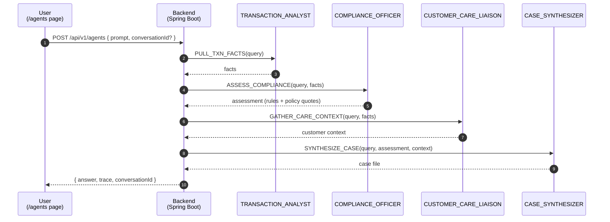
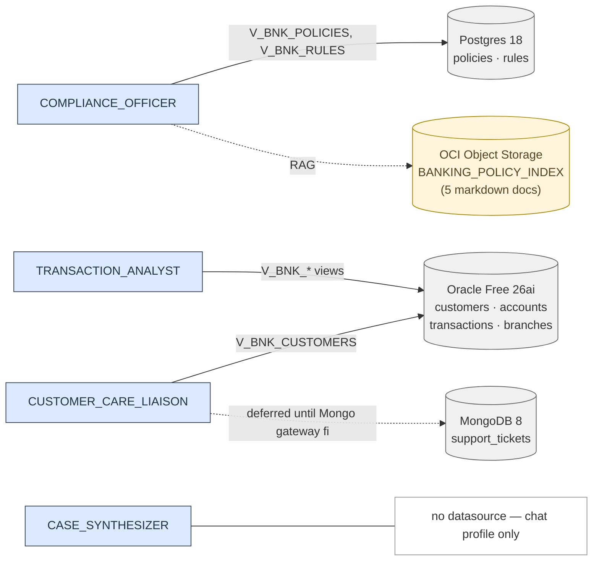

# Select AI Agents — Design Spec

Date: 2026-04-28
Replaces: the static `/future` page placeholder

## 1. Goal

Replace the `/future` placeholder with a working **Select AI Agents** page that drives a 4-agent banking investigation team, using federated views inside the ADB sidecar. The demo must show the team collaborating across Oracle Free, Postgres, and an OCI Object Storage policy library (RAG), with full execution trace visible in the UI.

## 2. In scope / out of scope

In:

- Rename `/future` route to `/agents` (label "Select AI Agents").
- New Spring Boot endpoint that runs the agent team and returns a structured execution trace.
- ADB-side DDL: OCI credential, network ACL, 5 Select AI profiles, 1 vector index, 4 tools, 4 agents, 4 tasks, 1 team.
- Banking schema upgrade in Oracle Free + Postgres (richer tables and seed data) and additive `V_BNK_*` federated views in ADB. **The existing `V_ACCOUNTS`, `V_TRANSACTIONS`, `V_POLICIES`, `V_RULES` views are not modified** — `/app` and `/sidecar` see exactly the same view shape they see today.
- MongoDB `support_tickets` collection extended from 4 to ~25 documents so the data is ready when the federation gateway is fixed.
- The DDL for `V_BNK_SUPPORT_TICKETS` (over `MONGO_LINK`) is shipped as a **commented-out** Liquibase changeset and the `BANKING_NL2SQL_CARE` profile excludes it for now — flipping the agent on once the gateway issue is resolved is a one-changeset / one-attribute change (see §14, "Mongo flip-the-switch").
- 5 short policy markdown docs uploaded to OCI Object Storage and indexed for RAG.
- Demo question gallery on the `/agents` page (clickable starter prompts).
- README.md updates: add a Select AI Agents section with prose, two mermaid diagrams (sequence and data-source map), and the demo question list; replace `/future` references; update the existing architecture mermaid (see §16).

Out:

- Streaming responses, partial results, server-sent events. Synchronous JDBC only.
- New `/query`, `/chat`, `/rag`, `/hybrid` pages. Only `/agents` is added.
- Production hardening: rate limiting, per-user auth, prompt sanitisation beyond a length+charset check.
- Hierarchical agent process (Oracle only documents `sequential`).
- Fixing the ADB heterogeneous MongoDB gateway issue. The agent demo is built so the gateway fix unlocks the `support_tickets` path with a minimal one-time follow-up change set; investigating the gateway itself stays where it is in `docs/ISSUE_ADB_HETEROGENEOUS_MONGODB_OBJECT_NOT_FOUND.md`.

## 3. Architecture overview

```
Browser (Angular)
   │  POST /api/v1/agents { prompt, conversationId? }
   ▼
Spring Boot backend  ─────────────────────────────────────────────┐
   │  jdbcTemplate.queryForObject(                                │
   │     "SELECT DBMS_CLOUD_AI_AGENT.RUN_TEAM(?,?,?) FROM DUAL")  │
   ▼                                                              │
ADB sidecar (Autonomous Database)                                 │
   │  Team BANKING_INVESTIGATION_TEAM (sequential)                │
   │  Task 1 → TransactionAnalyst   (SQL tool)                    │
   │  Task 2 → ComplianceOfficer    (SQL tool + RAG tool)         │
   │  Task 3 → CustomerCareLiaison  (SQL tool)                    │
   │  Task 4 → CaseSynthesizer      (no tool, chat profile only)  │
   │                                                              │
   │  ADB profiles call OCI Generative AI for LLM reasoning       │
   │  SQL tool issues SELECT against federated V_BNK_* views      │
   │  RAG tool searches BANKING_POLICY_INDEX (vector index over   │
   │     5 markdown docs in OCI Object Storage)                   │
   ▼                                                              │
ORAFREE_LINK ──────────────► Oracle Free 26ai (banking schema)    │
PG_LINK ────────────────────► Postgres 18 (compliance schema)     │
                                                                  │
After RUN_TEAM returns, backend reads                             │
   USER_AI_AGENT_TEAM_HISTORY,                                    │
   USER_AI_AGENT_TASK_HISTORY,                                    │
   USER_AI_AGENT_TOOL_HISTORY                                     │
filtered by team_exec_id (resolved via                            │
JSON_VALUE(COVERSATION_PARAM,'$.conversation_id'))                │
to assemble an AgentTrace and return it with the final answer ◄───┘
```

The MongoDB store stays as-is for this feature: the existing `support_tickets` collection is extended in seed data only (4 → ~25 docs). The `CUSTOMER_CARE_LIAISON` agent's profile object_list intentionally **excludes** any Mongo-backed view until the ADB heterogeneous-gateway fix lands; until then the CARE agent answers from `V_BNK_CUSTOMERS` (KYC status, risk tier, contact info), and the support-ticket integration is wired but commented out so a one-line flip enables it.

The existing `accounts`, `transactions` (Oracle Free) and `policies`, `rules` (Postgres) tables are extended with new nullable columns and additional seed rows; the existing federated views `V_ACCOUNTS`, `V_TRANSACTIONS`, `V_POLICIES`, `V_RULES` **are not modified** — the agent demo uses new, additive `V_BNK_*` views over the same backing tables. `/app` and `/sidecar` continue to operate against their original views, and any test that queries them sees exactly the same shape and content (plus the new rows) it saw before.

## 4. Agent topology

One team, four agents, sequential. Tasks chain via the `input` attribute.

```
            ┌────────────────────────────────────────────────────────────┐
            │     BANKING_INVESTIGATION_TEAM   process: sequential       │
            └────────────────────────────────────────────────────────────┘
                                       │
   ┌───────────────────────┬───────────┴───────────┬─────────────────────────┐
   ▼                       ▼                       ▼                         ▼
TransactionAnalyst     ComplianceOfficer       CustomerCareLiaison      CaseSynthesizer
task: pull_txn_facts   task: assess_compliance task: gather_context     task: synthesize
                       input: pull_txn_facts   input: pull_txn_facts    input: assess_compliance,
                                                                               gather_context
profile: BANKING_NL2SQL_TXN
                       profile: BANKING_NL2SQL_COMPLIANCE
                                               profile: BANKING_NL2SQL_CARE
                                                                        profile: BANKING_CHAT
tools: [TXN_SQL_TOOL]  tools: [COMPLIANCE_SQL_TOOL, COMPLIANCE_RAG_TOOL]
                                               tools: [CARE_SQL_TOOL]   tools: []
```

### 4.1 Tools (4)

| Name                  | Type  | Profile                     | Purpose                                                                                  |
| --------------------- | ----- | --------------------------- | ---------------------------------------------------------------------------------------- |
| `TXN_SQL_TOOL`        | `SQL` | `BANKING_NL2SQL_TXN`        | NL2SQL over `V_BNK_CUSTOMERS`, `V_BNK_ACCOUNTS`, `V_BNK_TRANSACTIONS`, `V_BNK_BRANCHES`. |
| `COMPLIANCE_SQL_TOOL` | `SQL` | `BANKING_NL2SQL_COMPLIANCE` | NL2SQL over `V_BNK_POLICIES`, `V_BNK_RULES`.                                             |
| `COMPLIANCE_RAG_TOOL` | `RAG` | `BANKING_RAG`               | Vector search over `BANKING_POLICY_INDEX`.                                               |
| `CARE_SQL_TOOL`       | `SQL` | `BANKING_NL2SQL_CARE`       | NL2SQL over `V_BNK_SUPPORT_TICKETS`, `V_BNK_CUSTOMERS`.                                  |

Tool names use uppercase to match Oracle's PL/SQL identifier convention.

### 4.2 Agents (4)

All four agents share the same `OCI_API_KEY_CRED`-backed credential and the same OCI Generative AI region; they differ only in profile (which controls table scope) and role description.

```sql
-- TransactionAnalyst
attributes => '{
  "profile_name": "BANKING_NL2SQL_TXN",
  "role": "You are a bank transaction analyst. When given a customer or transaction question, retrieve concrete facts only: which accounts, which transactions, amounts, dates, counterparties, geo, status. Do not interpret, recommend, or speculate. Return findings as a bullet list with one fact per line.",
  "enable_human_tool": "false"
}'

-- ComplianceOfficer
attributes => '{
  "profile_name": "BANKING_NL2SQL_COMPLIANCE",
  "role": "You are a bank compliance officer. Given transaction facts from the analyst, identify which AML, KYC, Reg E, OFAC, or fraud rules and policies apply. Use the SQL tool for rule data and the RAG tool for policy text. Cite rule codes (e.g. R-AML-005) and quote relevant policy sections. Classify each finding as INFO, WARNING, or VIOLATION.",
  "enable_human_tool": "false"
}'

-- CustomerCareLiaison (initial — Mongo gateway disabled)
attributes => '{
  "profile_name": "BANKING_NL2SQL_CARE",
  "role": "You are a customer care liaison. Given a customer context, retrieve customer KYC status, risk tier, country, and join date from V_BNK_CUSTOMERS. Note: support-ticket lookups are temporarily unavailable; do not fabricate ticket data. If the request requires ticket history, say so explicitly.",
  "enable_human_tool": "false"
}'

-- CustomerCareLiaison (target — once Mongo gateway is fixed; replace the role text and add V_BNK_SUPPORT_TICKETS to the profile object_list)
-- "role": "You are a customer care liaison. Given a customer context, retrieve open and recent support tickets, KYC status, and any prior issues that contextualise the case. Stick to facts. If no relevant tickets exist, return \"No relevant customer-care context.\""

-- CaseSynthesizer
attributes => '{
  "profile_name": "BANKING_CHAT",
  "role": "You are a senior banking case manager. Given transaction facts, a compliance assessment, and customer-care context, produce a final case file with three sections: Findings, Risk rating (LOW/MEDIUM/HIGH), Recommended next actions. Maximum 200 words. Be concrete; do not invent facts.",
  "enable_human_tool": "false"
}'
```

### 4.3 Tasks (4)

```sql
-- Task 1
task_name => 'PULL_TXN_FACTS'
attributes => '{
  "instruction": "Retrieve transactional facts relevant to the user request: {query}. Use the SQL tool. Return only facts; do not analyse.",
  "tools": ["TXN_SQL_TOOL"]
}'

-- Task 2
task_name => 'ASSESS_COMPLIANCE'
attributes => '{
  "instruction": "Given the user request {query} and the transactional facts in your input, identify all applicable rules and policies. Use the SQL tool for rule lookups and the RAG tool for policy citations. List each finding with rule code, severity, and a short explanation.",
  "tools": ["COMPLIANCE_SQL_TOOL", "COMPLIANCE_RAG_TOOL"],
  "input": "PULL_TXN_FACTS"
}'

-- Task 3
task_name => 'GATHER_CARE_CONTEXT'
attributes => '{
  "instruction": "Given the user request {query} and the transactional facts in your input, retrieve relevant support tickets and customer KYC status.",
  "tools": ["CARE_SQL_TOOL"],
  "input": "PULL_TXN_FACTS"
}'

-- Task 4
task_name => 'SYNTHESIZE_CASE'
attributes => '{
  "instruction": "Compose the final case file for the user request: {query}. Combine the compliance assessment and the customer-care context provided in your input. Output sections: Findings, Risk rating, Recommended next actions.",
  "input": "ASSESS_COMPLIANCE,GATHER_CARE_CONTEXT"
}'
```

### 4.4 Team

```sql
team_name => 'BANKING_INVESTIGATION_TEAM'
attributes => '{
  "agents": [
    {"name":"TRANSACTION_ANALYST",     "task":"PULL_TXN_FACTS"},
    {"name":"COMPLIANCE_OFFICER",      "task":"ASSESS_COMPLIANCE"},
    {"name":"CUSTOMER_CARE_LIAISON",   "task":"GATHER_CARE_CONTEXT"},
    {"name":"CASE_SYNTHESIZER",        "task":"SYNTHESIZE_CASE"}
  ],
  "process": "sequential"
}'
```

## 5. Profiles (5)

All profiles use `provider: oci`, `credential_name: OCI_API_KEY_CRED`, `oci_apiformat: GENERIC`, and the same `region` + `oci_compartment_id` rendered from Ansible variables. Each NL2SQL profile pins an `object_list` to enforce table scope.

| Profile                     | Action mode                                            | object_list                                                                                 | vector_index_name      |
| --------------------------- | ------------------------------------------------------ | ------------------------------------------------------------------------------------------- | ---------------------- |
| `BANKING_NL2SQL_TXN`        | (default — used by SQL tool)                           | `V_BNK_CUSTOMERS`, `V_BNK_ACCOUNTS`, `V_BNK_TRANSACTIONS`, `V_BNK_BRANCHES` (owner `ADMIN`) | —                      |
| `BANKING_NL2SQL_COMPLIANCE` | (used by SQL tool)                                     | `V_BNK_POLICIES`, `V_BNK_RULES`                                                             | —                      |
| `BANKING_NL2SQL_CARE`       | (used by SQL tool)                                     | `V_BNK_CUSTOMERS` (initial). `V_BNK_SUPPORT_TICKETS` added once the Mongo gateway is fixed. | —                      |
| `BANKING_RAG`               | (used by RAG tool)                                     | —                                                                                           | `BANKING_POLICY_INDEX` |
| `BANKING_CHAT`              | (used by synthesizer agent — chat-only, no DB context) | —                                                                                           | —                      |

## 6. Vector index and RAG documents

- New OCI Object Storage bucket `banking-rag-docs` provisioned in Terraform alongside the existing artifacts bucket.
- Five markdown documents uploaded by Ansible at deploy time. Each is short (~600–1200 words) and intentionally written to be quotable in agent answers:
  1. `aml-and-ctr-procedures.md` — BSA/AML basics, $10K CTR threshold, structuring detection, SAR filing timeline.
  2. `kyc-and-cip-requirements.md` — Customer Identification Programme, periodic refresh, EDD triggers.
  3. `reg-e-dispute-handling.md` — Reg E timeline (60-day window, 10-business-day provisional credit).
  4. `ofac-sanctions-screening.md` — OFAC SDN list checks, blocked country list (BY, IR, KP, RU, SY, etc.), wire-transfer screening protocol.
  5. `wire-transfer-sop.md` — wire limits, jurisdiction reviews, hold-and-release procedure.
- Vector index `BANKING_POLICY_INDEX` created via `DBMS_CLOUD_AI.CREATE_VECTOR_INDEX` with `vector_db_provider: oracle`, chunk_size 1500, chunk_overlap 300, source = the new bucket.

The documents are stored in the repo at `database/banking-policy-docs/*.md` and uploaded by an Ansible task to the bucket. They are not generated; they are hand-written for the demo so RAG quotes are predictable.

## 7. Banking schema upgrade

The existing `accounts`, `transactions` (Oracle Free) and `policies`, `rules` (Postgres) tables are extended with new nullable columns and additional rows. The existing rows for Alice Morgan, Bob Chen, Carol Diaz keep their original IDs (1, 2, 3). The existing `/app` and `/sidecar` pages continue to function because their queries do not reference the new columns and tolerate larger row counts. **The existing federated views `V_ACCOUNTS`, `V_TRANSACTIONS`, `V_POLICIES`, `V_RULES` are not modified at all.** The agent demo uses new, additive `V_BNK_*` views over the same backing tables (see §7.4).

### 7.1 Oracle Free — `database/liquibase/oracle/003-banking-rich.yaml`

New tables:

- **`customers`** (20 rows) — `id NUMBER PK`, `name VARCHAR2(100)`, `email VARCHAR2(120)`, `country_code VARCHAR2(2)`, `kyc_status VARCHAR2(16) CHECK IN ('VERIFIED','PENDING','EXPIRED')`, `risk_tier VARCHAR2(8) CHECK IN ('LOW','MEDIUM','HIGH')`, `joined_at DATE`. Customer 1 = Alice Morgan, 2 = Bob Chen, 3 = Carol Diaz; the remaining 17 are demo personas (Jamal Reed, Priya Iyer, Marco Russo, Yuki Tanaka, Sara Cohen, Liam Walsh, Aisha Khan, Diego Vargas, Mei Lin, Olu Adebayo, Tomás Herrera, Hannah Berg, Ravi Menon, Elena Petrova, Jonas Lind, Fatima Hassan, Ben Wright).
- **`branches`** (6 rows) — `id`, `branch_code` (e.g. `NYC-01`, `SFO-02`, `LON-01`), `city`, `country_code`, `manager_name`.

`support_tickets` does **not** move to Oracle Free — see §7.3 for the MongoDB seed extension that keeps the agent demo "almost done" pending the Mongo federation fix.

Altered tables:

- **`accounts`** — add `customer_id NUMBER FK customers.id`, `branch_id NUMBER FK branches.id`, `account_type VARCHAR2(16)` (`CHECKING`/`SAVINGS`/`CREDIT`/`MONEY_MARKET`), `currency VARCHAR2(3)`, `opened_at DATE`, `status VARCHAR2(8)` (`ACTIVE`/`FROZEN`/`CLOSED`). The existing `customer_name` column is **kept as a denormalised cached value** so the `/app` and `/sidecar` queries continue to work; a Liquibase changeset backfills it from `customers` after the seed: `UPDATE accounts a SET a.customer_name = (SELECT c.name FROM customers c WHERE c.id = a.customer_id) WHERE a.customer_id IS NOT NULL`. After expansion: ~35 accounts spread across the 20 customers (1–3 accounts each).
- **`transactions`** — add `txn_type VARCHAR2(8)` (`ACH`/`WIRE`/`CARD`/`ATM`/`INTERNAL`), `currency VARCHAR2(3)`, `channel VARCHAR2(8)` (`ONLINE`/`MOBILE`/`BRANCH`/`ATM`/`POS`), `merchant VARCHAR2(80)` nullable, `merchant_country VARCHAR2(2)` nullable, `counterparty_account VARCHAR2(40)` nullable, `status VARCHAR2(8)` (`POSTED`/`PENDING`/`DECLINED`/`REVERSED`), `occurred_at TIMESTAMP`. After expansion: ~400 transactions over a 90-day demo window.

### 7.2 Postgres — `database/liquibase/postgres/003-compliance-rich.yaml`

Altered tables:

- **`policies`** — add `code VARCHAR(20) UNIQUE` (e.g. `P-AML-01`, `P-KYC-01`, `P-REGE-01`, `P-OFAC-01`, `P-WIRE-01`, `P-FRAUD-01`), `category VARCHAR(16)`, `effective_at DATE`. Existing 2 rows backfilled with codes; 6 new rows added (total 8).
- **`rules`** — add `code VARCHAR(20) UNIQUE` (e.g. `R-AML-001` … `R-FRAUD-007`), `name VARCHAR(120)`, `threshold_amount NUMERIC(12,2)` nullable, `threshold_count INT` nullable, `threshold_window VARCHAR(16)` nullable (e.g. `P7D`, `P24H`), `severity VARCHAR(8)` (`INFO`/`WARNING`/`VIOLATION`), `description TEXT`, `policy_code VARCHAR(20)` (FK to `policies.code`). Existing 5 rules backfilled with codes/names; 13 new rules added (total 18).

### 7.3 Banking dataset — narrative seeds

Seed data is **deterministic** (fixed IDs, fixed timestamps relative to a frozen demo date `2026-04-15`) so the same demo question always reaches the same trace.

Tickets referenced below live in MongoDB. The existing `database/mongo/init.js` is extended from 4 to ~25 documents so the data is in place when the federation gateway is fixed. Each ticket carries `customer_id` (matching `customers.id` in Oracle Free) and the same fields the existing init.js already uses, plus `priority` and `updated_at`. Until the gateway is fixed, the CARE agent does not see these tickets — but the `/app` page does, exactly as it does today.

Customer-side facts the CARE agent **can** see today (via `V_BNK_CUSTOMERS`) for each narrative are called out below as "CARE today", to make clear what each demo question produces in the deferred state.

Five embedded narratives:

1. **Carol Diaz — structuring (HIGH risk)**: 4 outbound wires of $9,500–$9,800 to BY (Belarus) over 2026-04-09 to 2026-04-14, all from her checking account (id 3). Earlier transaction history shows no international activity. Mongo ticket #T-1042 created 2026-03-12: _"What's the daily wire limit?"_. Triggers rules `R-AML-005` (structuring), `R-OFAC-001` (high-risk jurisdiction). _CARE today: returns Carol's KYC status (`VERIFIED`), risk tier (`LOW` — about to escalate based on the new pattern), country, joined-at date._
2. **Bob Chen — Reg E dispute**: two near-identical $230 card charges from same merchant within 4 minutes on 2026-04-13. Mongo ticket #T-1051 opened 2026-04-15, status `OPEN`, body cites duplicate post. One prior dispute T-0871 resolved 2025-08-22. Triggers rule `R-REGE-002` (60-day window). _CARE today: KYC `VERIFIED`, risk tier `MEDIUM`._
3. **Alice Morgan — large cash deposits + expired KYC**: five cash deposits $9,000–$9,400 over 2026-04-05 to 2026-04-14 at branch `NYC-01`. KYC status `EXPIRED` (last refresh 2024-01-12). Mongo ticket #T-1056 about address change is `OPEN`. Triggers `R-AML-002`, `R-KYC-003`. _CARE today: surfaces the EXPIRED KYC, risk tier `HIGH` — the headline care fact for this case lives in `V_BNK_CUSTOMERS`, not in the ticket._
4. **Jamal Reed — velocity-triggered freeze**: 3 declined card transactions at gas pumps in 2 different countries within 1 hour on 2026-04-14, account auto-frozen. Mongo ticket #T-1063 opened next day reporting lost card. Triggers `R-FRAUD-007` (velocity). _CARE today: KYC `VERIFIED`, risk tier `LOW`. The frozen account is a transactional fact (TxAnalyst), not a CARE fact._
5. **Priya Iyer — international wire policy lookup (no incident)**: clean account, no flagged activity. Useful for demonstrating the team's behaviour on a policy-only question (analyst returns "no incident", liaison returns "no relevant context", compliance answers via RAG, synthesiser composes a guidance answer).

The remaining 15 customers have routine transactions (salary, rent, groceries, utilities) so the demo data feels realistic when the agents browse it.

### 7.4 ADB — `database/liquibase/adb/004-banking-views-extended.yaml`

The existing `V_ACCOUNTS`, `V_TRANSACTIONS`, `V_POLICIES`, `V_RULES` views are **left untouched**. Only additive `V_BNK_*` views are introduced:

- `V_BNK_CUSTOMERS`, `V_BNK_BRANCHES` over Oracle Free (via `ORAFREE_LINK`).
- `V_BNK_ACCOUNTS`, `V_BNK_TRANSACTIONS` over Oracle Free with the full extended column set (distinct from `V_ACCOUNTS`/`V_TRANSACTIONS` which keep their slim shape for `/sidecar`).
- `V_BNK_POLICIES`, `V_BNK_RULES` over Postgres (via `PG_LINK`, using the same `"public"."<table>"` schema-quoting workaround as the existing views).
- `V_BNK_SUPPORT_TICKETS` over MongoDB (via `MONGO_LINK`) — **shipped as a commented-out changeset** (`adb-004-view-support-tickets-deferred`) with a clear `TODO: enable once docs/ISSUE_ADB_HETEROGENEOUS_MONGODB_OBJECT_NOT_FOUND.md is resolved` marker. The view DDL is fully written so the only step to enable is uncommenting the changeset and adding `V_BNK_SUPPORT_TICKETS` to `BANKING_NL2SQL_CARE.object_list` (see §14).

Profiles in §5 reference the `V_BNK_*` views so the agent demo and the existing `/sidecar` demo stay decoupled.

## 8. ADB Select AI changelog — `database/liquibase/adb/005-select-ai-agents.yaml`

One Liquibase changelog with one changeset per object. Every changeset uses `endDelimiter: "/"` and `splitStatements: false`, and every CREATE is preceded by a guarded DROP, matching the established pattern in `002-db-links.yaml`.

Changeset order:

1. `adb-005-network-acl` — `DBMS_NETWORK_ACL_ADMIN.APPEND_HOST_ACE` for `*.oci.oraclecloud.com` so ADB can reach OCI Generative AI and Object Storage.
2. `adb-005-cred-oci-genai` — drop+create `OCI_API_KEY_CRED` using `${oci_user_ocid}`, `${oci_tenancy_ocid}`, `${oci_private_api_key}`, `${oci_fingerprint}` substituted from `liquibase.properties`.
3. `adb-005-profile-txn` — `BANKING_NL2SQL_TXN`.
4. `adb-005-profile-compliance` — `BANKING_NL2SQL_COMPLIANCE`.
5. `adb-005-profile-care` — `BANKING_NL2SQL_CARE`. Initial `object_list` contains `V_BNK_CUSTOMERS` only; the Mongo flip-the-switch (§14) adds `V_BNK_SUPPORT_TICKETS`.
6. `adb-005-profile-rag` — `BANKING_RAG`.
7. `adb-005-profile-chat` — `BANKING_CHAT`.
8. `adb-005-vector-index` — `BANKING_POLICY_INDEX` over OCI Object Storage bucket `${rag_bucket_namespace}/${rag_bucket_name}`.
9. `adb-005-tools` — `TXN_SQL_TOOL`, `COMPLIANCE_SQL_TOOL`, `COMPLIANCE_RAG_TOOL`, `CARE_SQL_TOOL`.
10. `adb-005-agents` — four agents.
11. `adb-005-tasks` — four tasks.
12. `adb-005-team` — `BANKING_INVESTIGATION_TEAM`.

Every PL/SQL block follows the pattern:

```sql
BEGIN
  BEGIN DBMS_CLOUD_AI_AGENT.DROP_TEAM(team_name => 'BANKING_INVESTIGATION_TEAM', force => true);
    EXCEPTION WHEN OTHERS THEN NULL;
  END;
  DBMS_CLOUD_AI_AGENT.CREATE_TEAM( team_name => 'BANKING_INVESTIGATION_TEAM', attributes => '{...}');
END;
/
```

This is mandated by memory: a partial first run that errors mid-DDL (e.g. `ORA-17008`) must not block retries.

## 9. Backend

### 9.1 New files (Spring Boot, Java 23)

Under the existing base package `dev.victormartin.adbsidecar.back`:

- `src/backend/src/main/java/dev/victormartin/adbsidecar/back/agents/AgentsController.java`
- `src/backend/src/main/java/dev/victormartin/adbsidecar/back/agents/AgentsService.java`
- `src/backend/src/main/java/dev/victormartin/adbsidecar/back/agents/dto/AgentRunRequest.java`
- `src/backend/src/main/java/dev/victormartin/adbsidecar/back/agents/dto/AgentRunResponse.java`
- `src/backend/src/main/java/dev/victormartin/adbsidecar/back/agents/dto/AgentTrace.java` (record with nested `TaskTrace`, `ToolTrace` records — same shape as the reference)

### 9.2 Endpoint

```
POST /api/v1/agents
  Body:    { "prompt": "...", "conversationId": "<uuid>"? }
  Returns: { "prompt": "...",
             "answer": "...",                  // RUN_TEAM final response
             "conversationId": "<uuid>",
             "elapsedMillis": 8421,
             "trace": {
                 "teamExecId": "...",
                 "teamName": "BANKING_INVESTIGATION_TEAM",
                 "state": "SUCCEEDED",
                 "tasks": [ { agentName, taskName, taskOrder, input, result, state, durationMillis }, ... ],
                 "tools": [ { agentName, toolName, taskName, taskOrder, input, output, toolOutput, durationMillis }, ... ]
             } | null }
```

### 9.3 Implementation

`AgentsService.runTeam(prompt, conversationId)`:

1. Generate `conversationId` if absent (`UUID.randomUUID()`).
2. Call `RUN_TEAM`:
   ```sql
   SELECT DBMS_CLOUD_AI_AGENT.RUN_TEAM(?, ?, ?) FROM DUAL
   ```
   parameters: team name (from `selectai.agents.team` config), prompt, params JSON `{"conversation_id":"<uuid>"}`.
3. Best-effort trace assembly (port the reference's `resolveTeamExecId` + `buildTrace`, including the `COVERSATION_PARAM` typo on Oracle's catalog view).
4. Return `AgentRunResponse`.

If trace assembly fails, log a warning and return the answer with `trace: null` — the answer is the contract; the trace is a bonus.

### 9.4 Configuration

`application.yaml.j2` (Ansible-rendered) gets a new section:

```yaml
selectai:
  agents:
    team: BANKING_INVESTIGATION_TEAM
```

The team name is fixed; we don't expose other profile names because the backend never references them directly — the team encapsulates them.

### 9.5 Validation

Reuse the prompt validator from the reference (length ≤ 1000, allowed character set). 4xx on invalid prompt; 5xx on unexpected JDBC errors.

### 9.6 Timeout

Default Spring Boot socket-read timeout is sufficient. Add `spring.datasource.adb.hikari.connection-timeout: 10000` and a per-call statement timeout via `JdbcTemplate.setQueryTimeout(120)` (2 minutes) on the `agents`-scoped template — agent runs can legitimately take 30–60 s.

## 10. Frontend

### 10.1 Route rename

- `src/frontend/src/app/app.routes.ts`: `path: 'future'` → `path: 'agents'`.
- Rename file `pages/future-page.component.ts` → `pages/agents-page.component.ts`; rename component class `FuturePageComponent` → `AgentsPageComponent`; update the lazy `loadComponent` import path.
- `src/frontend/src/app/nav.component.ts`: nav label `"AI features"` → `"Select AI Agents"`, route `/future` → `/agents`.

No redirect from `/future` — clean break.

### 10.2 New `agents-page.component.ts`

Standalone component, no backwards compatibility with the placeholder. Layout:

```
┌─ Select AI Agents ─────────────────────────────────────┐
│ Description (2 sentences) of the 4-agent team          │
├────────────────────────────────────────────────────────┤
│ [Demo question chip] [chip] [chip] [chip] [chip]       │  ← 5 starter prompts
├────────────────────────────────────────────────────────┤
│ Conversation:                                          │
│   ┌─ user bubble ─────────────────────────────────┐    │
│   │ "Are there any suspicious patterns on Carol…" │    │
│   └────────────────────────────────────────────────┘    │
│   ┌─ assistant bubble ────────────────────────────┐    │
│   │ Final synthesised answer (markdown)           │    │
│   │ ▸ Show execution trace (4 tasks, 5 tool calls)│    │
│   │   ───────────────────────────────────────     │    │
│   │   Task #1 TRANSACTION_ANALYST · 2.3s · ✔     │    │
│   │     Tool: TXN_SQL_TOOL · 1.8s                 │    │
│   │       ▸ Generated SQL                         │    │
│   │       ▸ Tool output                           │    │
│   │     Result: …                                 │    │
│   │   Task #2 COMPLIANCE_OFFICER · 4.1s · ✔      │    │
│   │     …                                         │    │
│   └────────────────────────────────────────────────┘    │
├────────────────────────────────────────────────────────┤
│ [textarea ......................................]      │
│                                            [Send →]    │
└────────────────────────────────────────────────────────┘
```

Chips populate the textarea on click. Trace toggle is per-bubble. Multi-turn — the same `conversationId` is sent on subsequent turns until the user clicks "New conversation".

### 10.3 Five starter prompts (chips)

The five demo narratives in §7.3, phrased as user-facing questions:

1. _Are there any suspicious patterns on Carol Diaz's accounts this month?_
2. _Bob Chen disputed a $230 charge — what should we do?_
3. _Summarise Alice Morgan's risk profile._
4. _Why is Jamal Reed's checking account frozen?_
5. _What policies apply to international wires above $10K?_

### 10.4 Service

`src/frontend/src/app/services/agents.service.ts` — single method `run(prompt, conversationId?)` that POSTs to `/api/v1/agents` and returns the typed response. Mirror the existing `query.service.ts` style.

### 10.5 Wall-clock badge parity

Each assistant bubble shows the total elapsed time from the response, matching the timing-badge convention used on `/sidecar` and `/app`.

## 11. Deployment

### 11.1 Terraform — `deploy/tf/`

- `modules/storage/` (or extend the existing `modules/app/storage.tf`): add a new bucket `banking-rag-docs` in the same compartment as the artifacts bucket. Output its name + namespace.
- Pass `rag_bucket_name`, `rag_bucket_namespace` into the Ansible inventory as group_vars.

### 11.2 Ansible — `deploy/ansible/databases/`

Add tasks (keep them in the same playbook that runs Liquibase today):

1. Render `database/liquibase/adb/liquibase.properties.j2` with the OCI key material (`oci_user_ocid`, `oci_tenancy_ocid`, `oci_private_api_key` (read from PEM file), `oci_fingerprint`, `genai_region`, `oci_genai_compartment_id`, `rag_bucket_name`, `rag_bucket_namespace`).
2. Upload `database/banking-policy-docs/*.md` to `banking-rag-docs` bucket via `oci os object put` (or the OCI Ansible collection).
3. Run Liquibase against ADB. Existing changelogs `001-init.yaml`, `002-db-links.yaml`, `003-measurements.yaml`, plus the new `004-banking-views-extended.yaml`, `005-select-ai-agents.yaml`. The master changelog (`db.changelog-master.yaml`) gets two new `include` entries.
4. Optionally run a smoke check: `select DBMS_CLOUD_AI_AGENT.RUN_TEAM('BANKING_INVESTIGATION_TEAM', 'ping', '{"conversation_id":"smoke-1"}') from dual` — log result, do not fail the playbook on miss (network or LLM glitches shouldn't block deploy).

For Oracle Free + Postgres, extend the existing Liquibase invocations to include the new `003-banking-rich.yaml` and `003-compliance-rich.yaml` changelogs.

### 11.3 `.env` additions

The existing `.env` file (read by `manage.py`) gets new variables:

```
OCI_USER_OCID=...
OCI_TENANCY_OCID=...
OCI_API_KEY_PATH=~/.oci/oci_api_key.pem
OCI_FINGERPRINT=...
OCI_GENAI_REGION=us-chicago-1
OCI_GENAI_COMPARTMENT_ID=...
```

`manage.py` exports them into the Terraform/Ansible run.

### 11.4 SQLcl + PTY caveat

Per memory: any direct SQLcl invocation from Ansible must wrap with `script -q /dev/null -c '...'` to provide a PTY (JLine crashes otherwise). Liquibase uses its own JDBC driver and is not affected. We run via Liquibase, so this caveat does not bite this changeset — but we document it inline in the spec so anyone tempted to drop down to raw SQLcl knows.

### 11.5 Idempotency

Every CREATE in changeset 005 is wrapped in a guarded DROP (per §8) so any partial first-run state can be recovered by re-running. This matches the established pattern in `002-db-links.yaml` and is reinforced by the memory note about ADB Liquibase DDL.

## 12. Error handling

| Failure                                                           | Behaviour                                                                                                                                                                             |
| ----------------------------------------------------------------- | ------------------------------------------------------------------------------------------------------------------------------------------------------------------------------------- |
| Empty / overlong / disallowed-char prompt                         | 400 from controller, message rendered in chat as system error.                                                                                                                        |
| `RUN_TEAM` raises `ORA-`                                          | 502 from controller; chat bubble shows "Agent run failed: …"; trace is whatever was assembled (likely null).                                                                          |
| Trace catalog query fails                                         | Answer still returned; trace is `null`. UI shows answer without the trace toggle.                                                                                                     |
| Network timeout on OCI Generative AI                              | Surfaces as `ORA-29024` or similar; treated as 502 above.                                                                                                                             |
| Vector index empty (RAG returns nothing)                          | Compliance officer's RAG tool returns "no policy citations found"; the synthesiser still composes an answer based on rule lookups alone.                                              |
| CARE agent asked a ticket-shaped question while Mongo is disabled | Role text instructs the agent not to fabricate; it returns an explicit "support-ticket lookups are temporarily unavailable" line. Synthesiser includes that note in the final answer. |
| Backend cold start before ADB is reachable                        | Existing `/api/v1/measurements` already tolerates this; reuse the same connection-pool config.                                                                                        |

The UI never blocks on the trace — if the trace is missing, the answer is still shown.

## 13. Testing

### 13.1 Backend unit tests (JUnit + Mockito)

- `AgentsServiceTest` — mocks `JdbcTemplate`, asserts that `runTeam` builds the right SQL, threads `conversationId`, and assembles a non-null trace from canned `USER_AI_AGENT_*` rows.
- `AgentsControllerTest` (Spring `@WebMvcTest`) — round-trips request/response JSON, validates 400 on bad prompt, 502 on service exception.

### 13.2 Manual demo plan

A new doc `docs/AGENTS_DEMO.md` documents the five starter questions and the expected high-level findings (per §7.3) so a demo-runner can verify each narrative end-to-end after deploy. The doc is intentionally short — per the troubleshooting-doc-style memory, prefer discovery commands and expected outputs over a comprehensive failure catalogue.

### 13.3 No integration tests against real ADB

OCI credentials, tenancy, and a live ADB are needed for a real run — these are out of scope for CI. Manual verification covers it.

## 14. Open questions / risks

- **OCI Generative AI region.** The reference defaults to `us-chicago-1`. Spec assumes the user's tenancy has Generative AI enabled in that region; if not, `OCI_GENAI_REGION` must be set to a region where it is.
- **Vector index build time.** First-run vector index creation can take 30–120 s for 5 small docs. Ansible will block on it. Acceptable for a one-shot deploy.
- **Sequential overhead.** All four agents run on every prompt, even policy-only questions. Total wall-clock 20–60 s per prompt. Trade-off accepted because (a) Oracle only documents `sequential`, (b) it makes the trace more visible.
- **Liquibase property substitution and multi-line PEM.** The OCI private key is multi-line. Liquibase substitution is plain text; we test once that the generated DDL is well-formed (single-quotes inside the PEM body, if any, must be doubled — they generally are not). Fallback: render the credential SQL as a Jinja file and run via SQLcl, bypassing Liquibase for that single statement.
- **Demo data drift over time.** Seed data uses absolute timestamps relative to `2026-04-15`. If the demo is run a year later, the dates will look stale. Acceptable for POC.
- **Mongo flip-the-switch (deferred completion path).** Once `docs/ISSUE_ADB_HETEROGENEOUS_MONGODB_OBJECT_NOT_FOUND.md` is resolved, the CARE agent comes online with three small changes — captured here so the path is unambiguous:
  1. In `database/liquibase/adb/004-banking-views-extended.yaml`: uncomment changeset `adb-004-view-support-tickets-deferred` (the `V_BNK_SUPPORT_TICKETS` view DDL is already written).
  2. In `database/liquibase/adb/005-select-ai-agents.yaml`, changeset `adb-005-profile-care`: add `V_BNK_SUPPORT_TICKETS` to `BANKING_NL2SQL_CARE.object_list`.
  3. In the same changeset 005 (or a new 006 changeset to avoid Liquibase checksum drift), update the `CUSTOMER_CARE_LIAISON` agent's role attribute from the "initial" text to the "target" text shown in §4.2.
     Re-running Liquibase replays only the new/changed changesets. No code change in the backend or frontend is required.

## 15. Out-of-scope cleanups

- The existing `accounts` / `transactions` slim views (`V_ACCOUNTS`, `V_TRANSACTIONS`) and `policies` / `rules` views are kept alongside the new `V_BNK_*` views to avoid changing the contract used by `/app` and `/sidecar`. A future cleanup could collapse them.

## 16. README.md updates

The README is the public face of the demo and must reflect the new topology. Three concrete edits, kept tight to the existing voice:

### 16.1 Replace the `/future` bullet on line 11

```diff
-- `/future` — **AI features.** Placeholder for Select AI Agents and other 26ai capabilities that land next.
+- `/agents` — **Select AI Agents.** A four-agent banking investigation team running entirely inside the ADB sidecar (`DBMS_CLOUD_AI_AGENT.RUN_TEAM`). One prompt fans out to a Transaction Analyst, a Compliance Officer (SQL + RAG over a policy-doc vector index), a Customer Care Liaison, and a Case Synthesiser; the page renders the final answer plus a per-task execution trace. See the new "Select AI Agents" section below.
```

### 16.2 Update the existing architecture mermaid (line 47)

Inside the `front` node label, replace the route list:

```diff
-front["Front · nginx + Angular 21<br/>/app · /sidecar · /future · /measurements"]
+front["Front · nginx + Angular 21<br/>/app · /sidecar · /agents · /measurements"]
```

The `adb` node label gets a small additional cue, and a new dotted `adb -.->|deferred MONGO_LINK| mongo` arrow makes the deferred Mongo path visible:

```diff
-adb[(Autonomous Database 26ai<br/><b>AI sidecar</b> · Vector · Select AI<br/>query_measurements)]
+adb[(Autonomous Database 26ai<br/><b>AI sidecar</b> · Vector · Select AI Agents<br/>BANKING_INVESTIGATION_TEAM · BANKING_POLICY_INDEX<br/>query_measurements)]
```

### 16.3 Insert a new "Select AI Agents" section between the `/sidecar` screenshot section and "Architecture"

The addition (heading, prose, table, two mermaid diagrams, demo question list, deferred-Mongo note) is shown rendered below — copy it into the README verbatim.

---

#### `/agents` — Select AI Agents

 <!-- captured after first deploy; see §13.2 -->

The same banking dataset, but every question is now answered by a team of four
agents collaborating inside ADB. The backend issues one
`DBMS_CLOUD_AI_AGENT.RUN_TEAM` call; ADB plans the work, calls OCI Generative
AI for each agent, runs the SQL/RAG tools against `V_BNK_*` views, and returns
both the final synthesised answer and a structured execution trace.

**The team — `BANKING_INVESTIGATION_TEAM`, sequential process:**

| #   | Agent                   | Profile                     | Tools                                        | Reads from                                                                                             |
| --- | ----------------------- | --------------------------- | -------------------------------------------- | ------------------------------------------------------------------------------------------------------ |
| 1   | `TRANSACTION_ANALYST`   | `BANKING_NL2SQL_TXN`        | `TXN_SQL_TOOL`                               | `V_BNK_CUSTOMERS`, `V_BNK_ACCOUNTS`, `V_BNK_TRANSACTIONS`, `V_BNK_BRANCHES`                            |
| 2   | `COMPLIANCE_OFFICER`    | `BANKING_NL2SQL_COMPLIANCE` | `COMPLIANCE_SQL_TOOL`, `COMPLIANCE_RAG_TOOL` | `V_BNK_POLICIES`, `V_BNK_RULES`, `BANKING_POLICY_INDEX` (5 markdown policy docs in OCI Object Storage) |
| 3   | `CUSTOMER_CARE_LIAISON` | `BANKING_NL2SQL_CARE`       | `CARE_SQL_TOOL`                              | `V_BNK_CUSTOMERS` today; `V_BNK_SUPPORT_TICKETS` once the Mongo gateway is fixed                       |
| 4   | `CASE_SYNTHESIZER`      | `BANKING_CHAT`              | (none — pure LLM reasoning)                  | The other agents' outputs                                                                              |





**Five demo questions** (clickable chips on the page; each reaches a different combination of agents and tools):

1. _Are there any suspicious patterns on Carol Diaz's accounts this month?_
2. _Bob Chen disputed a $230 charge — what should we do?_
3. _Summarise Alice Morgan's risk profile._
4. _Why is Jamal Reed's checking account frozen?_
5. _What policies apply to international wires above $10K?_

**Mongo support tickets are wired but deferred.** `V_BNK_SUPPORT_TICKETS` is shipped as a commented-out Liquibase changeset; the seed in `database/mongo/init.js` is extended from 4 to ~25 documents so the data is in place. When the ADB heterogeneous-gateway issue (`docs/ISSUE_ADB_HETEROGENEOUS_MONGODB_OBJECT_NOT_FOUND.md`) is resolved, three small Liquibase edits flip the CARE agent online — see §14, "Mongo flip-the-switch".
